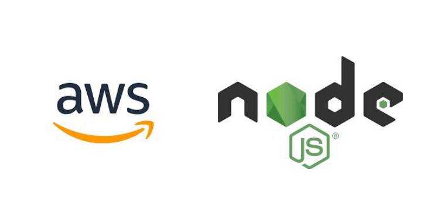

보통의 웹 서비스는 서버를 이용하여 서비스를 제공합니다. 서버 컴퓨터를 직접 구성해서 할 수도 있지만, 요즘에는 클라우드 서비스를 많이 이용합니다. 클라우드 서비스를 이용하면 물리적으로 서버를 직접 구성하거나 가지고 있지 않아도 되고, 내가 사용할 서비스에만 집중하여 서버를 운영할 수 있습니다. 이번 포스트에서는 대표적인 클라우드 컴퓨팅 서비스 중 하나인 Amazon Web Service(AWS)를 이용하여 Node.js 서버를 배포해보겠습니다.

오늘 배포할 웹 서비스 환경은 다음과 같이 구성됩니다.

- Node.js 웹 어플리케이션
- AWS EC2와 Ubuntu (+ nginx 프록시)
- AWS RDS와 Mysql

우리가 만든(미리 만들어둔) 웹 어플리케이션을 EC2의 Ubuntu에 구성할 것입니다. 그리고 서비스에 사용될 데이터베이스는 RDS의 Mysql 서버를 구성할 것입니다.

---

### 0. Node.js 웹 어플리케이션 준비하기

우리의 웹 서비스가 실제로 동작할 웹 어플리케이션이 필요합니다. 여기서는 Node.js 웹 어플리케이션을 사용할 것인데, 간단한 Node.js REST Api 서버를 만듭니다. _(Node.js 어플리케이션에 대한 부분은 자세히 다루지 않습니다.)_

저는 미리 준비한 Node 앱을 가져오겠습니다. 먼저 로컬에 설치해서 잘 동작하는 지 확인해볼게요. 코드를 깃헙에서 가져오고, 빌드 후 구동합니다.

```bash
$ git clone https://github.com/hoontae24/node-simple-server.git
$ cd simple-node-server
$ npm install
$ npm run build
$ npm start
```

서버가 시작하고, 브라우저에서 요청을 보내어 동작을 확인해봅니다.

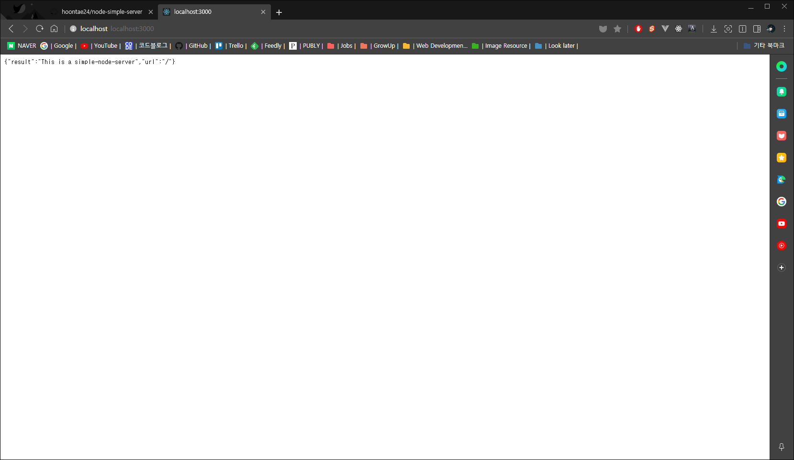

간단한 응답이 도착하네요. 로컬에서 서버가 잘 동작하는 것 같습니다. 서버를 종료해줍니다.

```bash
$ npm run stop
```

---

### 1. EC2 서버 구성하기

EC2(Amazon Elastic Compute Cloud)는 클라우드에서 컴퓨팅 서비스를 이용할 수 있도록 해줍니다. AWS에서 인스턴스를 만들고, SSH로 원격 연결을 통해 서버 컴퓨터를 제어할 수 있습니다.

#### 1.1 EC2 인스턴스 만들기

AWS로 가서 EC2 인스턴스를 만들어 봅시다. [EC2 Management Console](https://ap-northeast-2.console.aws.amazon.com/ec2/home?region=ap-northeast-2)에 들어가서 `인스턴스 시작`을 선택합니다.

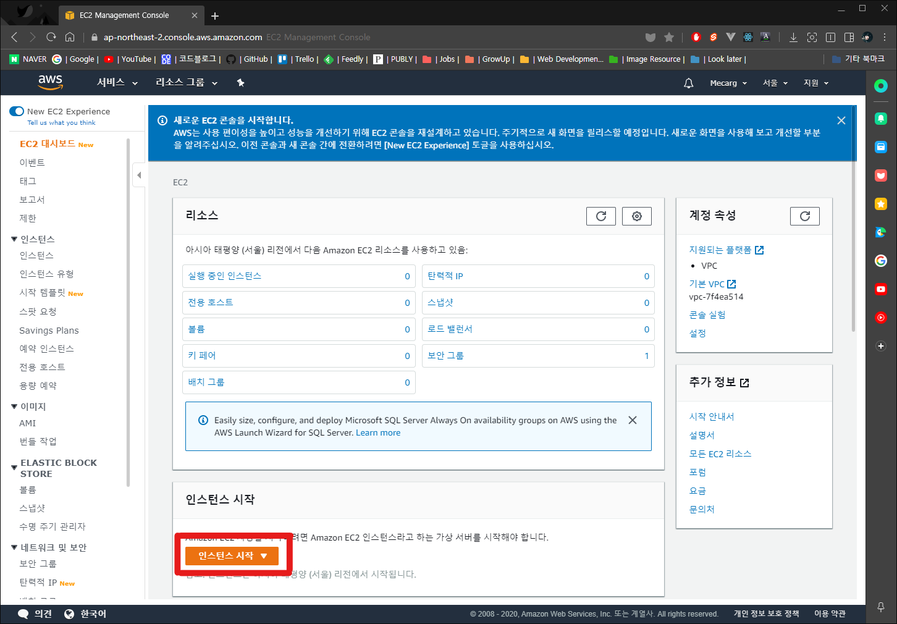

AMI 템플릿은 빠른시작 탭에서 `Ubuntu Server 18버전`을 선택하겠습니다.

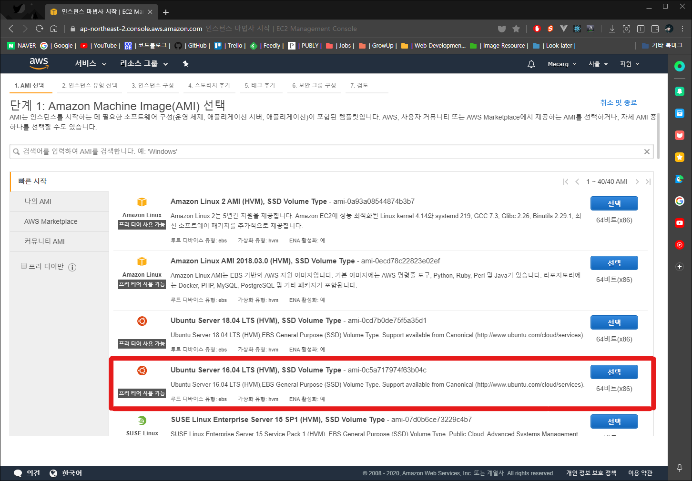

인스턴스는 기본으로 선택되어있는 `t2.micro 유형`을 선택하겠습니다.

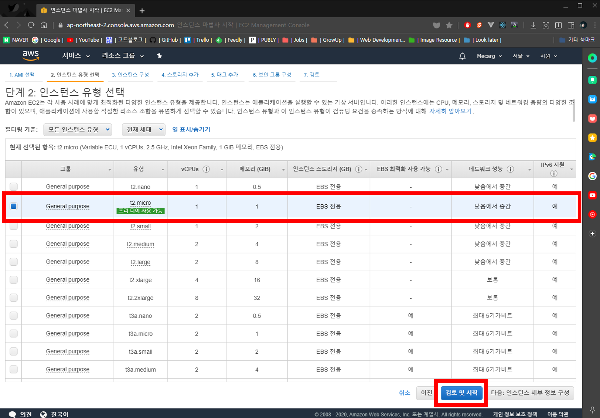

저는 새 보안 그룹 생성을 하고, 적당한 이름을 붙여주겠습니다. 규칙은 기본으로 작성된 대로 모든 IP에서 접속 가능하도록 하겠습니다.

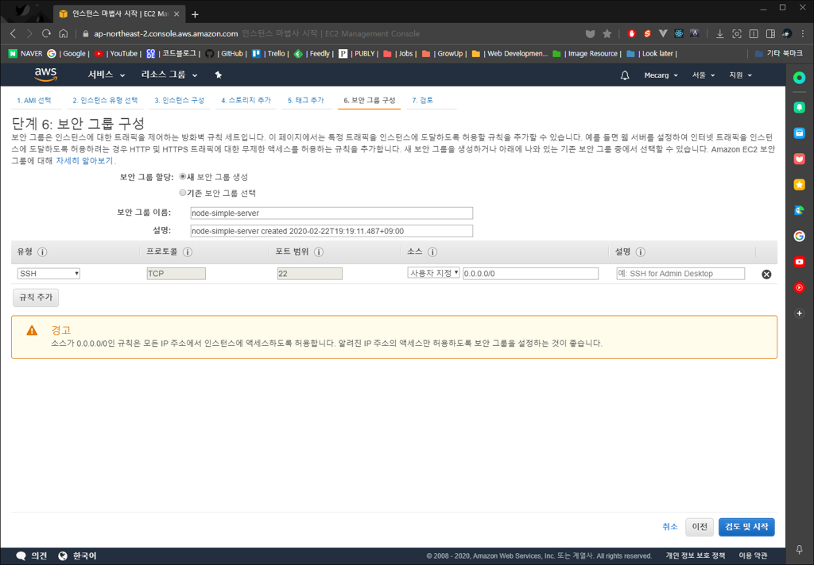

다음 인스턴스 시작 검토에서 `시작하기`를 선택하고, `새 키페어 생성`을 선택합니다. 적당한 이름을 붙여주고 `키 페어 다운로드`를 선택합니다.

키 페어 파일(`.pem`)이 다운로드 되면, 파일을 따로 보관해주세요. SSH 연결 시 사용됩니다.

이제 `인스턴스 시작`을 선택합니다.

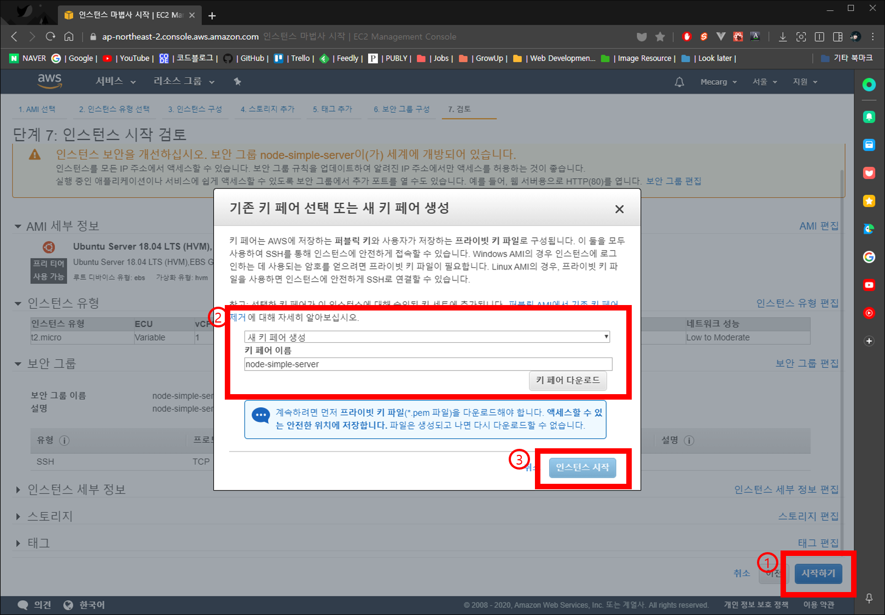

AWS EC2 인스턴스 생성을 완료했습니다. EC2 인스턴스 탭에 새로운 인스턴스가 생성되었는지 확인해보세요.

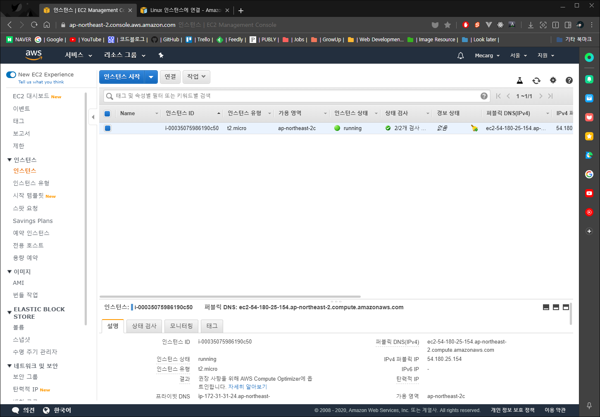

#### 1.2 EC2 인스턴스에 접속하기

EC2 컴퓨터에 접속하는 방법은 여러가지가 있습니다. [여기](https://docs.aws.amazon.com/ko_kr/AWSEC2/latest/UserGuide/AccessingInstances.html)를 참조해 주세요. 저는 이 중에서 Windows에서 [PuTTY를 사용하여 접속](https://docs.aws.amazon.com/ko_kr/AWSEC2/latest/UserGuide/putty.html)하는 방법으로 연결해보겠습니다.

먼저 AWS 설명서의 안내대로 [PuTTY를 설치](https://www.chiark.greenend.org.uk/~sgtatham/putty/)합니다. windows용 최신 버전으로 설치합니다.

설치가 완료되었으면 `PuTTYGen`을 이용하여 `.pem`파일을 `PuTTY`에서 사용되어지는 `.ppk`파일로 변환합니다. `PuTTY`와 함께 설치된 `PuTTYGen`을 실행합니다.

생성할 키 유형을 `RSA`로 선택하고, `Load`를 선택하여 인스턴스를 생성할 때 생성했던 `키 페어(.pem)` 파일을 불러옵니다. 그리고 `Save private key`를 선택하고 `.ppk`형식으로 저장합니다.

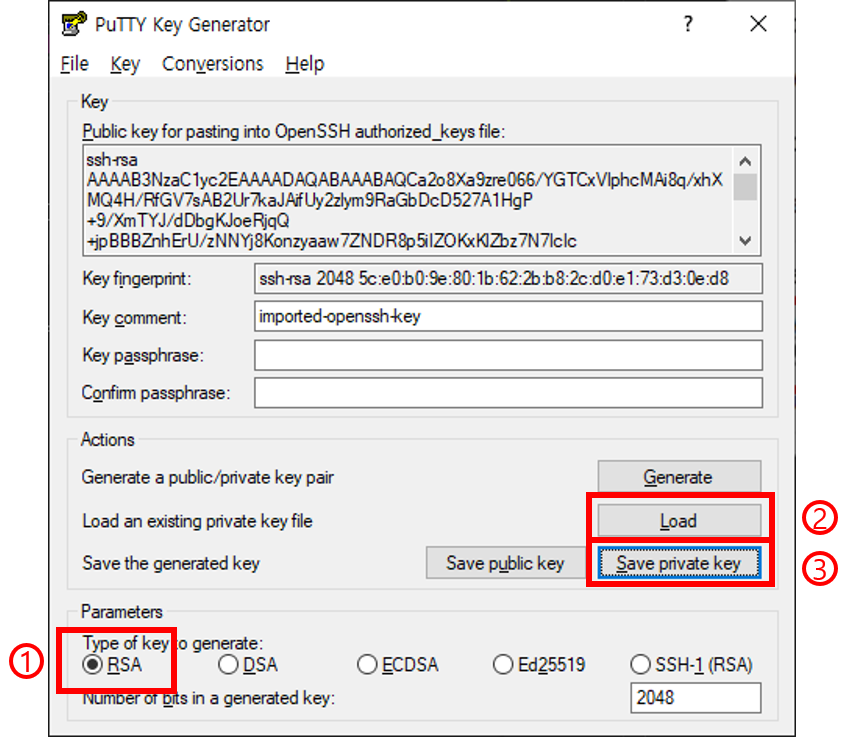

이제 `PuTTY`를 실행해주세요. 아래와 같은 창이 뜨면, 빈칸을 입력해줍니다.

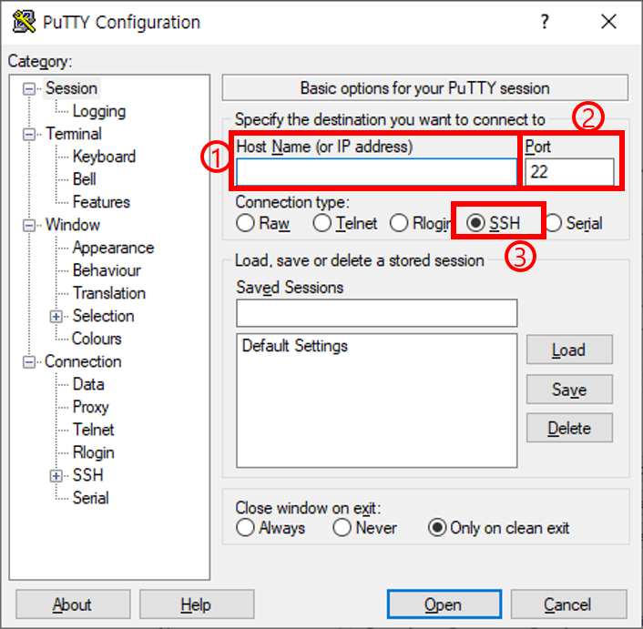

(1) Hostname: `{username}@{public_dns_name}`형식의 주소를 입력합니다. `username`부분은 `"Ubuntu"`이고 `public_dns_name`은 EC2의 주소입니다. 아래 사진처럼 AWS EC2 Management Console에서 해당 인스턴스의 Public Dns를 확인해주세요.

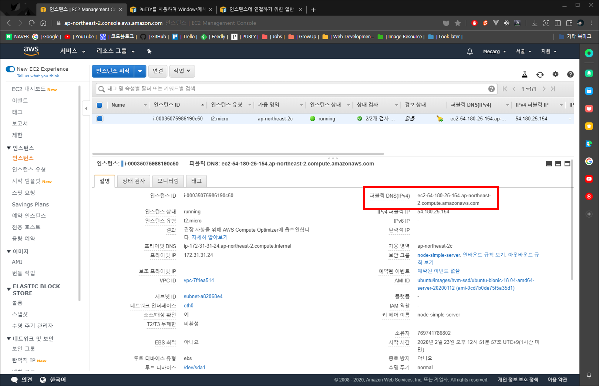

(2) Port: 22(ssh) 포트를 확인해주세요.

(3) Connection Type: SSH 선택을 확인해주세요.

(4) 왼쪽의 메뉴에서 Connection / SSH / Auth 탭을 선택하고, `PuTTYGen`으로 저장한 `.ppk`파일을 불러옵니다.

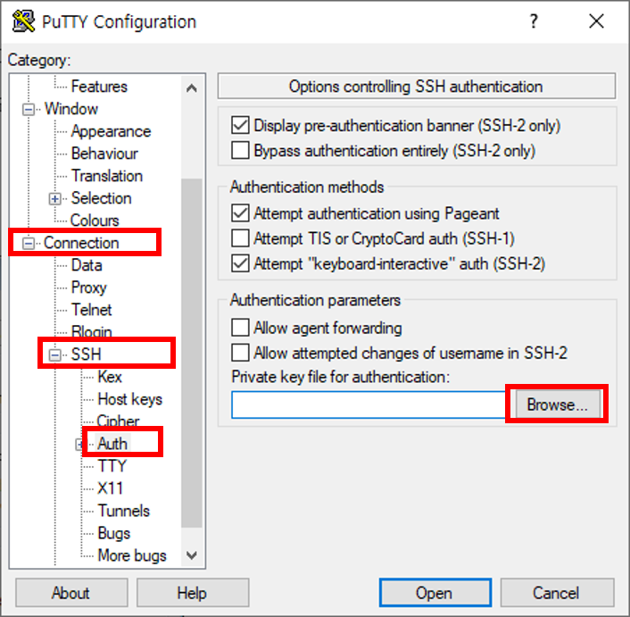

(5) 이제 `Open`을 선택합니다. 아래와 같이 보안 알림이 뜨면 `예`를 선택합니다.(인스턴스에 처음으로 접속할 때, 인스턴스 호스트가 신뢰할만 한 지 PuTTY가 묻습니다.)

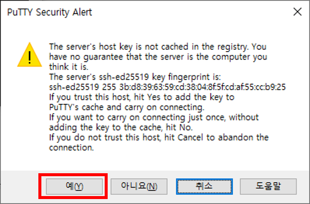

아래와 같이 원격 콘솔이 실행되네요. 접속에 성공했습니다.

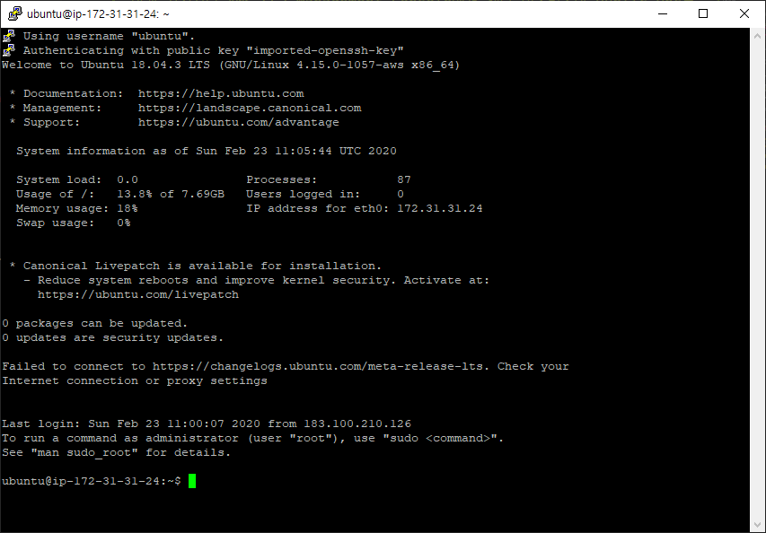

---

### 2. RDS 데이터베이스 구성하기

EC2가 웹 애플리케이션 서비스를 담당하는 서버 역할을 한다면, RDS는 웹 서비스의 데이터베이스 서버 역할을 담당합니다. 규모가 작고 트래픽이 적은 서비스라면 EC2 서버 컴퓨터에 로컬로 구성하여 사용할 수 있지만, AWS RDS를 이용하여 데이터베이스를 구성해 보겠습니다.

#### 2.1 RDS 인스턴스 생성하기

AWS의 RDS 페이지로 가서, `데이터베이스 생성`을 선택합니다.

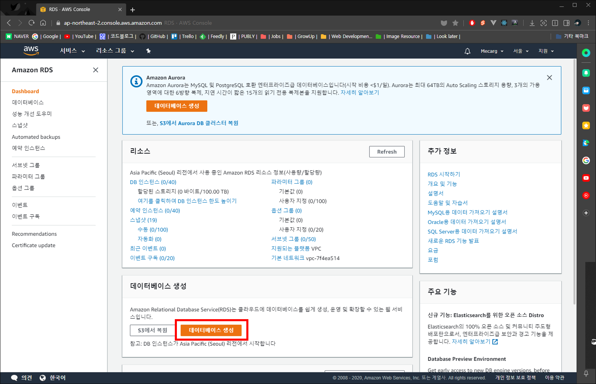

데이터베이스 엔진을 `Mysql`로 선택하고, 적당한 이름을 설정합니다. 마스터 사용자 이름과 암호를 입력합니다.

그리고 `연결 섹션`에서 `추가 연결 구성`을 열고 `VPC 보안 그룹`을 EC2의 보안그룹과 같은 그룹으로 선택합니다. 이제 `데이터베이스 생성`을 선택하여 다음으로 진행합니다.

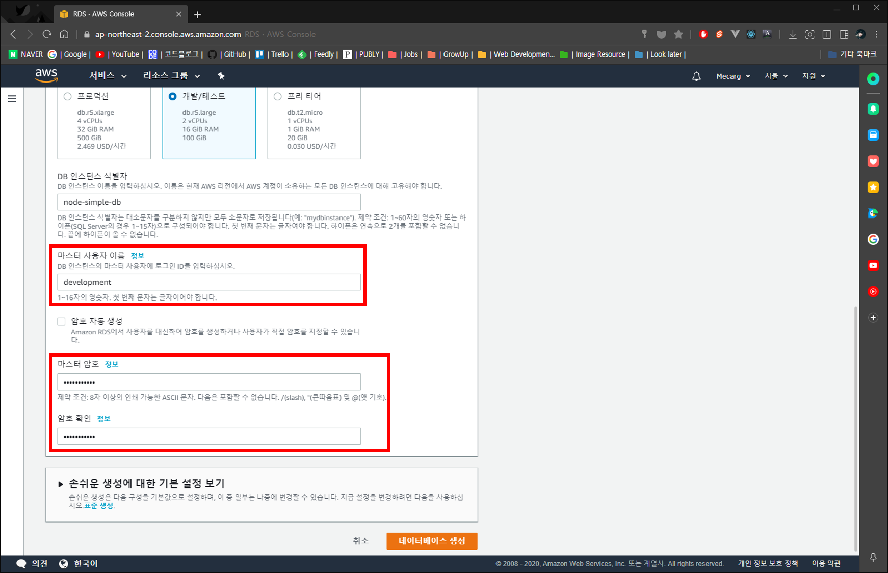

대시보드에서 생성이 완료될 때까지 잠깐 기다립니다.

#### 2.2 RDS 인스턴스에 접속하기

RDS 인스턴스에 접속하기 위해서는 AWS 보안그룹 설정에서 접속을 허용해주어야 합니다. RDS의 보안그룹을 따로 가지면 좋겠지만, 이 포스트에서는 EC2의 보안그룹으로 같이 사용하겠습니다.

EC2와 RDS의 보안그룹 설정으로 들어가주세요. (만약, EC2와 RDS의 보안그룹이 다르다면, 같은 보안그룹으로 설정해주세요.)

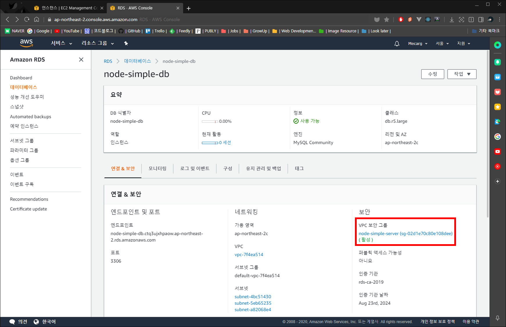

보안 그룹을 선택하고, `인바운드 규칙`을 편집합니다. `규칙 추가`를 선택하여 `Mysql/Aurora`유형을 선택하고, 포트 범위는 `3306`으로 지정합니다. 주소는 현재 보안그룹의 `ID`를 입력하고 저장합니다.

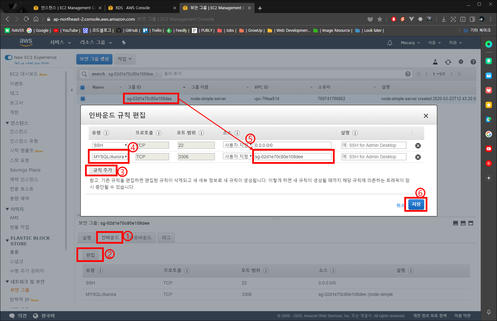

이제 EC2에서 RDS Mysql(3306) 서버로 접속할 수 있습니다.

EC2 콘솔에서 `mysql-server`를 설치합니다.

```bash
$ sudo apt-get update
$ sudo apt-get install mysql-server
```

그리고 mysql client를 이용하여 RDS의 mysql 서버에 접속합니다.

```bash
# mysql -u {username} -p -h {rds_endpoint_url}
# 제 경우에는 아래와 같습니다.
$ mysql -u development -p -h node-simple-db.ctq3ujxhpaow.ap-northeast-2.rds.amazonaws.com

Enter password: # 패스워드 입력
```

RDS의 mysql 서버에 접속이 되었다면, 웹 서비스가 사용할 Database를 생성해줍니다. 제가 간단히 작성한 Node 서버는 DB 연결만 이루어지고, 실제 작업은 구현된 게 없어서 따로 테이블은 만들지 않겠습니다.

```mysql
mysql> CREATE DATABASE node_simple_server;
```

이제 RDS도 준비되었습니다.

---

### 3. EC2에 웹 서비스 배포하기

#### 3.1 Node.js, NPM 설치하기

EC2에 Node.js가 설치되어 있지 않았다면 설치해주세요.

```bash
$ sudo apt install nodejs
$ sudo apt install npm

# 설치 확인
$ node -v
$ npm -v
```

#### 3.2 Node 웹 서버 배포하기

이제 EC2에서 웹 서비스 프로젝트를 불러옵니다. 깃과 깃헙을 이용해서 불러오겠습니다.

```bash
$ git clone https://github.com/hoontae24/node-simple-server
$ cd node-simple-server
$ npm install
```

RDS 데이터베이스 서버에 연결할 수 있도록 약간의 설정을 수정해주세요. Database HOST, USERNAME, PASSWORD 등의 정보를 알맞게 수정합니다. 그리고 웹 서비스를 빌드하고, 서버를 시작하겠습니다.

```bash
$ npm run build
$ npm start
```

이제 Node 서버가 구동되었는데요, 제가 작성한 Node 서버는 3000번 포트에 열려있습니다. EC2 보안그룹 인바운드 규칙에 3000번 포트를 열어주어야 합니다. (저는 http 전용 포트와 https 전용 포트도 함께 열어주었습니다.)

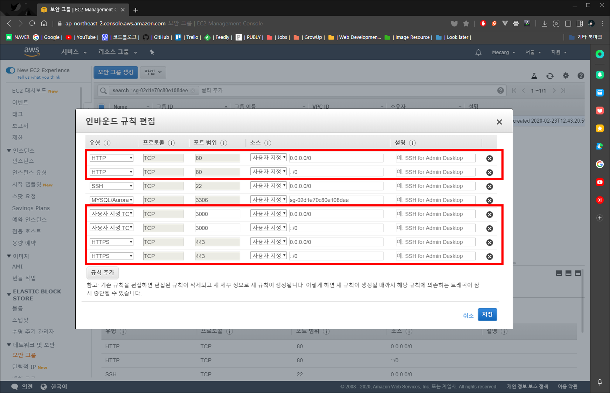

이렇게 포트를 열었으면 EC2 서버에 접속할 수 있습니다. `EC2 퍼블릭 DNS`를 주소창에 입력하고, 접속할 포트번호를 입력해주세요.

```url
http://ec2-54-180-25-154.ap-northeast-2.compute.amazonaws.com:3000/
```

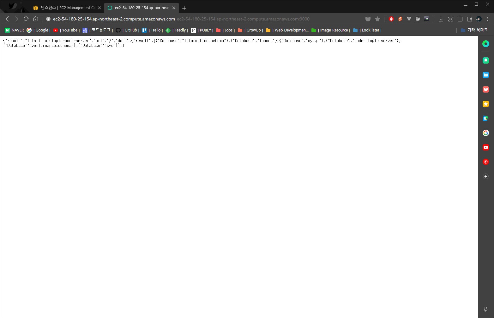

브라우저에서 주소창을 이용해 요청을 보내면 정상적으로 응답이 돌아오는 것을 확인할 수 있습니다.

#### 3.3 Nginx 프록시 서버 구성하기

Node 서버는 3000번 포트에 열려있는데, 일반적으로 서비스 url에는 포트번호를 포함하지 않습니다. 그래서 Nginx 프록시 서버를 이용해 http(80) 또는 https(443) 요청이 오면, 원하는 서비스로 매핑해줄 수 있습니다. 지금의 경우에는 `:3000`을 쓰지 않고 URL만으로 서비스에 요청할 수 있도록 매핑할 것입니다.

먼저 EC2 Ubuntu에 `Nginx`를 설치합니다. 설치가 완료되면 `nginx`를 실행해보겠습니다.

```bash
# 설치
$ sudo apt-get install nginx

# 실행
$ sudo service nginx start
```

nginx가 실행되었는지 확인하기 위해서, `퍼블릭 DNS`로 접속해봅니다. 브라우저에서 EC2의 url로 접속해보겠습니다.

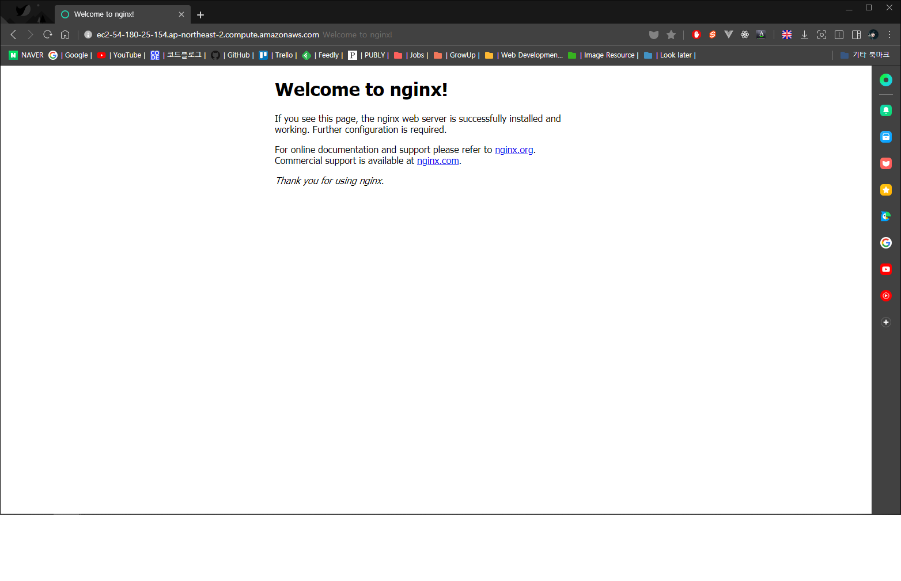

nginx가 잘 실행되니, 웹 서비스로 요청을 분배하도록 설정해주겠습니다.

```bash
$ sudo find / -name nginx.conf
# >> /etc/nginx/nginx.conf
$ cd /etc/nginx/sites-available
$ sudo vi default
```

`default` 파일에서 기본 설정으로 되어있는 내용을 지우고 다음과 같이 입력해주세요.

```txt
server {
    listen 80;

    location / {
      proxy_pass http://127.0.0.1:3000;
    }
}
```

수정된 내용을 저장하고, `nginx`를 다시 시작하겠습니다.

```bash
$ sudo service nginx restart
```

이제 `EC2 퍼블릭 DNS`에 포트 번호 없이 접속해보겠습니다.

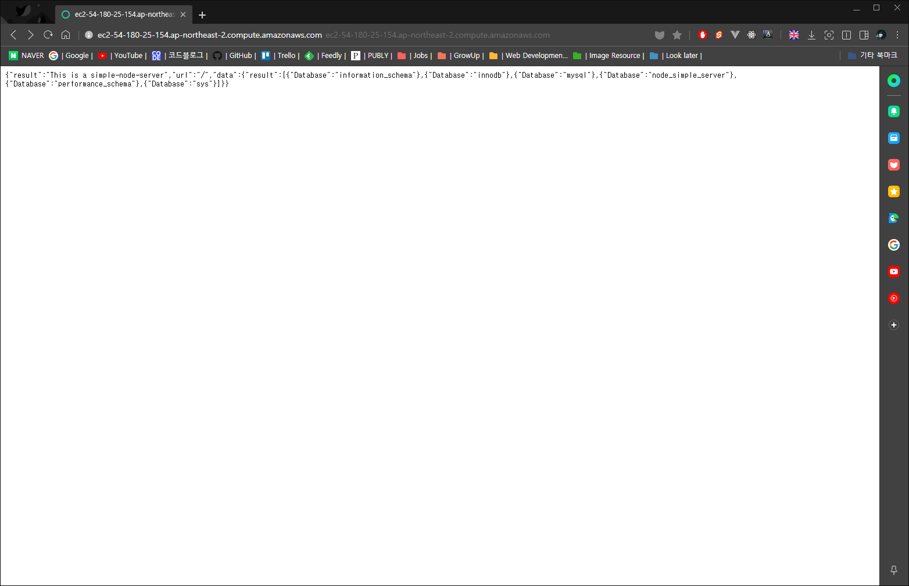

잘 접속되는 것을 볼 수 있습니다. 이렇게 `nginx`를 이용하면, 웹 서비스가 제공하는 엔드포인트에 EC2서버로 들어오는 요청을 매핑할 수 있습니다. 또한 하나의 EC2 컴퓨터 서버에 여러 개의 서비스를 구동시키고, 각각 다른 엔드포인트로 접근할 수 있게 할 수 있습니다. 만약 프론트 엔드 서버와 API 서버가 있다면 각각을 다음과 같이 매핑할 수 있죠.

- 프론트엔드 서버: {퍼블릭 DNS}/
- API 서버: {퍼블릭 DNS}/api

다른 두 개의 서비스를 하나의 도메인으로 제공할 수도 있습니다.

---

### 마무리

여기까지 AWS의 클라우드 서비스인 EC2와 RDS를 이용하여 Node.js 웹 서비스를 배포해 보았습니다. 간단히 연결하는 작업만 해보았지만, 막상 하기전에 생각했던 것보다 복잡하지는 않았습니다. 아주 간단하지는 않지만 어떤 식으로 연결하고 구성하는 지 알게 되었습니다.

서비스 규모가 커지거나 복잡해 질수록 더 많은 설정이 필요하겠지만 기본적인 개념을 익힐 수 있는 시간이었던 것 같습니다. 다음에는 AWS의 다른 클라우드 서비스나, Google Firebase, Microsoft Azure와 같은 다른 서비스를 알아보는 시간도 가져보겠습니다.
