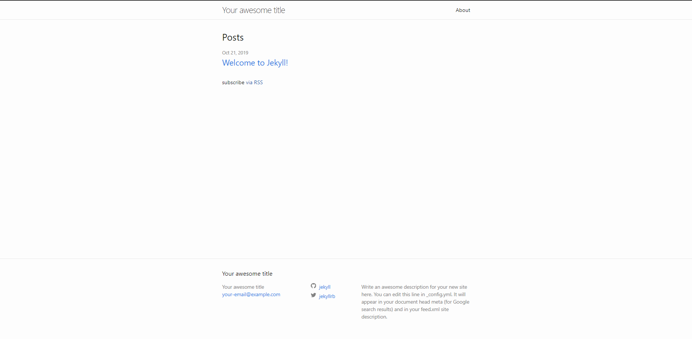
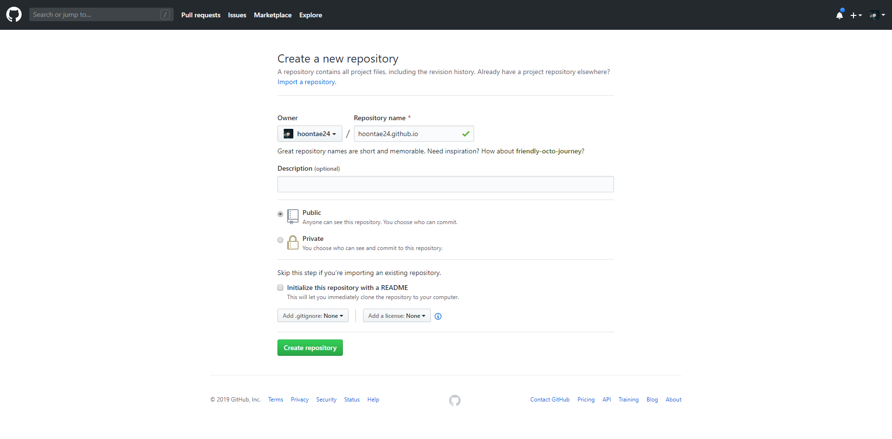
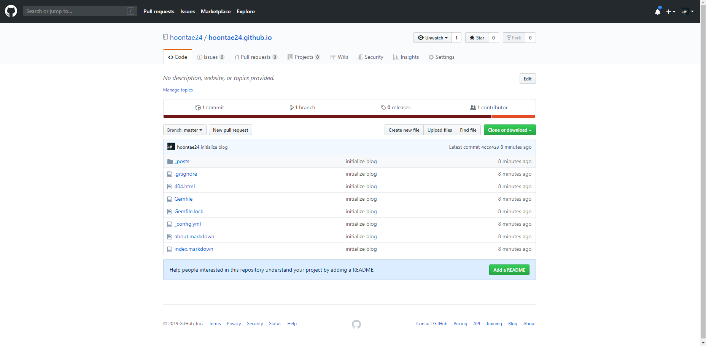

개발자로 취업을 준비하면서 포트폴리오를 만들었던 적이 있다. 개발자, 디자이너 등으로 취업하는 분들은 이러한 경험이 있을 것이다. 내가 어떠한 것들을 만들었는지 정리하면서 그것들을 보여주는 것도 나에겐 참 어려운 일이었다.

어찌어찌 신입 개발자로 취업을 하였지만, 마음 한구석에는 두 가지 고민이 계속 있었는데, 하나는 "개발자로서 어떻게 계속 공부해 나갈 것인가"였고, 또 하나는 "내가 공부하고 관심 있는 것들을 정리할 블로그가 있으면 좋겠다"였다.

미루어 왔던 개발 블로그를 더 늦기 전에 시작해보려 하는데, 어떠한 플랫폼이 좋을지 선택해야 한다. github을 이용하면 로컬에서 쉽게 글을 쓰고 push할 수 있고, jekyll theme을 가져와서 템플릿을 이용할 수 있다.
(다른 서비스도 좋은 것들이 많지만, 시작과 꾸준함이 제일 중요하니까... 일단 시작해보자.)

_[jekyll 빠른 시작 설명서](https://jekyllrb-ko.github.io/docs/quickstart/)를 참조하였습니다._  
_(Ruby, Gem이 설치되어 있어야 한다. [Ruby 설치하기](https://jekyllrb-ko.github.io/docs/installation/))_

---

## **1. jekyll, bundler 설치하기**

> Jekyll 은 아주 심플하고 블로그 지향적인 정적 사이트 생성기입니다.

Jekyll은 Ruby로 만들어진 정적 사이트 생성기다. 개인적으로 약간 생소하긴 했지만, 초기 설정만 잘 해두면 쉽게 블로그를 만들어 갈 수 있을 것이다.  
bundler는 "다른 루비 젬들을 관리하는 루비 젬입니다." 라고 나와있는데, 패키지를 관리해주는 녀석인 듯 하다.

콘솔에서 다음과 같이 명령을 입력하여 설치한다.

> $ gem install jekyll bundler

설치가 잘 되었는지 확인해볼 수 있다.

> $ jekyll -v  
> $ bundler -v

---

## **2. 기본 블로그 구성하기**

이제 기본 블로그 사이트를 만들 수 있다.

> $ jekyll new my-blog-site

jekyll이 작업을 마치면 my-blog-site라는 폴더가 생성되고, 기본 파일들이 생성되어 있다.

> $ cd my-blog-site

아직 갖춰진 것은 없지만 블로그가 만들어 졌다. 다음 명령을 통해 로컬에서 미리보기 빌드해 볼 수 있다.

> $ jekyll serve

[http://127.0.0.1:4000/](http://127.0.0.1:4000/) 으로 접속해 볼 수 있다.

_(위와 같은 페이지가 나오면 성공)_

---

## **3. github pages에 호스팅하기**

이렇게 생성된 블로그를 꾸미는 것도 중요하지만, github pages를 이용해 호스팅 해야한다. _(git 또는 github에 대해서는 자세히 다루지 않겠습니다.)_

### 1. 호스팅 용 github 저장소 만들기

  
_(Repository name은 반드시 "[username].github.io")_  
_(여기서 [username]은 github의 username과 동일해야 한다)_

### 2. 로컬에서 Git 초기화 및 커밋하기

> $ git init

_(블로그 폴더에 .git 이라는 폴더가 생겼으면 성공)_

> $ git add .  
> $ git commit -m "initialize blog"

> $ git log

_(commit된 목록이 생겼으면 성공)_

### 3. github 원격 저장소 설정 및 push 하기

로컬에서 생성된 저장소를 1에서 만들어둔 깃헙 저장소와 연결해야 한다. github에 만들어둔 저장소 페이지에 보면 clone을 할 수 있도록 "https://github.com/hoontae24/hoontae24.github.io.git"와 같은 형식의 주소가 있다. 이것을 복사.

> $ git remote add origin https://github.com/hoontae24/hoontae24.github.io.git  
> _(git remote add origin [저장소 주소])_

이제 로컬에서 작성된 블로그 파일들을 원격 저장소로 올린다.

> $ git push --set-upstream origin master  
> _(깃헙 계정과 관련해서 인증과정을 거쳐야 할 수도 있음)_

여기까지 잘 진행되었으면, Github 저장소에 파일이 올라간 것을 확인할 수 있다.

---

## **4. 호스팅 된 블로그 확인하기**

이제 자신이 저장소 이름으로 접속해보면 블로그를 확인할 수 있다.  
~~(내 경우엔 [https://hoontae24.github.io/](https://hoontae24.github.io/), 주소 형식만 참고해주세요. 결과물은 변경되었습니다.)~~

아직은 텅 빈 블로그지만 이제 몇가지 설정만 하면 멀쩡한 블로그가 될 것 같다.

- Github 블로그에 게시글 작성하기
- Jekyll theme으로 디자인하기
