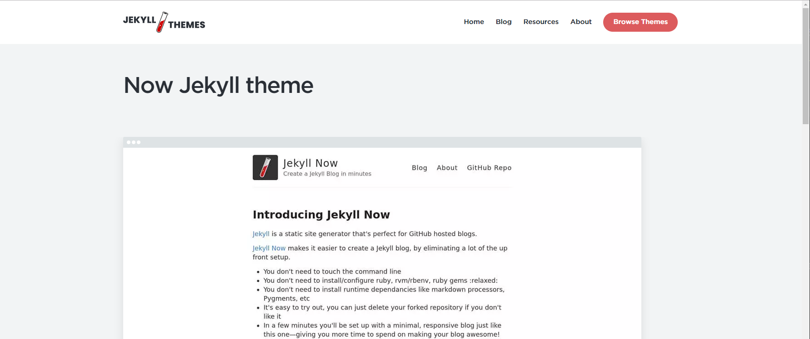
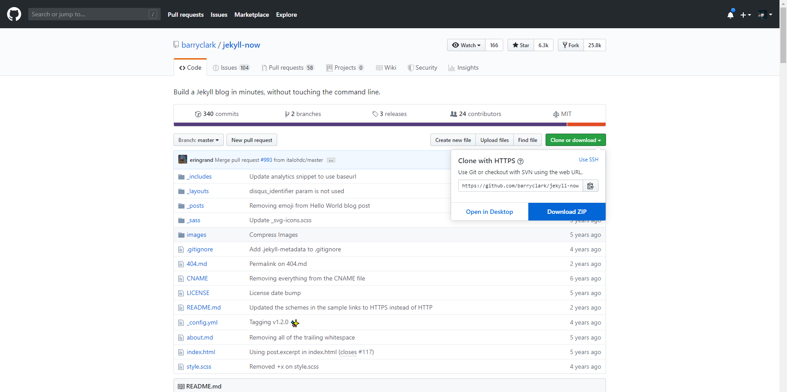
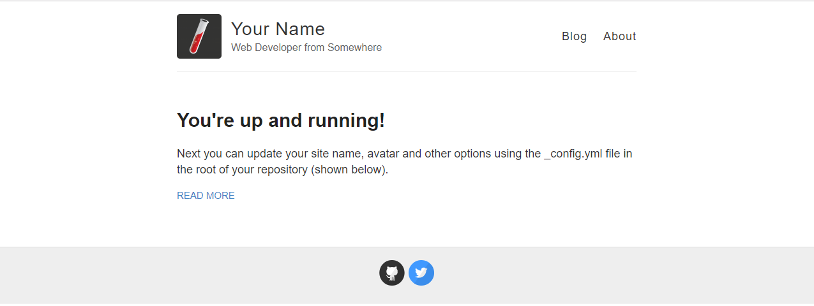
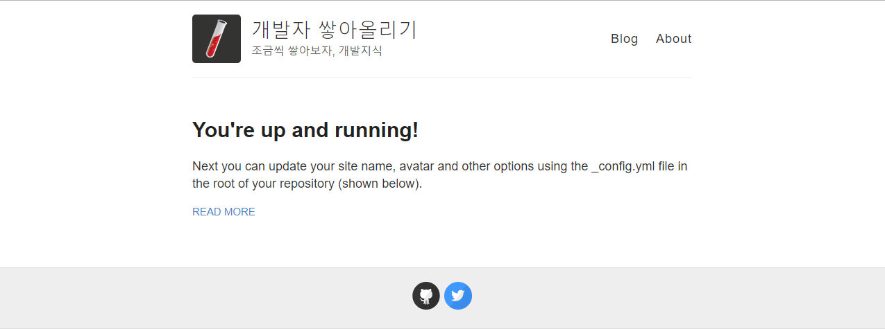
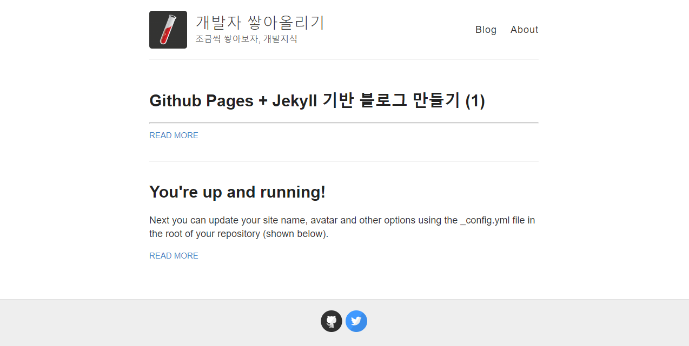

지난 포스트에서 Github Pages를 이용하여 호스팅하는 블로그를 만들어보았다. 지금은 접속할 수 있는 환경을 만들어 둔 정도다. 이제 Jekyll을 좀 더 제대로 이용하면서 Theme 디자인 및 템플릿을 설정하여 블로그답게 만들 수 있다.

---

## **1. Jekyll Theme 가져오기**

테마를 적용할 수 있는 방법은 여러가지이다. 아마 제일 쉬운 방법은 테마가 셋팅된 저장소를 그대로 가져오는 것이다. 사실 이전에 했던 작업이 그대로 덮어쓰여지기 때문에, 이전 포스트의 작업을 선행할 필요는 없다. 다만, Github Pages에 호스팅 하는 개념만 알고 있으면 된다.

먼저 적용하고 싶은 테마를 [Jekyll Theme](http://jekyllthemes.org/), [Free Jekyll Theme](http://jekyllthemes.io/free)에서 찾아본다. 이미 만들어져 있는 테마가 많기 때문에 자신이 원하는 스타일을 고르면 된다. 이후에 세부적인 부분은 코드를 수정해서 디자인할 수도 있다.

나는 가장 상위에 있는 **_Now_** 라는 테마를 선택했다.



테마에 사용되는 플러그인 등에 따라 폴더 구조나 파일들이 제각각이다. 아직 Jekyll 블로그를 자유자재로 다룰 정도는 아니기 때문에 비교적 간단한 테마를 선택했다. 이제 테마의 Github 저장소에 가서 코드를 몽땅 다운로드한다.  
(저장소를 Fork해서 가져와도 동일하다. 이 경우엔 fork해서 가져온 저장소의 이름을 이전 포스트에서 작업한 것 처럼 username.github.io로 변경해주고 내려받으면 된다.)



기존의 로컬 블로그 폴더에 있던 파일을 **.git** 폴더만 제외하고 모두 삭제한다.(.git 폴더를 지우면 Github 원격 저장소 연결이 사라진다.)  
사용하고 싶은 테마의 저장소에서 내려받은 코드를 압축 해제하고, 다 지워버린 블로그 폴더에 붙여넣기 해준다.

이제 덮어쓰여진 새로운 블로그를 로컬에서 띄워보자.

> $ cd my-blog-site  
> $ jekyll serve

[http://127.0.0.1:4000/](http://127.0.0.1:4000/) 으로 접속한다.


_(기본 테마와 크게 다른게 없는 것 같다...)_

---

## **2. 블로그 환경설정 변경하기**

> Jekyll 의 핵심 역할은 텍스트 변환 엔진입니다.

Jekyll은 정적인 사이트를 생성해준다. [디렉토리 구조](https://jekyllrb-ko.github.io/docs/structure/)나 [환경설정](https://jekyllrb-ko.github.io/docs/configuration/)을 통해 나만의 블로그 포맷을 만들 수 있는 것이다.

**\_config.yml**파일을 열어 몇가지 설정을 변경해주어 커스터마이징 해보자. 아직은 모든 설정을 잘 모르기 때문에 중요한 부분들만 먼저 바꾸어 본다.

```yml
name: 개발자 쌓아올리기
description: 조금씩 쌓아보자, 개발지식
url: https://[username].github.io/
baseurl: ''
```

해당 부분들을 변경하고 새로고침하면 블로그의 이름과 설명이 자동으로 변경된다.



기본으로 생성되어 있는 index.html 파일을 열어보면 다음과 같이 머리말이 지정되어있다.

```html
---
layout: default
---
```

layout으로 default라는 파일을 사용한다는 것인데, **\_layout** 폴더의 **default.html** 파일을 보자.

```html

<header class="masthead clearfix">
  <a href="{{ site.baseurl }}/" class="site-avatar"
    ></a>
  <div class="site-info">
    <h1 class="site-name"><a href="{{ site.baseurl }}/">{{ site.name }}</a></h1>
    <p class="site-description">{{ site.description }}</p>
  </div>
  <nav>
    <a href="{{ site.baseurl }}/">Blog</a>
    <a href="{{ site.baseurl }}/about">About</a>
  </nav>
</header>
```

{{ ... }} 로 둘러싸인 부분은 Liquid 라는 문법으로 쓰여진 것인데, 정적 페이지로 빌드할 때 jekyll이 해당 부분을 변환해준다. **{{ site.name }}** 의 부분은 \_config.yml에서 설정했던 **name**에 해당하는 값으로 변환되는 것이다.
다른 많은 부분들에서도 설정된 변수나 환경에 따라 변환되도록 코딩되어 있어서, 반복되는 작업을 하거나 외부적인 플러그인을 설치하여 쉽게 정적 페이지를 제공할 수 있게 해준다.


[Jekyll 사용 설명서](https://jekyllrb-ko.github.io/docs/home/)를 통해서 필요한 기능들을 익혀가야 한다.

---

## **3. 포스트 작성하기**

Jekyll에서 포스트는 [마크다운](https://daringfireball.net/projects/markdown/)으로 작성한다. **\_post**폴더에 YYYY-MM-DD-[제목].md 형식으로 파일을 저장하면 자동으로 포스트가 생성된다.

**\_posts**에 _2019-10-21-Gibhub Pages + Jekyll Blog (1).md_ 라는 파일을 생성하고 다음과 같이 코드를 추가하였다.

```html
---
layout: post
title: Github Pages + Jekyll 기반 블로그 만들기 (1)
subtitle: Github Pages 호스팅 및 Jekyll 설치하기
author: Hoontae
categories: blog
tags: blog jekyll
# image: assets/images/1.jpg
featured: true
hidden: false
permalink: '/:categories/:title'
---

--- Github Pages와 Jekyll을 이용해 블로그 만들기 ---
```

md파일을 추가하기만 해도 포스트가 생성된다. 블로그 폴더에 /\_site/blog/[제목].html 파일이 생성된 것을 볼 수 있다. 설정마다 다르게 생성되는데, 지금은 md파일의 머리말에 permalink 속성으로 /:categories/:title 로 설정해두어 위와 같은 경로로 포스트 파일이 생성된 것이다.

블로그에 접속해보면 해당 포스트가 생성된 것을 확인할 수 있다.



몇가지 설정하는 부분은 아직 모르는 부분이 많지만, 마크다운 형식으로 파일을 작성하여 Github 저장소에 Push하기만 하면 쉽게 블로그에 글을 올릴 수 있게 되었다.
