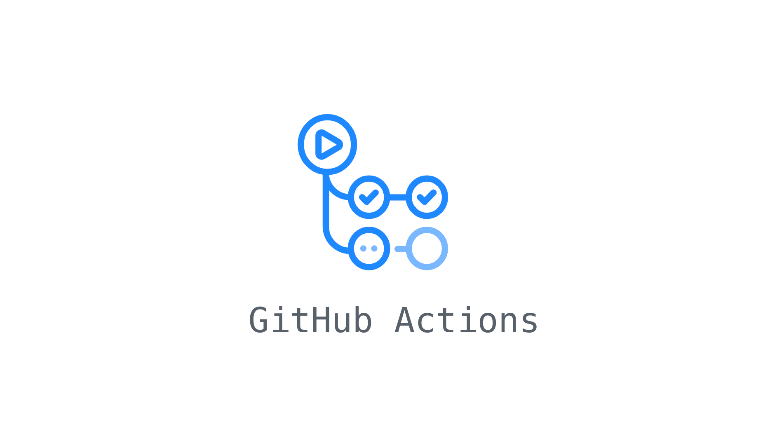
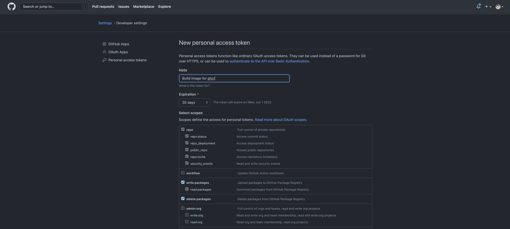
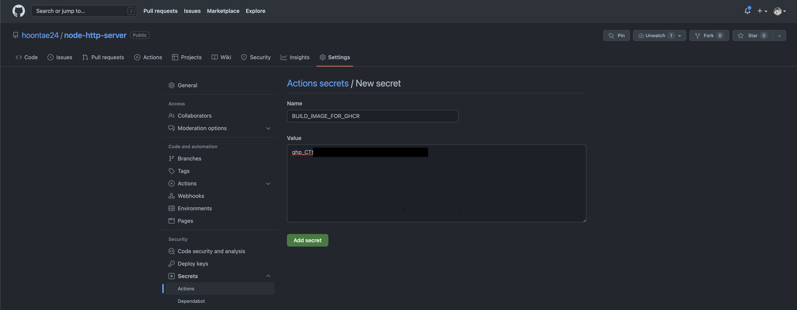
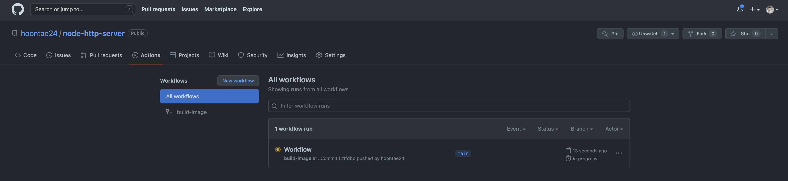
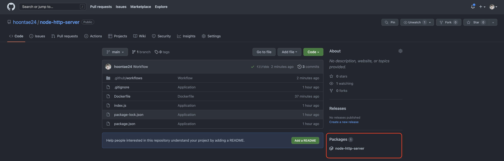
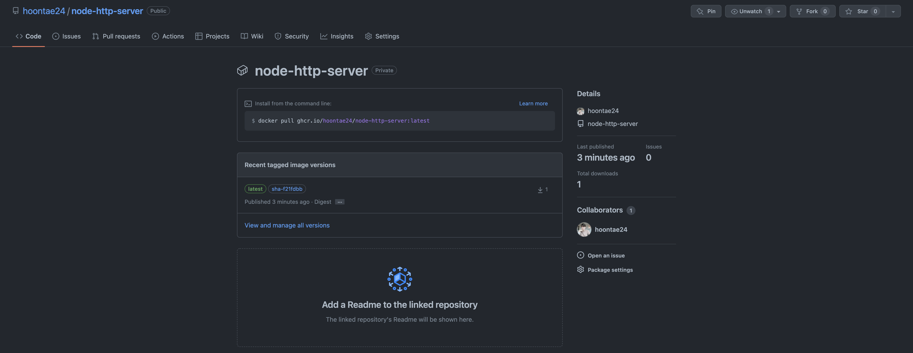
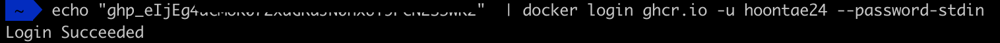
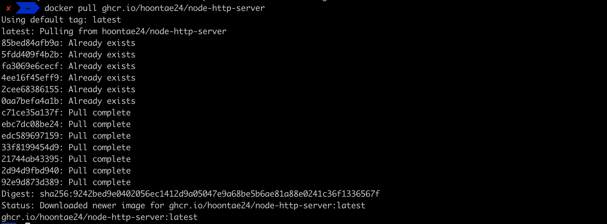
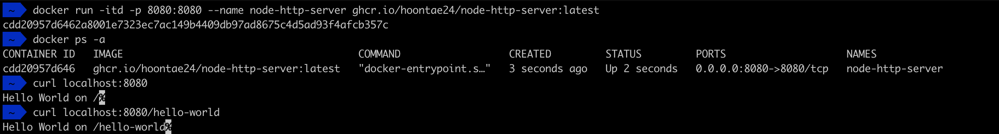

소프트웨어 제품이나 서비스의 운영에 있어 배포는 적지 않게 중요합니다. 특히 운영 규모가 커지거나 많은 사람이 협업하는 경우에는 더욱 강조될 것입니다. 그렇기에 배포 프로세스를 자동화하면 생산성을 높이고, 휴먼 에러를 줄일 수 있습니다.

요즘은 서비스 운영 환경이 컨테이너 기반으로 이루어진 경우도 많이 있습니다. 만약 kubernetes를 사용한다면 필수적입니다. 오늘은 그러한 운영 환경을 위한 배포 프로세스의 일부분이 될 수 있는 이미지 빌드에 대한 작업을 알아보겠습니다. 또한 많은 개발자들이 사용하는 Github에서 제공하는 기능인 Github Actions를 이용하여 이미지 빌드를 자동화해보겠습니다.

> 오늘 다룰 내용에서는 배포를 위한 이미지 빌드 이후에 운영 환경에 배포하는 작업은 포함하지 않습니다.

모든 소스코드는 [이 저장소](https://github.com/hoontae24/node-http-server)에서 보실 수 있습니다.

## 1. 어플리케이션 준비

먼저 배포할 어플리케이션을 준비합니다. Node.js 기반의 간단한 HTTP 서버를 작성합니다. npm 패키지를 포함하기 위해 `lodash`도 추가했습니다.

```js
const http = require("http");
const lodash = require("lodash");

http
  .createServer((request, response) => {
    const url = lodash.get(request, "url");
    console.log("incoming request", url);
    response.end(`Hello World on ${url}`);
  })
  .listen(8080, () => console.log("Server is listening on port 8080"));
```

빌드된 이미지로 컨테이너를 생성할 때, 명령어를 통해 서버를 실행할 수 있도록 `package.json`에 다음 내용을 추가했습니다.

```json
{
  "scripts": {
    "start": "node index.js"
  }
}
```

## 2. Dockerfile 작성

작성된 서버를 docker 이미지로 빌드하려면 Dockerfile을 작성하여 이미지 빌드에 대한 스펙 및 동작을 작성해주어야 합니다. Node.js 이미지를 빌드하기 위한 Dockerfile에 대한 예시는 [여기](https://nodejs.org/ko/docs/guides/nodejs-docker-webapp/)서 참고할 수 있습니다.

```Dockerfile
FROM node:16

WORKDIR /usr/src/app

COPY package*.json ./

RUN npm ci --only=production

COPY . .

EXPOSE 8080

CMD [ "npm", "start" ]
```

작성된 `Dockerfile`이 제대로 빌드되는지 로컬에서 먼저 테스트 해봅니다. 제대로 빌드가 되었다면 이미지 목록에서 확인할 수 있습니다.

```sh
docker build -t node-http-server:latest .

docker images
```

빌드된 이미지를 컨테이너로 실행해봅니다.

```sh
docker run -itd -p 8080:8080 --name node-http-server node-http-server:latest
```

위 명령어로 빌드된 어플리케이션 이미지가 `8080`포트로 개방된 컨테이너로 실행됩니다.

```sh
curl localhost:8080

curl localhost:8080/hello-world
```

`Dockerfile`로 작성된 어플리케이션 이미지는 잘 동작되는 것을 확인했으니, 이제 Github Actions를 사용하여 이미지가 자동으로 빌드되는 방법을 알아보겠습니다.

## 3. Github Token(PAT) 생성 및 등록

docker 이미지를 빌드한 후 저장할 이미지 저장소가 필요합니다. `dockerhub`, `aws ecr`, `ghcr` 등이 있습니다. 이번 글에서는 Github Container Registry인 `ghcr`에 빌드된 이미지를 저장하겠습니다.

`ghcr`에 접근하기 위해서는 Github 계정의 `Personal Access Token`이 필요합니다. Github Actions 또는 다른 자동화 스크립트에서 Github에 접근할 수 있도록 인증을 위한 토큰입니다.

Github에서 `Settings` > `Developer Settings` > `Personal Access Token` 메뉴로 진입하여, `Generate new token`을 선택합니다.



적당한 토큰에 대한 내용을 입력하고 `write:packages`, `read:packages`, `delete:packages` 권한을 선택한 후 토큰을 생성합니다. 생성된 토큰은 복사하여 따로 저장해둡니다.

이제 Github Actions가 실행될 저장소에 토큰을 등록하겠습니다. `Repository's settings` > `Secrets` > `Actions` 메뉴로 진입하여 `New repository secret`을 선택합니다.



## 4. Github workflows 작성

이제 Github Actions를 사용하여 이미지를 빌드하기 위해 저장소에 workflow를 작성합니다. `.github/workflows/build-image.yml` 파일을 생성하고 다음을 작성합니다. 빌드와 이미지 태깅에 대한 부분 모두 marketplace에서 불러와 사용합니다.

```yml
name: build-image

on:
  push:
    branches:
      - main

env:
  REGISTRY: ghcr.io
  IMAGE_NAME: ${{ github.repository }}

jobs:
  build-and-push-image:
    runs-on: ubuntu-latest
    permissions:
      contents: read
      packages: write

    steps:
      - name: Checkout repository
        uses: actions/checkout@v3

      - name: Log in to the Container registry
        uses: docker/login-action@f054a8b539a109f9f41c372932f1ae047eff08c9
        with:
          registry: ${{ env.REGISTRY }}
          username: ${{ github.actor }}
          password: ${{ secrets.BUILD_IMAGE_FOR_GHCR }}

      - name: Extract metadata (tags, labels) for Docker
        id: meta
        uses: docker/metadata-action@98669ae865ea3cffbcbaa878cf57c20bbf1c6c38
        with:
          images: ${{ env.REGISTRY }}/${{ env.IMAGE_NAME }}
          tags: |
            type=sha
          flavor: |
            latest=true

      - name: Build and push Docker image
        uses: docker/build-push-action@ad44023a93711e3deb337508980b4b5e9bcdc5dc
        with:
          context: .
          push: true
          tags: ${{ steps.meta.outputs.tags }}
          labels: ${{ steps.meta.outputs.labels }}
```

각 부분을 간단하게만 짚어 보겠습니다.

```yml
env:
  REGISTRY: ghcr.io
  IMAGE_NAME: ${{ github.repository }}
```

workflow 내에서 사용할 환경변수를 선언합니다. 빌드된 이미지의 이름을 현재 저장소 이름으로 지정합니다.

```yml
permissions:
  contents: read
  packages: write
```

저장소의 컨텐츠에 대한 권한과 패키지에 대한 권한을 지정합니다.([자세히](https://docs.github.com/en/actions/using-jobs/assigning-permissions-to-jobs))

```yml
- name: Log in to the Container registry
  uses: docker/login-action@f054a8b539a109f9f41c372932f1ae047eff08c9
  with:
    registry: ${{ env.REGISTRY }}
    username: ${{ github.actor }}
    password: ${{ secrets.BUILD_IMAGE_FOR_GHCR }}
```

Github Container Registry에 접근할 수 있도록 인증 절차를 진행합니다. 저장소에 등록해둔 PAT를 불러와 로그인합니다.

```yml
- name: Build and push Docker image
  uses: docker/build-push-action@ad44023a93711e3deb337508980b4b5e9bcdc5dc
  with:
    context: .
    push: true
    tags: ${{ steps.meta.outputs.tags }}
    labels: ${{ steps.meta.outputs.labels }}
```

이미지를 빌드하고 로그인된 저장소에 푸시합니다. 이 때, 이미지 태그를 지정해줄 수 있습니다. 여기서는 앞선 step에서 저장소 이름을 사용하도록 지정했습니다.

이제 작성된 workflow 파일을 저장하고 커밋한 뒤 `git push` 명령으로 코드를 푸시합니다. workflow가 푸시되면 Github Actions가 동작합니다. Github 저장소에서 `Actions` 탭을 확인해보겠습니다.



정상적으로 workflow가 성공한다면 해당 저장소의 `packages`에서 빌드된 이미지를 확인할 수 있습니다.





## 5. 빌드된 이미지 Pull 받아 컨테이너로 실행하기

`ghcr`에 올라간 이미지를 수동으로 내려 받아 컨테이너로 실행하여 제대로 빌드된 것인지 확인해보겠습니다. ghcr에 접근하기 위해 앞 단계에서 생성했던 PAT가 필요합니다.

로컬에서 docker 이미지 저장소를 `ghcr.io`로 로그인합니다. `$PAT`에는 PAT를 입력하고, `$USERNAME`에는 github username을 입력합니다.

```sh
echo "$PAT" | docker login ghcr.io -u $USERNAME --password-stdin
```



이제 빌드된 이미지를 Pull하여 내려 받습니다.

```sh
docker pull ghcr.io/hoontae24/node-http-server
```



이제 앞 단계와 같이 컨테이너를 실행해봅니다.

```sh
docker run -itd -p 8080:8080 --name node-http-server ghcr.io/hoontae24/node-http-server:latest
```



`ghcr`로부터 내려받은 이미지가 컨테이너로 잘 동작하는 것을 확인할 수 있습니다.

## 마치며

오늘은 Github Actions를 이용하여 Docker 이미지를 빌드하고 Github Container Registry에 올리는 작업을 진행해봤습니다. 배포 프로세스를 자동화하는 과정 중 일부를 Github Actions를 이용하면 어렵지 않게 진행할 수 있을 것으로 보입니다.

이번에는 편의를 위해 `ghcr.io`에 작업을 하였는데, 자주 사용하는 `dockerhub`나 `aws ecr`에도 적용해보면 좋을 것 같습니다. 또한 이미지 빌드뿐만 아니라 운영 서비스를 업데이트 하는 배포 과정에도 Github Actions를 사용해보면 좋을 것 같습니다.

> 도움을 받은 자료
>
> - https://docs.github.com/en/packages/working-with-a-github-packages-registry/working-with-the-container-registry
