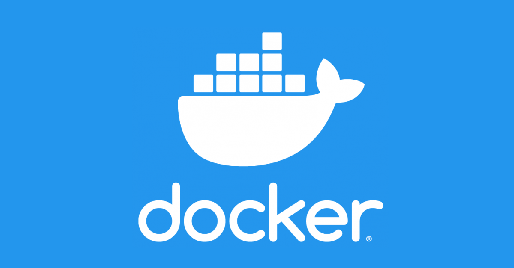
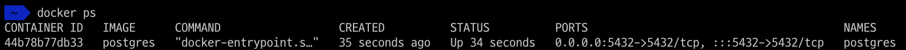
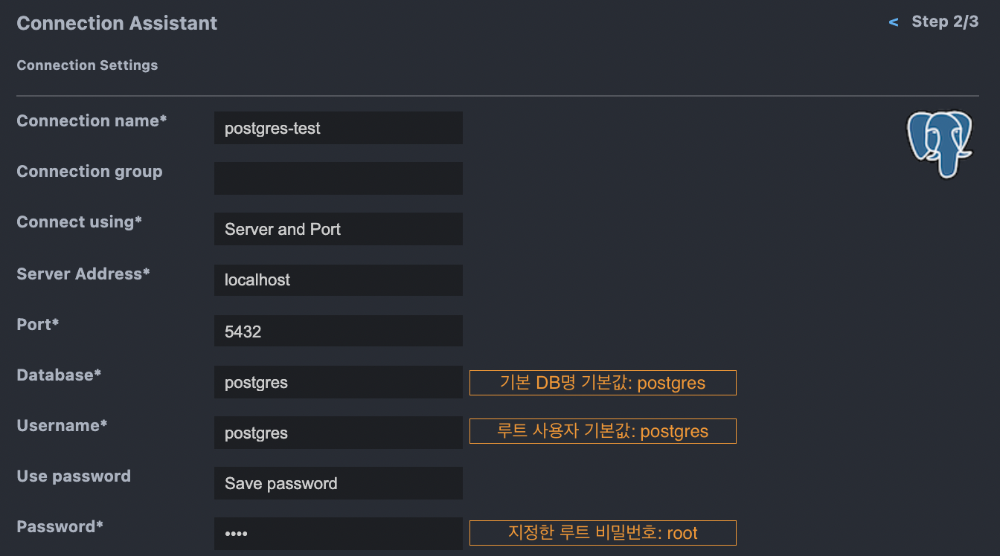
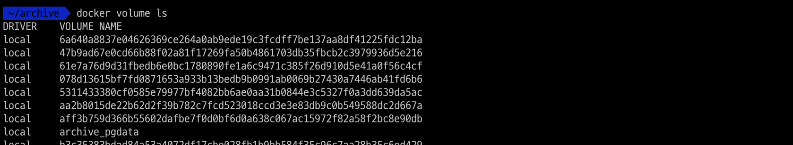

데이터베이스는 로컬 개발환경에서 자주 필요한 것 중 하나일 것입니다. 데이터베이스 서버는 한번 설치하고 서비스로 설정해두면 크게 손이 갈 일이 없긴 하지만, 저는 컴퓨터에 자주 사용하지 않는 프로그램을 설치하는 것이 찝찝하기도 합니다.

이런 데이터베이스 서버를 사용할 때마다 설치 없이 구동하는 방법이 있습니다. 바로 [Docker](https://docker.com)를 이용하여 데이터베이스 서버를 구동하는 것입니다. _(아무것도 설치하지 않는 것은 아닙니다...)_

> TL;DR \
> [docker-compose로 데이터베이스 서버 실행하기](https://hub.docker.com/_/postgres)

> 준비: Docker가 설치되어 있어야 합니다. (환경에 따라 docker 명령어 앞에 `sudo`를 붙여야 할 수도 있습니다.)

## 1. Postgres Docker 컨테이너 실행하기

Docker가 준비되어 있다면 아주 간단하게 `postgres` 서버를 시작할 수 있습니다. 먼저 Postgres에서 제공하는 [Docker 이미지](https://hub.docker.com/_/postgres)를 이용하여 컨테이너를 실행하고, 컨테이너를 시작할 때 몇 가지 환경 변수만 지정해주면 됩니다.

```sh
$ docker run --name postgres -e POSTGRES_PASSWORD=root -p 5432:5432 -d postgres
```

postgres 컨테이너를 실행하기 위해서는 `POSTGRES_PASSWORD` 환경 변수를 필수적으로 주입해야 합니다. 저는 `root`라는 값으로 지정했습니다. 또한 컨테이너 그룹이 아닌 외부망 또는 호스트에서 접근하기 위해서 포트를 `-p 5432:5432` 옵션으로 지정하였습니다.

위 명령어를 실행하면 컨테이너가 실행됩니다. 만약 `postgres` 도커 이미지가 없다면, 자동으로 다운로드 됩니다. 이렇게 실행한 후에 `docker ps` 명령어로 컨테이너를 확인해봅니다.



데이터베이스 서버에 접속하여 구동을 확인하려면 `psql` 등의 DB 클라이언트가 설치되어 있어야 합니다. 하지만 로컬에 설치하기 싫어서 도커 컨테이너를 이용한 것이기 때문에... 저는 이미 설치된 VSCode의 [SQLTools Extension](https://marketplace.visualstudio.com/items?itemName=mtxr.sqltools)을 이용하여 접속해보겠습니다.



로컬에 설치되어 있는 클라이언트 툴이 있다면 다른 것을 사용하셔도 좋습니다.

## 2. docker-compose 이용하기

`docker-compose`를 이용하면 명령어를 따로 기억하지 않아도 항상 같은 설정으로 컨테이너를 실행할 수 있습니다. [postgres docker image](https://hub.docker.com/_/postgres) 페이지에서는 docker-compose 설정과 함께 `adminer` 설정이 포함되어 있습니다.

먼저 `docker-compose.yml` 파일을 작성하고 컨테이너를 실행합니다.

```yml
version: "3.1"

services:
  postgres:
    image: postgres
    container_name: postgres
    restart: always
    ports:
      - 5432:5432
    environment:
      POSTGRES_PASSWORD: root

  adminer:
    image: adminer
    container_name: adminer
    restart: always
    ports:
      - 8080:8080
```

```sh
$ docker-compose -f ./docker-compose.yml up -d
```


두 개의 컨테이너가 실행되었습니다. 이 때, 저는 두 컨테이너를 묶은 `archive_default`라는 `network`가 자동으로 생성되었습니다. `docker-compose.yml` 파일이 `archive` 폴더 내에 위치했기 때문에 `archive`라는 prefix가 붙었는데, `docker-compose -p <project-name>` 옵션으로 직접 지정할 수도 있습니다.

호스트에서는 아까와 같이 접속할 수 있고, `localhost:8080`으로 접속하면 `adminer`를 사용할 수 있습니다. 이때 `adminer`에서는 Postgres 서버 컨테이너 이름을 `host`로 지정해야 접속할 수 있습니다. 도커 컨테이너 간 통신에 대해 더 알아보시려면 [여기](https://docs.docker.com/network/bridge/)를 참고하거나 도커 네트워크 설정을 살펴보시면 됩니다.

### 볼륨을 지정하여 데이터 관리하기

지금은 컨테이너 내부에서만 데이터가 저장되므로 컨테이너가 삭제되면 데이터도 유실됩니다. 컨테이너에 볼륨을 지정하여 데이터베이스에서 저장되는 데이터만 따로 보존할 수 있습니다.

`docker-compose.yml` 파일을 수정하여 `volume` 속성을 추가하겠습니다.

```yml
version: "3.1"

services:
  postgres:
    image: postgres
    container_name: postgres
    restart: always
    ports:
      - 5432:5432
    volumes:
      - pgdata:/var/lib/postgresql/data
    environment:
      POSTGRES_PASSWORD: root

  adminer:
    image: adminer
    container_name: adminer
    restart: always
    ports:
      - 8080:8080

volumes:
  pgdata:
```

이제 컨테이너를 종료 후 다시 시작하거나 바로 재시작하면 데이터를 볼륨에 저장합니다.

```sh
$ docker-compose -f ./docker-compose.yml down # 컨테이너 종료(Optional)
$ docker-compose -f ./docker-compose.yml up -d # 컨테이너 시작
```

볼륨을 지정하고 컨테이너를 시작하면 처음 시작할 때 자동으로 볼륨을 생성합니다. 아래 명령을 통해 자동 생성된 `archive_pgdata` 볼륨을 확인할 수 있습니다.

```sh
$ docker volume ls
```



볼륨에 제대로 데이터가 저장되는지 아래 순서로 테스트해보세요:

1. 클라이언트로 접속하여 임의의 데이터베이스를 하나 생성한다.
2. 컨테이너를 종료 후 다시 시작한다. (`down`, `up` 명령)
3. 클라이언트로 접속하여 `1`에서 생성한 데이터베이스가 존재하는지 확인한다.
4. (위 과정을 볼륨을 지정하지 않은 설정으로 반복하여 비교해보세요.)

## 마치며

이번 글에서는 도커를 이용하여 간단히 데이터베이스 서버를 구동하는 법을 알아보았습니다. docker-compose 파일을 정의해두면 재설치나 버전 업그레이드할 때에도 도커 컨테이너만 변경하면 됩니다. 데이터베이스 서버가 구동되는 환경과 데이터를 완벽히 분리하여 관리할 수 있습니다.

예제에서는 Postgres를 사용했지만 [mysql](https://hub.docker.com/_/mysql), [mariadb](https://hub.docker.com/_/mariadb), [mongodb](https://hub.docker.com/_/mongo) 등 다양한 데이터베이스를 간단하게 세팅할 수 있습니다. 데이터베이스 설정에 스트레스받지 않고 간단한 방법으로 개발 경험에 도움이 되었기를 바랍니다.
