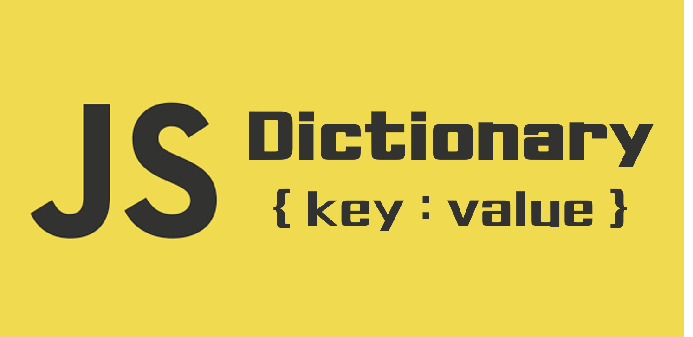
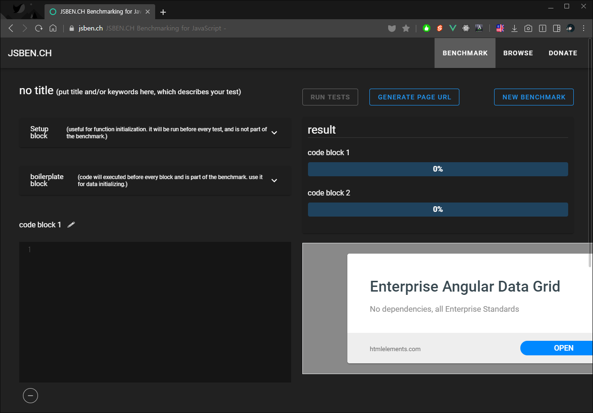
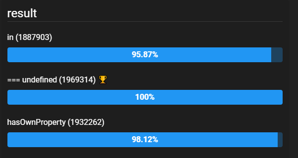
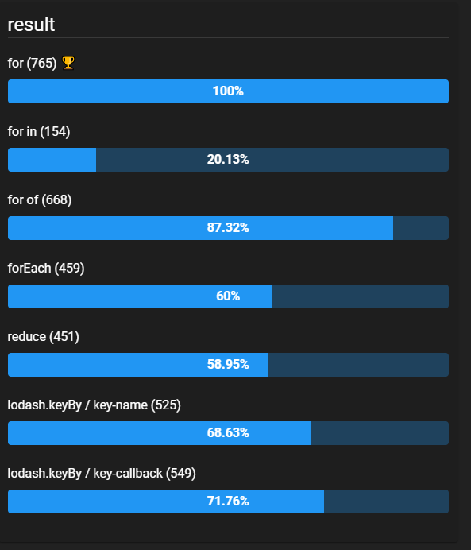

자바스크립트 개발을 하면서 여러가지 자료구조를 사용하게 됩니다. 가장 많이 쓰이는 것은 역시 `Array(배열)`이겠죠? 그리고 데이터에 맞게 `Object(객체)`를 만들어 사용하기도 합니다. `Prototype`을 이용하거나, `ES6`의 `Class` 문법을 통해 객체 생성자를 만들어 사용하기도 합니다.

오늘 포스트에서 살펴볼 자료구조는 바로 `Dictionary`입니다. `Dictionary`는 자바스크립트에는 없는 자료형 이름인데, `Object(객체)`와 동일합니다. `key`, `value` 쌍으로 이루어진 객체를 통해 데이터를 취급하는 자료구조입니다. `파이썬`에서는 `Dictionary`라고 부르기도 하죠. 제가 `Dictionary`라고 부르는 이유는 바로 사용 목적에 있습니다. `key`를 이용하여 데이터를 취급하는 객체라는 것을 명시적으로 나타내기 위해 `Dictionary`라고 명명하도록 하겠습니다.

---

### 언제 사용할까?

`Dictionary`는 언제 사용할까요? 여러가지 상황에서 사용할 수 있지만 오늘은 배열에 있는 항목을 `index`가 아닌 다른 값으로 접근하고자 할 때, `Dictionary`를 만들어 사용해 보도록 하겠습니다.

먼저 다음과 같은 배열이 있다고 합시다.

```js
const items = [
  { id: 1, name: "banana" },
  { id: 2, name: "apple" },
  { id: 3, name: "orange" },
  // ...
];
```

`items`배열의 항목은 `index`를 이용하여 바로 접근할 수 있지만, `index`를 알지 못하고 `id`를 통해 접근해야 한다면 어떻게 할까요? 만약 배열이 크지 않거나, 자주 하는 작업이 아니라면 다음과 같이 할 수도 있을겁니다.

```js
const itemId = 1;
const item = items.find((item) => item.id === itemId);
```

하지만 위 작업은 실행할 때 마다 `O(n)`의 시간복잡도를 가지게 됩니다. 이 작업이 반복된다면 꽤 부담스러울 수도 있습니다. 그래서 `id`를 `key`로 하는 딕셔너리를 만들어서 사용합니다. `items`를 딕셔너리로 만들면 다음과 같습니다.

```js
// item의 id를 key로 가지는 딕셔너리
const itemDict = {
  1: { id: 1, name: "banana" },
  2: { id: 2, name: "apple" },
  3: { id: 3, name: "orange" },
};
```

---

### 딕셔너리 만들기

딕셔너리를 만드는 방법은 아주 간단합니다. 객체를 만들고 `id`를 `key`로 하는 값을 할당해주면 됩니다.

```js
const itemDict = {};
for (let i = 0; i < items.length; i++) {
  const item = items[i];
  itemDict[item.id] = item;
}
```

간단한 반복 작업이기 때문에 `for`문이 아닌 다른 방법을 이용할 수도 있습니다. `items`의 항목이 많거나 각 항목이 복잡한 구조라면 딕셔너리를 만드는 것도 부담이 될 수 있습니다. 그래서 어떤 방법으로 딕셔너리를 만드는 것이 빠르고 적은 부담인지 알아보도록 하겠습니다.

---

### 여러가지 방법 비교해보기

##### JSBen.ch 이용하기



[JSBen.ch](https://jsben.ch/)는 여러가지 케이스를 생성하여 비교해볼 수 있는 자바스크립트 벤치마킹 서비스입니다. **BROWSE** 탭을 열어보면 다른 벤치마크 테스트들을 볼 수 있습니다. 가장 views가 많은 **check object key**의 결과를 다음과 같이 한 눈에 볼 수 있습니다.



#### Setup Block 작성하기

벤치마크에 사용될 기본적인 초기값을 설정해줍니다. 벤치마크 테스트에는 포함되지 않습니다. 딕셔너리로 만들 `items` 배열을 초기화해줍니다.

```js
const itemCount = 100000;
const items = new Array(itemCount).fill(true).map((_, i) => {
  return { id: i + 1, value: Math.random() };
});
```

#### 테스트 케이스

딕셔너리를 만드는 테스트 케이스를 각 코드블럭에 작성하겠습니다.

##### 1. for

```js
const result = {};
for (let i = 0; i < itemCount; i++) {
  result[items[i].id] = items[i];
}
```

##### 2. for in

```js
const result = {};
let i;
for (i in items) {
  result[items[i].id] = items[i];
}
```

##### 3. for of

```js
const result = {};
let item;
for (item of items) {
  result[item.id] = item;
}
```

##### 4. forEach

```js
const result = {};
items.forEach((item) => (result[item.id] = item));
```

##### 5. reduce

```js
const result = items.reduce((res, item) => {
  res[item.id] = item;
  return res;
}, {});
```

##### 6. lodash keyBy / key-name

```js
const result = _.keyBy(items, "id");
```

##### 7. lodash keyBy / key-callback

```js
const result = _.keyBy(items, (item) => item.id);
```

#### 벤치마크 테스트하기

이제 테스트 케이스가 작성했으니, 테스트를 실행해 보겠습니다. 다음과 같은 결과가 나왔습니다.



가장 단순한 `for`문이 가장 빠른 결과를 보여줍니다. `for in`문은 상대적으로 많이 느린 동작을 보여줍니다. `Array`의 메소드인 `forEach`와 `reduce`는 비슷한 속도를 가지고 있고, `lodash.keyBy`도 방식은 달라도 비슷한 속도를 보여줍니다.

---

### 마무리

`Dictionary` 만들기라는 주제로 자바스크립트 반복문의 성능에 대해 간단히 알아보았습니다. 실제 개발을 할 때는 `for`문 보다 `reduce`나 `map`같이 `Array`메소드를 많이 활용하는데, 상황에 따라 필요한 것을 사용해야 할 것 같습니다. 간단한 작업이라면 성능을 많이 요구하지 않을테니 아무거나 사용해도 괜찮겠지만요.

여기까지 구문에 따라 다른 성능을 보여주는 여러가지 반복문에 대해 알아보았습니다. 다음에 기회가 된다면 각 구문에 왜 다른 성능을 보여주는지, 어떤 상황에서 어떤 방법이 유리한 지 분석해보는 시간도 가져보겠습니다.
