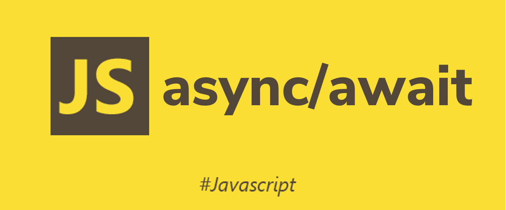
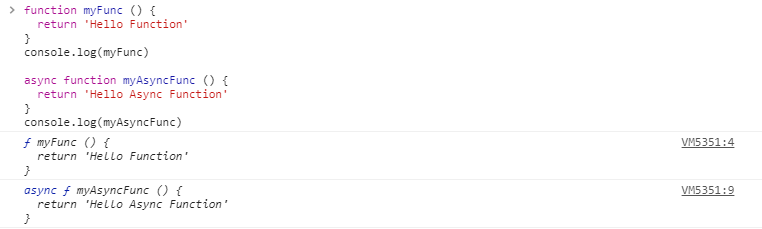
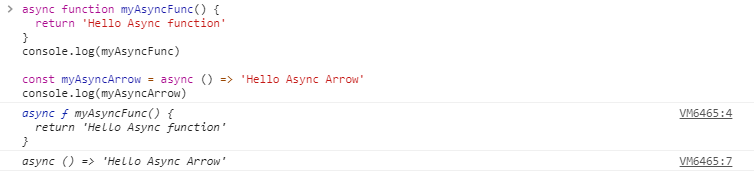
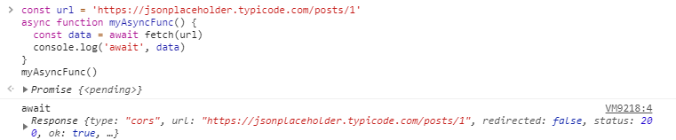

안녕하세요. 오늘은 자바스크립트의 비동기 처리를 다루는 async/await 문법에 대해 알아보겠습니다. 지난 글에서 다루었던 [Promise](6)와 함께 자바스크립트의 비동기 패턴 중 하나입니다. 또한 async/await 패턴은 **Promise**를 기반으로 하고 있습니다. 혹시 아직 **Promise**에 대해 모르신다면 이 글들을 추천드립니다.

> [자바스크립트 Promise 쉽게 이해하기 • Captain Pangyo](https://joshua1988.github.io/web-development/javascript/promise-for-beginners/)  
> [Promise - MDN - Mozilla](https://developer.mozilla.org/ko-KR/docs/Web/JavaScript/Reference/Global_Objects/Promise)

---

## 1. async/await 문법 살펴보기

**async/await**는 ECMAScript 2017부터 추가된 문법입니다. **Promise**를 살펴볼 때, 하나의 객체로 취급했었습니다. 그래서 **Promise**가 자바스크립트 표준으로 정의되기 전에도 커스텀으로 구현되어 사용되어지고 있었습니다. 하지만 **async/await**는 하나의 문법이기 때문에 라이브러리나 모듈이 아닌 자바스크립트 새로운 키워드를 사용합니다.

**async/await**는 새로운 문법이기 때문에 최신 버전의 자바스크립트를 지원하지 않는 런타임에서는 구동할 수 없습니다. 오늘의 예제 코드는 Chrome 브라우저에서 실행되는 코드이며, Chrome에서는 **async/await**문법을 지원합니다.

&nbsp;

### 1-1. async function(비동기 함수) 정의하기

> async function 선언은 AsyncFunction객체를 반환하는 하나의 비동기 함수를 정의합니다. [_(출처: MDN)_](https://developer.mozilla.org/ko/docs/Web/JavaScript/Reference/Statements/async_function)

`async` 키워드를 이용하여 함수를 선언하면 `AsyncFunction`객체를 만들 수 있습니다. 코드를 함께 보겠습니다.

```js
function myFunc() {
  return 'Hello Function'
}
console.log(myFunc)

async function myAsyncFunc() {
  return 'Hello Async Function'
}
console.log(myAsyncFunc)
```

기존 `function`키워드로 선언한 함수와 `async function`키워드로 선언한 함수를 비교해 보겠습니다. 출력 로그를 확인해 보세요.



`async function`키워드로 선언한 함수는 `async f`로 표시되는 것을 볼 수 있습니다. 화살표 함수로도 선언할 수 있습니다.

```js
async function myAsyncFunc() {
  return 'Hello Async function'
}
console.log(myAsyncFunc)

const myAsyncArrow = async () => 'Hello Async Arrow'
console.log(myAsyncArrow)
```



&nbsp;

### 1-2. await 키워드와 함께 사용하기

> await 연산자는 async function 내부에서만 사용할 수 있습니다. [_(출처: MDN)_](https://developer.mozilla.org/ko/docs/Web/JavaScript/Reference/Operators/await)

`await`키워드는 `async function`내부에서만 사용되어집니다. 만약 `async function`밖에서 사용한다면 문법이 틀렸다고 판단해 `SyntaxError`를 발생합니다.

`await`키워드는 `promise`를 기다리기 위해 사용됩니다. 즉, `async function` 내부에서 `promise`의 비동기 작업을 기다리기 위해 `await`키워드를 사용합니다. 코드를 보겠습니다.

```js
// 브라우저에 내장된 fetch함수를 이용해 비동기 작업을 수행합니다.
// fetch함수는 URL로부터 데이터를 가져와서 promise를 반환합니다.
// fetch('https://jsonplaceholder.typicode.com/posts/1')

const url = 'https://jsonplaceholder.typicode.com/posts/1'
async function myAsyncFunc() {
  const data = await fetch(url)
  console.log('await', data)
}
myAsyncFunc()
```



콘솔에서 실행해 보면 `Response`객체가 출력되는 것을 볼 수 있습니다. `fetch API`를 통해 불러온 데이터가 출력되는 것입니다. `fetch`함수에서 비동기 작업이 이루어지고, `await`키워드가 붙었기 때문에 `async function`내에서 해당 작업을 기다립니다.

만약 위와 같은 작업을 `promise`패턴으로 코드를 작성하면 다음과 같을 것입니다.

```js
const url = 'https://jsonplaceholder.typicode.com/posts/1'
function myFunc() {
  fetch(url).then(data => {
    console.log(data)
  })
}
```

아직 코드의 양이나 로직이 이해되는 것에 크게 차이가 있지 않아 보입니다. 하지만 비동기 작업이 많아지거나 함수의 코드가 길어지면 `await`키워드를 이용하여 조금 더 가독성이 좋은 직관적인 코드를 작성할 수 있습니다.
_(Promise와 async/await는 비동기 작업을 다루는 패턴 중 하나입니다. 개인 취향에 따라 다르게 평가될 수 있습니다.)_

비동기 작업이 여러 번 반복된다면 더 진가를 발휘한다고 생각합니다.

```js
const userDataUrl = 'https://jsonplaceholder.typicode.com/users/1'
const postDataUrl = 'https://jsonplaceholder.typicode.com/posts/1'

// promise 패턴
function myFunc() {
  fetch(userDataUrl)
    .then(res => res.json())
    .then(user => {
      console.log(user)
    })
  fetch(postDataUrl)
    .then(res => res.json())
    .then(post => {
      console.log(post)
    })
}
myFunc()

// async/await 패턴
async function myAsyncFunc() {
  const user = await fetch(userDataUrl).then(res => res.json())
  const post = await fetch(postDataUrl).then(res => res.json())

  console.log(user)
  console.log(post)
}
myAsyncFunc()
```

위 코드에서 `console.log`부분의 작업이 단순히 출력이 아니라고 생각해보세요. `user`데이터와 `post`데이터를 함께 다루어야 한다면 `promise`패턴보다 `async/await`패턴으로 더 직관적인 코드를 작성할 수 있을 것입니다.

---

&nbsp;

## 2. async/await 이해 & 응용하기

새로운 문법이라 하더라도 자바스크립트의 비동기 처리의 코어 내부적인 동작이 크게 달라진 것은 아닙니다. 그럼 어떻게 async/await이 동작하는지 이해하고 비동기 작업을 다양한 상황에서 잘 다룰 수 있게 살펴봅시다.

&nbsp;

### 2-1. async function 이해하기

`await`키워드가 `promise`를 기다리는 동작이 마치 프로그램이 정지된 것처럼 느껴질 수 있습니다. 하지만 `promise.then`함수처럼 다음 동작이 완료되는 것을 기다리는 것뿐입니다. `await`키워드가 `async function` 내부에서만 사용할 수 있다는 것을 기억하세요. `await`키워드가 `promise`를 기다릴 수 있는 이유는 `async function`이 이미 `promise`를 반환하기 때문입니다. 코드를 통해서 동작을 이해해 봅시다.

```js
async function myAsyncFunc() {
  const result = await new Promise(res => {
    setTimeout(res, 1000, 'hello')
  })
  console.log(result)
  return result
}
console.log(myAsyncFunc())
console.log('Finish')
```

위 코드의 순서를 한번 보세요. `async function`인 `myAsyncFunc`을 호출하면서 동시에 반환값을 출력해보면 `Promise {<pending>}`이 출력됩니다. 그 후에 `Finish`가 출력되고, 1초 후에 `hello`가 출력됩니다.

출력순서:

- `Promise {<pending>}`
- `Finish`
- `Hello`

`async function`이 호출되면 즉시 `promise`가 반환됩니다. 위 코드에서 `myAsyncFunc()`로 함수를 호출하고 나면 메인 콜스택에서는 `promise`를 반환받고, 내부의 동작에는 신경쓰지 않습니다. `async function` 내부의 `await`의 기다림 동작에서도 메인 프로세스는 멈추지 않고 동작할 수 있습니다.

또한 `async function`에서 `return`되는 값을 그 `promise`의 `resolved`로 전달됩니다. 그렇기 때문에 `return` 구문에서는 `await` 키워드를 사용할 필요가 없습니다.

```js
async function myAsyncFunc() {
  return 'Done'
}
const result = myAsyncFunc()
result.then(console.log)
console.log(result)
```

&nbsp;

### 2-2. await 이해하기

`await`키워드가 사용되는 문법은 이러한 형태입니다.

```js
async function myAsyncFunc() {
  await someAsyncFunc()
  // or
  await somePromise
  // or
  await someValue
}
```

`await`는 `promise`를 기다린 후에 반환하지만, 꼭 `promise`가 아닌 `어떤 값`일 수도 있습니다.

```js
function getPromise() {
  return new Promise(res => setTimeout(res, 1000, 'promise'))
}
async function myAsyncFunc() {
  const someCondition = Math.random() > 0.5
  const result = await (someCondition ? getPromise() : 'Done')
  console.log(result)
}
myAsyncFunc()
```

위 코드를 여러 번 실행해 보면, 실행할 때 마다 다른 결과를 얻을 수 있습니다. `someCondition`에 따라 `await`키워드는 `promise`를 받을 수도, `Done`이라는 값을 받을 수도 있습니다. 만약 `promise`라면 해당 동작을 기다린 후에 값을 `result`에 전달합니다.

이러한 특징을 이용해서 어떠한 값에 대해 `promise`이든 `어떤 값`이든 유연하게 처리할 수 있습니다.

### 2-3. async/await와 promise 응용하기

`async function`내에서 `await`를 이용하여 원하는 시점에 결과값을 다룰 수 있습니다. 다음 코드를 봅시다.

```js
function delay(time, msg) {
  return new Promise(res =>
    setTimeout(() => {
      console.log(msg)
      res(msg)
    }, time),
  )
}
async function myAsyncFunc() {
  const result1 = await delay(1000, 'Hello')
  const result2 = await delay(2000, 'Async')
}
myAsyncFunc()
```

`dealy`함수는 입력된 시간후에 `msg`를 출력하는 함수입니다. 비동기 작업인 `delay`함수를 호출할 때마다 `await`를 붙여주었습니다. 위 코드의 실행 순서는 먼저 1초를 기다린 후 `Hello`가 출력되고, 2초후에 `Async`가 출력됩니다. 두번째 `delay`함수가 호출되기 위해서 앞선 `delay`함수가 끝날 때까지 `await`로 인해 기다리게 됩니다. 동작이 완료되기 위해서는 총 3초의 시간이 소요됩니다.

만약 두 개의 비동기 작업이 서로 관련이 없이 독립적으로 동작해도 괜찮다면 이렇게 코드를 수정할 수 있을 것입니다.

```js
function delay(time, msg) {
  return new Promise(res =>
    setTimeout(() => {
      console.log(msg)
      res(msg)
    }, time),
  )
}
async function myAsyncFunc() {
  const _result1 = delay(1000, 'Hello')
  const _result2 = delay(2000, 'Async')
  const result1 = await _result1
  const result2 = await _result2
}
myAsyncFunc()
```

이전의 순서와 다른 점을 찾으셨나요? `delay`함수를 호출하는 순서는 같지만, 두번째 `delay`함수가 호출되기 위해서 첫번째 `delay`함수를 기다리지 않습니다. 그렇기 때문에 두 개의 `delay`함수가 지연없이 연속적으로 호출됩니다. 출력 시간도 1초 후에 `Hello`가 출력되고, 또 1초후에 `Async`가 출력됩니다. 총 소요 시간은 2초 정도의 시간이 소요됩니다.

이렇게 비동기 작업이 서로 연관이 없거나, 독립적인 요청으로 데이터를 불러올 수 있는 상황이라면 필요한 시점에 `await`를 사용하면 됩니다. 또 `Promise` 메소드를 이용하면 이렇게 표현할 수도 있습니다.

```js
function delay(time, msg) {
  return new Promise(res =>
    setTimeout(() => {
      console.log(msg)
      res(msg)
    }, time),
  )
}
async function myAsyncFunc() {
  const _result1 = delay(1000, 'Hello')
  const _result2 = delay(2000, 'Async')
  const [result1, result2] = await Promise.all([_result1, _result2])
}
myAsyncFunc()
```

---

&nbsp;

### 3. async/await 예외 처리하기

`async function`에서 **예외 처리**방법은 `try/catch`를 이용합니다.

```js
const url = 'https://jsonplaceholder.typicode.com'
const getData = async (field, id) => {
  const _id = id ? `/${id}` : ''
  return fetch(`${url}/${field}${_id}`).then(res => res.json())
}
async function myAsyncFunc() {
  try {
    const posts = await getData('posts')
    console.log(posts)
  } catch (e) {
    console.error(e)
  }
}
myAsyncFunc()
```

`async function`내에서 발생하는 오류에 대해 위와 같이 처리할 수 있습니다. 비동기에 대한 오류 뿐만 아니라 일반적인 오류도 처리할 수 있습니다. 만약 `await`가 기다리는 `promise`인 `getData`함수가 `rejected`를 반환한다면 오류가 발생하게 됩니다.

```js
const url = 'https://jsonplaceholder.typicode.com'
async function myAsyncFunc() {
  const posts = await fetch(`${url}/posts`).then(res => res.json())
  throw new Error('Error in Async!!')
  console.log(posts)
}
myAsyncFunc()
  .then(() => console.log('Done'))
  .catch(e => console.log(e))
```

만약 `async function`에서 에러를 처리해주지 않으면 `async function`이 반환하는 `promise`가 `rejected`상태와 오류를 반환해줍니다. 이 경우에는 `async function`이 호출된 부분에서 에러를 처리해주어야 합니다.

&nbsp;

## 마무리

자바스크립트의 비동기 처리에 대해 알아보았습니다. **async/await**를 이용하면 조금 더 직관적인 코드를 작성할 수 있을 것입니다.

특히 **Promise**를 기반으로 하고 있기 때문에, 직관적이면서도 비동기 작업을 단순히 동기적으로 보여지는 가독성만 높이는 것이 아니라, 하나의 값으로 다루면서 유연하게 처리할 수 있도록 공부해야겠습니다.
