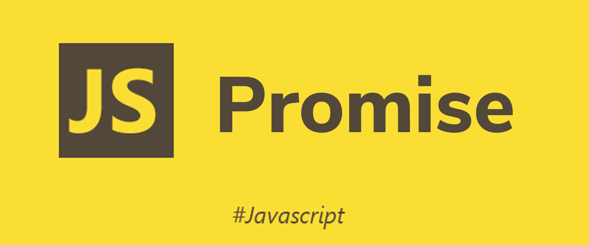

오늘은 자바스크립트에서 비동기 처리를 다루는 **Promise**에 대해 알아보겠습니다.

## 1. Promise? 왜 필요할까요?

자바스크립트 코드가 동작할 때, 어떠한 작업을 기다리게 된다면 어떻게 될까요? 만약 브라우저에서 실행되는 코드라면 웹 페이지의 동작이 멈추게 될 것입니다. 특히 웹 페이지에서는 1-2초의 먹통에도 사용자는 답답함을 느끼게 됩니다. 개발자는 이러한 상황을 만들지 않고 싶을 것입니다.

자바스크립트는 그러한 상황에서 그 작업을 기다리지 않고 다음 작업을 수행하는 특성을 가지고 있습니다. 그래서 즉시 응답을 보장하지 못하는 경우에는 따로 비동기를 위한 처리를 해주어야 합니다. 대표적인 방법으로 기존에 많이 쓰였던 **Callback**함수를 이용한 패턴이 있습니다.

예시 코드를 통해서 **Callback**함수를 사용하는 방식을 간단히 짚어보겠습니다.

```js
// getUsers: 사용자 목록을 불러오는 함수
getUsers(users => {
  console.log(users)
})
```

`getUsers`라는 함수를 통해 사용자의 데이터를 불러오는 작업을 가정해봅시다. 불러오는 값이 즉시 반환되지 못하고, API서버나 DB 등에서 불러오는 작업을 한다면 비동기 작업으로 이루어집니다. `getUsers` 내부에서는 불러온 `users` 데이터를 `Callback`함수의 인자로 전달해 주어, 해당 데이터를 다룰 수 있게 됩니다.

만약 이러한 작업이 여러 개이면 어떨까요?

```js
// getUsers: 사용자 목록을 불러오는 함수
// getPosts: 게시글 목록을 불러오는 함수
// getComments: 댓글 목록을 불러오는 함수
getUsers(users => {
  getPosts(posts => {
    getComments(comments => {
      console.log(users, posts, comments)
    })
  })
})
```

위와 같이 비동기 작업이 연속적으로 여러 개라면 콜백 안의 콜백으로 이루어져 조금 더 복잡해 보입니다. 또 다른 경우를 봅시다.

```js
// getUsers: 사용자 목록을 불러오는 함수
// getPosts: 게시글 목록을 불러오는 함수
// getComments: 댓글 목록을 불러오는 함수
const data = {}
function doSomething() {
  const { users, posts, comments } = data
  if (!users || !posts || !comments) return
  // do something with users, posts, comments...
}

getUsers(users => {
  data.users = users
  doSomething()
})
getPosts(posts => {
  data.posts = posts
  doSomething()
})
getComments(comments => {
  data.comments = comments
  doSomething()
})
```

이번에는 세가지의 비동기 작업이 병렬적으로 진행됩니다. 하지만 세가지 데이터를 한번에 다룰 작업이 필요하다면 코드가 복잡해지고, 가독성도 떨어지게 됩니다.

## 2. 그럼... Promise 어떻게 사용할까요?

이제 본격적으로 **Promise**에 대해 알아보겠습니다. **Promise**는 콜백 방식에 비해 비동기 작업을 조금 더 유연하게 다룰 수 있습니다.

> Promise 개체는 비동기 작업이 맞이할 미래의 완료 또는 실패와 그 결과 값을 나타냅니다.
> [_(출처: MDN)_](https://developer.mozilla.org/ko/docs/Web/JavaScript/Reference/Global_Objects/Promise)

**Promise**는 비동기 작업을 하나의 객체로 다루는 개념입니다. 단순히 **Callback**보다 깔끔한 코드를 위해서가 아니라 작업 자체를 값으로 생각하는 것입니다.

### 2.1 Promise 객체 생성하기

그럼 **Promise**가 어떻게 사용되어지고, 동작하는지 한번 알아봅시다.

```js
const promise = new Promise((resolve, reject) => {
  // ... do something with async process
  resolve('완료!')
})
console.log(promise) // output: Promise {<resolved>: "완료!"}
```

`Promise`는 `new Promise()`를 통해 객체를 생성합니다. 생성자의 인자로 넘겨준 `executor(callback)`함수에서 `resolve`를 호출하여 작업을 처리합니다. 그렇게 출력되어진 결과는 `완료!`라는 값을 가진 `Promise` 객체입니다.

### 2.2 Promise의 상태

- 대기(pending): 이행하거나 거부되지 않은 초기 상태
- 이행(fulfilled): 연산이 성공적으로 완료됨
- 거부(rejected): 연산이 실패함

**Promise**는 위와 같은 세가지 중 하나의 상태를 가집니다. 위의 코드에서 `new Promise()`에 전달한 함수에서 첫번째 인자인 `resolve`를 호출하면 **이행(fulfilled)** 상태가 됩니다. 만약 두번째 인자인 `reject`를 호출하면 **거부(rejected)** 상태가 됩니다. 그리고 주석 처리된 부분에서 비동기 작업이 아직 진행 중이면 아직 `resolve`나 `reject`를 호출하지 않았기 때문에 **대기(pending)** 상태가 됩니다.  
_(**대기** 중이지 않으며 **이행** 또는 **거부** 상태가 된 것을 **처리(settled)** 라고 부르기도 합니다.)_

```js
const pending = new Promise((resolve, reject) => {
  setTimeout(() => resolve('대기!'), 1000)
})
const fulfilled = new Promise((resolve, reject) => {
  resolve('완료!')
})
const rejected = new Promise((resolve, reject) => {
  reject('거부!')
})

console.log(pending) // output: Promise {<pending>}
console.log(fulfilled) // output: Promise {<resolved>: "완료!"}
console.log(rejected) // output: Promise {<rejected>: "거부!"}
setTimeout(() => console.log(pending), 1000) // output: Promise {<resolved>: "대기!"}
```

`Promise` 객체를 콘솔에 출력해보면 각각의 상태와 값을 볼 수 있습니다. `pending`의 경우에는 처음에는 `대기`상태였지만, 1초 후에 출력하면 `이행`상태가 되어 있는 것을 확인할 수 있습니다.

이렇게 `Promise` 객체를 통해 비동기 작업을 코드의 순서와 관계없이 객체에 담아서 다룰 수 있습니다. 하지만 `Promise` 객체 자체를 데이터로 사용할 순 없으니, `이행` 또는 `거부`된 `Promise` 객체에서 값을 꺼내 다루는 법을 알아보겠습니다.

### 2.3 Promise 사용하기

`Promise`객체는 다음과 같은 메소드를 가집니다. 메소드를 호출하여 `Promise`객체에 담긴 값을 다룰 수 있습니다.

- then: Promise에 이행 또는 거부에 대한 처리기(callback)를 추가합니다.
- catch: Promise에 거부에 대한 처리기(callback)를 추가합니다.
- finally: Promise가 처리(settled)되면 무조건 실행되는 처리기(callback)를 추가합니다.

```js
const promise = new Promise((res, rej) => {
  // 무언가 비동기 작업...
  const data = { users: ['Jason', 'Conan'] }
  if (data) {
    res(data)
  } else {
    rej(new Error('data가 없어요'))
  }
})

promise
  .then(value => {
    console.log(value.users) // output: ['Jason', 'Conan']
  })
  .catch(err => {
    console.error(err)
  })
```

위의 3가지 메소드는 모두 `Promise`객체를 반환합니다. `then`과 `catch`는 콜백함수의 반환값이 담긴 `이행(fulfilled)`된 `Promise`가 반환됩니다. `finally`는 콜백 함수에서 에러가 발생하면 `거부`된 `Promise`가 반환되고, 그렇지 않으면 `finally`가 호출된 `Promise`가 반환됩니다.

`Promise`의 메소드는 값의 변경이 있든 아니든 다시 `Promise`를 반환하기 때문에 메소드 체이닝(Chaining)이 가능합니다. 이미 위의 `then`과 `catch`를 이어서 호출한 것도 그때문에 가능합니다.

```js
const promise = new Promise((res, rej) => {
  // 무언가 비동기 작업...
  const data = { users: ['Jason', 'Conan'] }
  if (data) {
    res(data)
  } else {
    rej(new Error('data가 없어요'))
  }
})

promise
  .then(value => {
    return new Promise(res => {
      // 무언가...
      res(value.users)
    })
  })
  .then(users => {
    return new Promise(res => {
      // 비동기...
      res(users.map(user => user.length))
    })
  })
  .then(counts => {
    // 작업...
    console.log(counts) // output: [5, 5]
  })
  .catch(err => {
    console.error(err)
  })
```

이렇게 `Promise`의 체이닝을 이용해서 연속적인 비동기 작업을 처리할 수 있습니다. 위의 코드에서는 `new Promise()`를 선언하여 객체를 생성했지만, 비동기 작업에 대한 코드를 미리 `Promise`객체를 반환하는 라이브러리를 사용하거나 함수를 선언해두면 더 보기 좋게 코드를 작성할 수 있습니다.

### 2.4 Promise 메소드 더 알아보기

`Promise`에는 자체 메소드가 몇가지 있습니다.

- Promise.all()
- Promise.race()
- Promise.resolve()
- Promise.reject()

#### 2.4.1 Promise.all

`Promise.all()` 메소드는 여러 개의 `Promise`객체의 처리 여부에 대한 작업을 수행합니다. 또한 인자로 받는 `iterable`의 모든 처리 결과가 `이행(fulfilled)`이면 `Promise.all()`은 `이행`된 `Promise`객체를 반환합니다. 만약 하나의 `Promise` 객체라도 `거부(rejected)`되면 `Promise.all()`은 즉시 `거부`된 `Promise`를 반환합니다.

```js
const promise1 = new Promise(res => res(1))
const promise2 = new Promise(res => res(2))
const promise3 = new Promise((r, j) => r(3))
const promise = Promise.all([promise1, promise2, promise3])
promise.then(value => {
  console.log(value) // output: [1, 2, 3]
})
```

위의 코드에서는 간단히 작성 하였지만, 여러개의 비동기 작업을 처리해야 할 때 잘 활용하면 좋습니다. `이행`된 값을 확인해 보면 `Promise.all()`의 매개변수로 넘겨준 `iterable`의 각각의 `이행`된 값을 가지고 있습니다.

#### 2.4.2 Promise.race()

`Promise.race()` 메소드는 여러 개의 `Promise`객체를 매개변수로 받아 가장 먼저 `처리(settled)`된 `Promise` 객체를 반환합니.

```js
const promise1 = new Promise(res => setTimeout(() => res(1), 1000))
const promise2 = new Promise(res => setTimeout(() => res(2), 500))
const promise3 = new Promise((res, rej) => rej(3))
const promise = Promise.race([promise1, promise2, promise3])
promise
  .then(value => {
    console.log(value) // "이행되지 않음"
  })
  .catch(err => {
    console.log('error:', err) // output: error: 3
  })
```

#### 2.4.3 Promise.resolve() / Promise.reject()

`Promise.resolve()`메소드는 파라미터로 넘겨준 값을 가진 `이행`된 `Promise` 객체를 즉시 반환합니다. 만약 어떤 값을 처리할 때, `Promise`인지 아닌지 확실하지 않은데 `Promise`로 처리하고자 하면 `Promise.resolve(value)`를 이행한 후 반환된 `Promise`에 대해 값을 처리하면 됩니다.

`Promise.reject()`메소드는 파라미터로 넘겨준 이유로 `거부`된 `Promise` 객체를 반환합니다.

## 마무리

이렇게 **Promise**를 다루는 방법을 알아 보았습니다. 어떻게 사용되어지고 어떠한 메소드들이 있는지 알아보았는데, 사실 이번 글을 통해 비동기를 다루는 **Promise**의 특징과 장점에 대해서는 많이 알지 못해서 조금 아쉽습니다. 단순히 사용법을 넘어서 **Promise**를 이용해 비동기를 더 유연하고, 쉽게 다루는 스킬을 익혀야겠습니다.
