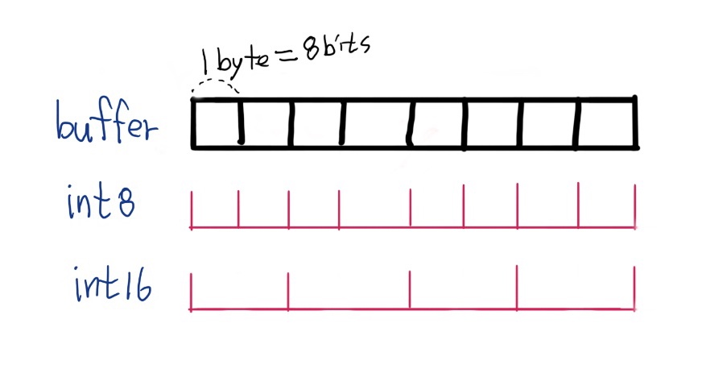

프로그래밍에 있어 빠질 수 없는 자료구조 중 하나는 바로 "배열"일 것입니다. 자바스크립트에는 "Array"라는 전역 객체로 배열을 사용할 수 있습니다. (_"Array"를 번역하면 "배열"이지만_) 실제로 자바스크립트의 Array는 일반적으로 컴퓨터과학에서 다루는 "[배열](https://ko.wikipedia.org/wiki/배열)"과는 다릅니다. JS Array는 기본적으로 객체 타입이며, 연속적인 데이터 저장을 보장하지 않습니다.

JIT 컴파일러를 사용하는 V8과 같은 엔진에서는 개선된 부분이 있지만, 연속성과 고정 타입을 늘 강제할 수는 없습니다. 만약 파일이나 이미지 등의 바이너리 데이터를 다룬다면 연속적인 메모리에 저장된 데이터 구조를 사용하는 것이 성능에 도움이 될 수 있습니다. 그러한 문제를 위해 ArrayBuffer와 TypedArray를 사용할 수 있습니다.

## ArrayBuffer

> "버퍼(buffer)"는 데이터를 한 곳에서 다른 한 곳으로 전송하는 동안 일시적으로 그 데이터를 보관하는 메모리의 영역이다.

**ArrayBuffer**의 의미적인 이해를 돕기 위해 **Buffer**의 뜻을 검색해봤습니다. Buffer와 Array가 결합된 ArrayBuffer는 "연속적인 데이터를 보관하는 메모리의 영역"정도로 이해할 수 있습니다. MDN에서는 "바이트로 구성된 배열"이라고 표현하고 있습니다.

하지만 ArrayBuffer는 데이터를 직접 다루는 기능을 제공하지 않습니다. TypedArray나 DataView 등의 객체를 이용하여 ArrayBuffer에 할당된 공간을 특정 타입의 데이터로 읽거나 쓸 수 있습니다. (_마치 ArrayBuffer는 종이, 다른 도구는 펜과 잉크 같은 역할이라고나 할까요..._)

```js
const buffer = new ArrayBuffer(8);
console.log(buffer.byteLength); // output: 8
```

위 코드와 같이 `ArrayBuffer(8)` 생성자를 이용해 고정된 길이(8)를 가진 객체를 직접 생성할 수 있습니다.

```js
const src =
  "https://www.google.com/images/branding/googlelogo/2x/googlelogo_color_272x92dp.png";

fetch(src)
  .then((res) => res.arrayBuffer())
  .then((buffer) => console.log(buffer.byteLength)); // output: 13504
```

이미지를 바이너리로 다룰 때, ArrayBuffer를 이용할 수 있습니다. 간단히 예제로 구글 홈페이지의 로고를 `fetch` API로 가져와 `ArrayBuffer`로 변환하는 코드입니다. 이미지 데이터의 버퍼 길이와 실제 구글 로고의 용량을 비교해보면 같은 것을 볼 수 있습니다. 실제 데이터의 용량만큼 ArrayBuffer가 생성됩니다.

```js
const src =
  "https://www.google.com/images/branding/googlelogo/2x/googlelogo_color_272x92dp.png";

fetch(src)
  .then((res) => res.arrayBuffer())
  .then((buffer) => {
    const blob = new Blob([buffer]);
    const dataUrl = window.URL.createObjectURL(blob);
    const img = document.createElement("img");
    img.src = dataUrl;
    document.body.appendChild(img);
  });
```

위 예제처럼 ArrayBuffer에 담긴 데이터를 이용해 Blob으로 변환해 이용할 수도 있습니다. 구글 메인 페이지에서 개발자도구로 실행해보세요. 실제로 ArrayBuffer를 위처럼 사용하지는 않지만 데이터가 저장되는 공간을 다루는 ArrayBuffer를 다양하게 활용할 수 있을 것입니다.

## TypedArray (Int8Array, Int16Array)

앞서 ArrayBuffer에 데이터를 직접 수정할 수 없다고 했습니다. ArrayBuffer를 다루는 방법으로 TypedArray에 대해 알아보겠습니다. TypedArray는 "형식화 배열"이라고 번역되며 의미는 이름에서와 같이 "타입이 지정된 배열"로 이해할 수 있습니다.

```js
const buffer = new ArrayBuffer(8);

const int8arr = new Int8Array(buffer);
const int16arr = new Int16Array(buffer);

console.log(int8arr); // Int8Array [0, 0, 0, 0, 0, 0, 0, 0]
console.log(int16arr); // Int16Array [0, 0, 0, 0]
```

`ArrayBuffer` 객체를 생성하고 그 버퍼에 대해서 TypedArray 중 하나인 `Int8Array`객체를 생성했습니다. **Int8Array**는 **2의 보수 8비트 부호 있는 정수의 배열**입니다. 현재 선언된 버퍼의 크기는 `8bytes`이고 Int8Array의 각 요소의 크기는 `8bits === 1byte`이므로 길이가 `8`인 Int8Array가 생성되었습니다.

이어서 같은 버퍼를 참조하여 생성된 **Int16Array**는 길이가 `4`입니다. Int16Array의 각 요소의 크기는 `2bytes`이기 때문입니다.

```js
const buffer = new ArrayBuffer(8);

const int8arr = new Int8Array(buffer);
const int16arr = new Int16Array(buffer);

int8arr[1] = 1;
int16arr[3] = 1;

console.log(int8arr); // Int8Array [0, 1, 0, 0, 0, 0, 1, 0]
console.log(int16arr); // Int16Array [256, 0, 0, 1]
```

위 코드에서는 각각의 배열의 값을 변경했지만, 같은 ArrayBuffer를 공유하고 있기 때문에 두 배열이 영향을 받습니다. ArrayBuffer의 또 다른 **뷰**인 [DataView](https://developer.mozilla.org/ko/docs/Web/JavaScript/Reference/Global_Objects/DataView)를 이용하면 **엔디언**방식을 지정하여 값을 다룰 수 있습니다. (엔디언에 관한 자세한 정보는 [여기](https://developer.mozilla.org/ko/docs/Glossary/Endianness)를 참고해주세요.)



이처럼 형식화 배열이 ArrayBuffer를 어떻게 이용하는 지 살펴보았습니다. 실제 개발을 하면서 데이터를 다룰 때 같은 buffer를 가지고 다른 배열에서 접근하여 사용할 일은 거의 없을 것이지만요.

## Examples for Threejs

```js
const geometry = new THREE.SphereGeometry(15, 32, 16);
console.log(geometry.attributes.position.array); // Float32Array [-0, 15, 0, -0, 15, 0, -0, 15, 0, -0, …]
```

**WebGL**을 이용한 3D 시각화 라이브러리 [Threejs](https://threejs.org)의 코드에서 TypedArray를 사용합니다. 3차원의 입체 도형을 나타내기 위해 Vertex의 위치 정보를 Float32Array에 담아 사용합니다. 3D 이미지 자료이기 때문에 큰 용량의 데이터를 처리할 때 TypedArray를 쓰는 것이 장점이 있을 것으로 보입니다.

## 마치며

이번 글에서는 ArrayBuffer와 TypedArray에 대해서 간단히 살펴봤습니다. 프로그래밍을 하다 보면 성능에 대한 문제를 마주칠 때가 많은데, 그런 경우에 자료구조나 메모리를 다루는 방법이 필요합니다. ArrayBuffer를 통해 자바스크립트에서도 연속적인 메모리 영역에 저장된 데이터를 다룰 수 있다는 것을 살짝 찍먹해보았습니다.

ArrayBuffer가 추가된 것처럼 자바스크립트는 계속해서 발전하고 있습니다. 약한 타입과 스크립트 기반의 언어로서 단점이 많이 있기도 하지만, 많은 개발자들이 계속해서 고민하면서 한계를 점점 넓혀가고 있습니다. 새로운 것을 배우는 것이 때로는 소소한 즐거움이 되는 것 같습니다.
