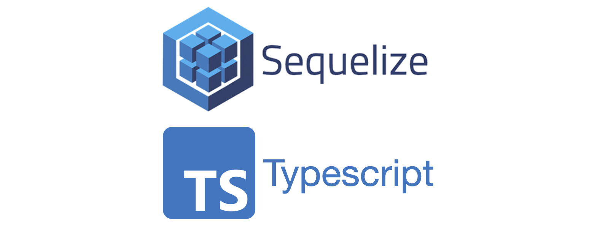
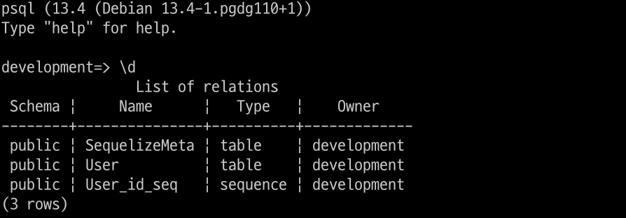

NodeJS 환경에서 `Sequelize`를 사용할 때 `sequelize-cli`를 사용하면 `Model 생성`, `Migration 관리`, `시드 구성` 등의 기능을 CLI에서 사용할 수 있습니다. 하지만 `sequelize-cli`는 자바스크립트 기반으로 동작하고, 관련 파일을 `JS`파일로 작성해야 합니다. `sequelize-cli`를 사용할 때 `typescript`를 적용해서 사용할 수 있는 방법을 소개합니다.

`sequelize`, `seqeuzlie-cli` 패키지를 미리 설치하겠습니다.

```sh
npm i sequelize sequelize-cli
```

## 핵심 원리

`sequelize-cli`를 사용하면서 `config.json` 파일이나 `migrations` 폴더를 커스터마이징하고 싶을 때 [.sequelizerc](https://sequelize.org/master/manual/migrations.html#the--code--sequelizerc--code--file) 파일을 작성하면 됩니다. `sequelize-cli`가 명령을 실행할 때 `.sequelizerc`파일을 읽고 작성된 설정대로 동작하는 것입니다.

`sequelize-cli`가 `.sequelizerc`파일을 읽을 때, `babel`을 이용하여 `typescript`를 사용할 수 있도록 설정할 수 있습니다. 기본적으로 작성하는 `config.json`, `migrations` 등의 파일을 `typescript`로 작성할 수 있고, 다른 `ts`파일을 모듈로 `import`할 수 있습니다.

간단한 실습으로 확인해보겠습니다.

## BABEL 설정

`babel` 및 `typescript` 관련 패키지를 먼저 설치합니다.

```sh
npm i @babel/core @babel/register @babel/preset-env @babel/preset-typescript @babel/runtime @babel/plugin-transform-runtime typescript
```

`sequelize-cli`에서 `babel`을 이용할 수 있도록 하는 핵심 패키지는 `@babel/register`입니다.

`.babelrc` 또는 `babel.config.json` 파일에 다음와 같이 `typescript` 설정을 추가합니다.

```json
{
  "presets": ["@babel/preset-env", "@babel/preset-typescript"],
  "plugins": ["@babel/plugin-transform-runtime"]
}
```

이제 `babel`이 `@babel/preset-typescript` 설정으로 인해 `typescript`를 읽을 준비가 되었습니다. `.sequelizerc`파일에서 `@babel/register`를 불러와 런타임에서 `babel`이 동작하도록 설정합니다.

```js
// .sequelizerc
// runtime에서 babel을 사용(이 포스트의 핵심 코드)
require("@babel/register")({
  configFile: "./.babelrc",
  extensions: [".js", ".ts"],
});

const path = require("path");

module.exports = {
  config: path.resolve("db", "config.ts"),
  "models-path": path.resolve("db", "models"),
  "seeders-path": path.resolve("db", "seeders"),
  "migrations-path": path.resolve("db", "migrations"),
};
```

이제 `sequelize-cli`가 동작할 때 `.babelrc`에서 작성된 설정대로 동작합니다.

## sequelize-cli

순수 `sequelize-cli`를 사용할 때는 `js`, `json` 파일로 생성됩니다. 현재 `babel`을 이용한 설정은 `sequelize-cli`가 관련 파일을 읽는 것을 도와주는 역할입니다. 그래서 `sequelize-cli`를 이용하여 생성되는 파일은 여전히 `js` 파일로 생성됩니다. 그래서 파일이 생성된 후에 `ts` 파일로 변경하고 코드를 재작성해야 합니다.

### 초기화

```sh
npx sequelize-cli init
```

초기화를 실행하면 `.sequelizerc`에서 작성한 대로 파일이 생성됩니다. 위에서 작성한 대로 진행하면 `db`폴더가 생성되고 그 아래에 `config.ts`파일이 있습니다. 기본 코드가 `json`으로 작성되었기 때문에 `ts` 코드로 재작성해줍니다.

```ts
// db/config.ts
import { Options } from "sequelize/types";

export const development: Options = {
  username: "development",
  password: "development",
  database: "development",
  host: "localhost",
  port: 5432,
  dialect: "postgres",
};
```

이렇게 하면 타입 지원을 받을 수 있고, 외부 모듈에서 값을 불러올 수도 있습니다. 예로, `dotenv`에서 선언된 값을 사용할 수도 있겠네요.

### 마이그레이션 생성

제가 `sequelize-cli`를 `typescript`로 사용하려는 가장 큰 이유가 바로 마이그레이션 작성 때문입니다. 마이그레이션 코드를 작성할 때, 다른 모듈을 `import`하여 작성할 경우도 있고 기존 프로젝트 코드와의 일관성을 위해 타입을 지원받고 싶습니다.

```sh
npx sequelize-cli migration:generate --name initialize
```

위 명령어로 마이그레이션을 생성하면 `db/migrations` 폴더 아래에 새로운 마이그레이션 파일이 생성됩니다. 해당 파일은 `js` 파일로 생성되기 때문에 `ts` 파일로 재작성 해야 합니다. 재작성하는 것이 귀찮을 수도 있지만 기존 프로젝트 모듈과 타입을 그대로 적용할 수 있는 것이 훨씬 개발 경험에 유리하다고 생각됩니다.

생성된 마이그레이션의 코드를 다음과 같이 새롭게 작성합니다.

```ts
import { QueryInterface, DataTypes } from "sequelize";

type T = typeof DataTypes;

export const up = async (queryInterface: QueryInterface, DataTypes: T) => {
  await queryInterface.createTable("User", {
    id: {
      type: DataTypes.INTEGER,
      primaryKey: true,
      allowNull: false,
      autoIncrement: true,
    },
    name: {
      type: DataTypes.STRING,
      allowNull: false,
    },
  });
};
export const down = async (queryInterface: QueryInterface, DataTypes: T) => {
  await queryInterface.dropTable("User");
};
```

작성된 마이그레이션을 실행해보겠습니다.

```sh
npx sequelize-cli db:migrate
```



작성한 마이그레이션 내용처럼 테이블이 생성되었습니다. 성공입니다!

## 마무리

위에서 언급한 것처럼 `sequelize-cli`에서 `typescript`를 사용할 수 없다는 것은 크게 두가지 불편함이 있습니다.

- Sequelize DB Config, 모델, 시드, 마이그레이션 코드에서 타입 지원을 받을 수 없다.
- 타입스크립트 기반 프로젝트의 모듈을 불러올 수 없고, 코드 일관성이 떨어진다.

이 불편을 해결하기 위해서는 자체적으로 마이그레이션 등의 코드를 `ts`로 작성하여 사용할 수도 있습니다. 하지만 그렇게 하면 `sequelize-cli`가 관리하는 기능을 온전히 사용하지 못합니다.

사실 이 포스트의 주제는 **`sequelize-cli`에 `babel` 적용하기**가 더 적당할 것 같지만, 타입스크립트를 적용하는 것에 큰 의미가 있고 이것으로 제가 겪은 문제를 해결하였기 때문에 `typescript` 적용에 초점을 맞추어 보았습니다.

> 예제 코드는 [Github](https://github.com/hoontae24/blog-examples/tree/main/node/sequelize-cli-with-typescript)에서 확인할 수 있습니다.
