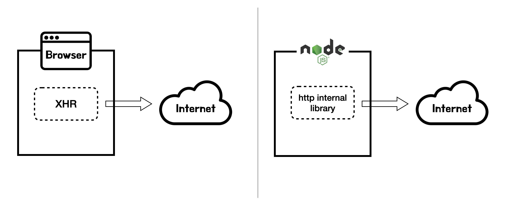
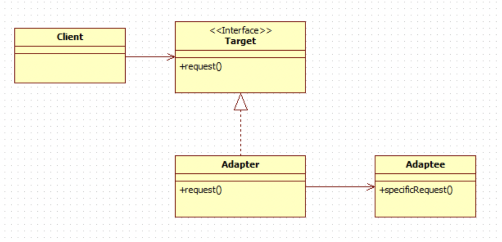

소프트웨어 개발에는 여러 가지 원칙들이 있습니다. 원칙을 적용하면 소프트웨어를 더 유연하고 견고하게 만들 수 있습니다. 개발 관점에서 원칙이라는 것은 지켜야하는 수칙이라기 보다는 더 나은 소프트웨어를 위한 방법이라고 볼 수도 있습니다. 이번 글에서는 [axios](https://github.com/axios/axios)라는 자바스크립트 라이브러리를 살펴보면서 **관심사의 분리**와 **추상화**에 대해 살펴보겠습니다.

## axios

자바스크립트 개발자 중에서 axios를 모르는 분은 없을 겁니다. axios는 자바스크립트로 http 통신을 위해 사용하는 라이브러리입니다. 자바스크립트가 동작하는 대표적인 두 환경인 웹 브라우저와 nodejs를 지원합니다. 브라우저에서 http 요청을 하려면 [XHR](https://developer.mozilla.org/ko/docs/Web/API/XMLHttpRequest)이나 [Fetch API](https://developer.mozilla.org/ko/docs/Web/API/Fetch_API)를 사용할 수 있습니다. 대부분의 브라우저에서 http 통신을 위해서 제공하는 기능입니다. nodejs 환경에서는 XHR이나 Fetch API를 사용할 수 없습니다. nodejs 런타임에서 http 요청을 하려면 [http](https://nodejs.org/api/http.html#http) nodejs 내장 모듈을 사용해야 합니다.



axios를 사용하면 http 요청 관련 기능을 쉽게 사용할 뿐만 아니라, 브라우저 또는 nodejs와 같은 실행 환경에 구애받지 않고 코드를 작성할 수 있습니다. 각 환경에서 http 요청을 위한 동작은 axios 내부에서 처리해주기 때문입니다. 개발자는 환경이 달라도 같은 로직 코드를 작성할 수 있고, 같은 결과를 기대할 수 있습니다.

## 관심사의 분리

> 컴퓨터 과학에서 관심사 분리(separation of concerns, SoC)는 컴퓨터 프로그램을 구별된 부분으로 분리시키는 디자인 원칙으로, 각 부문은 개개의 관심사를 해결한다. ([위키백과](https://ko.wikipedia.org/wiki/%EA%B4%80%EC%8B%AC%EC%82%AC_%EB%B6%84%EB%A6%AC))

브라우저와 nodejs는 http 통신을 위해서 서로 다른 인터페이스를 제공합니다. 만약 우리의 코드가 두 환경에서 동작해야하는 코드라면 각 환경에 따라 다른 인터페이스를 사용해서 구현해야 합니다. axios는 관심사의 분리를 통해 이 문제를 해결합니다. axios의 코드 중에서 http 요청을 실행하는 부분의 코드를 봅시다.

```js
// axios/lib/core/Axios.js (https://github.com/axios/axios/blob/649d739288c8e2c55829ac60e2345a0f3439c730/lib/core/Axios.js#L21)
class Axios {
  // ...
  request(configOrUrl, config) {
    // ...
    promise = dispatchRequest.call(this, newConfig);
  }
}
```

코드의 일부는 생략하고 `Axios` 객체가 http 요청을 실행하는 `request` 메소드를 살펴봅시다. 요청의 여러 분기 조건들이 있지만 최종적으로 http 요청을 수행하는 것은 `dispatchRequest` 함수를 호출하는 것입니다. Axios 객체가 http 요청을 실행하기 위해서 실행 환경에 대해서는 알 수도 없고, 알 필요도 없습니다. Axios를 통해 로직을 구현하는 개발자 역시 환경에 대한 처리를 할 필요가 없습니다. 개발자는 Axios 인터페이스를 통해 http 관련 로직에만 집중할 수 있습니다.

```js
// axios/lib/core/dispatchRequest.js (https://github.com/axios/axios/blob/649d739288c8e2c55829ac60e2345a0f3439c730/lib/core/dispatchRequest.js#L33)
export default function dispatchRequest(config) {
  // ...
  const adapter = config.adapter || defaults.adapter;

  return adapter(config)
    .then
    // ...
    ();
}

// axios/lib/defaults/index.js (https://github.com/axios/axios/blob/649d739288c8e2c55829ac60e2345a0f3439c730/lib/defaults/index.js#L22)
function getDefaultAdapter() {
  let adapter;
  if (typeof XMLHttpRequest !== "undefined") {
    // For browsers use XHR adapter
    adapter = adapters.getAdapter("xhr");
  } else if (typeof process !== "undefined" && utils.kindOf(process) === "process") {
    // For node use HTTP adapter
    adapter = adapters.getAdapter("http");
  }
  return adapter;
}

// axios/lib/adapters/index.js (https://github.com/axios/axios/blob/649d739288c8e2c55829ac60e2345a0f3439c730/lib/adapters/index.js#L2)
import httpAdapter from "./http.js";
import xhrAdapter from "./xhr.js";

const adapters = {
  http: httpAdapter,
  xhr: xhrAdapter,
};
```

`dispatchRequest` 함수 내부를 살펴보면, `adapter`를 통해 요청을 처리합니다. `adapter`는 axios를 호출하는 개발자가 주입할 수도 있지만 기본값은 내부적으로 구현되어 있습니다. `getDefaultAdapter` 함수에서는 실행 환경에 따라 기본 어댑터를 지정합니다. 브라우저 또는 nodejs에서 동작하는 http 관련 로직을 구현해두고, 환경에 따라 특정 adapter로 연결만 해줍니다.



위 다이어그램은 어댑터 패턴을 나타내는 클래스 다이어그램입니다. 어댑터 패턴 다이어그램의 요소들과 완전히 일치하진 않겠지만 비교를 하면 다음과 같습니다.

- Client 클래스 -> Axios 클래스
- Target 인터페이스 -> getDefaultAdapter 함수의 응답값
- Adapter 구현 클래스 -> httpAdapter(nodejs), xhrAdapter(브라우저)
- Adaptee 클래스 -> http 내장 라이브러리(nodejs), XMLHttpRequest(브라우저)

Axios를 사용하는 개발자는 어댑터 패턴을 통해 http 요청에 대한 로직만 다루면 됩니다. 환경에 대한 분기처리나 제한사항은 axios의 각 환경별로 구현된 어댑터가 대신 처리할 것입니다. 관심사의 분리와 동시에 일종의 추상화가 이루어진 것인데요. axios의 다른 부분을 통해 추상화를 조금 더 살펴봅시다.

## 추상화

> 소프트웨어 개발관점에서 추상화란 인터페이스에 의존하고, 구체적인 구현에는 의존하지 않는다. ([https://choi3950.tistory.com/25](https://choi3950.tistory.com/25)) \
> 추상화는 뒷편 시스템의 기술적 복잡함을 단순한 API 뒤에 숨깁니다. ([MDN](https://developer.mozilla.org/ko/docs/Glossary/Abstraction))

이미 우리는 관심사의 분리 예제를 통해 추상화를 다루었습니다. 개발자는 Axios를 사용하면서 환경 별로 다루어야할 로직을 처리할 필요가 없습니다. 그저 http 요청에 필요한 axios 인터페이스에만 집중할 수 있습니다. axios가 내부적으로 처리하는 환경에 대한 로직은 감추어져 있습니다. 만약 브라우저에서 XHR 인터페이스가 변경된다면, axios의 xhrAdapter만 수정하면 됩니다. Axios 객체를 다루는 코드를 변경할 필요는 없을 것입니다.

또 여기 axios의 config 옵션들을 통해 추상화를 살펴볼 수 있습니다.

```js
// https://github.com/axios/axios#axiosconfig
// Send a POST request
axios({
  method: "post",
  url: "/user/12345",
  data: {
    firstName: "Fred",
    lastName: "Flintstone",
  },
});
```

만약 우리가 http post 요청을 데이터와 함께 보낸다면 위 예시 코드와 같이 작성할 것입니다. 여기서 `data`라는 객체가 xhrAdapter, httpAdapter로 전달되고 http 요청으로 실행될 때 어떤 과정을 거치는 지 알 필요가 없습니다. 개발자는 그저 `data`라는 객체에 원하는 정보를 넘겨주기만 하면 됩니다.

만약 `post` 요청이 아닌 `put` 요청을 하려면 `method: 'put'`으로 코드를 변경하면 됩니다. 우리는 `post`, `put` http 메소드가 어떤 과정을 통해 통신으로 전달되는 지 알 필요가 없습니다.

## 마치며

axios를 통해 소프트웨어 개발 원칙 중 하나인 추상화와 관심사의 분리에 대해 살펴봤습니다. 사실 예시로 소개한 코드들이 이 원칙들을 완벽히 설명하지는 않을 것입니다. 하지만 원칙을 이해하는 데 도움이 되고, 실제 개발 과정에서 나도 모르게 고려하고 있는 추상화에 대해 정리하는 시간이었습니다. 기술에 대한 이해와 성장 뿐만 아니라 개발 방법론, 개발 원리에 대한 넓은 시야와 통찰력을 가지고 좋은 소프트웨어를 만드는 개발자로 성장하길 스스로 응원하며 글을 마칩니다.
