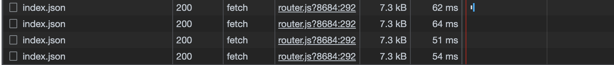
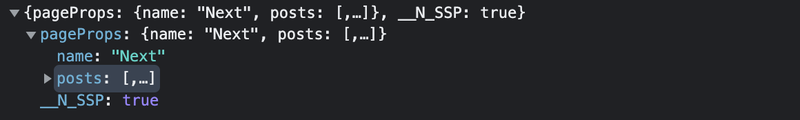

Nextjs는 리액트 생태계에서 가장 많이 사용하는 프레임워크 중 하나입니다. 주로 SSR 기반의 프로젝트에 사용합니다. 또한 파일 시스템 기반의 직관적인 라우팅, 이미지 최적화, 타입스크립트 지원 등 간단한 설정으로 사용할 수 있는 기능이 많아서 프로젝트를 구성하고 관리하는 작업이 줄어듭니다.

여러 기능 중 SSR에서는 DataFetch를 쉽게 구현할 수 있습니다. SSR 페이지에서 초기 데이터를 로드하려면 `getServerSideProps` 함수를 정의하여 페이지 컴포넌트의 `Props`로 주입받을 수 있습니다. `getServerSideProps`를 사용해보고 동작하는 방식을 알아보겠습니다.

> 예시로 작성된 코드 전체는 [여기](https://github.com/hoontae24/blog-examples/tree/main/react/nextjs-getServerSideProps)에서 볼 수 있습니다.

## 사용법

먼저 간단한 페이지 컴포넌트를 만들고, 페이지 컴포넌트 파일에 `getServerSideProps`라는 이름으로 함수를 정의합니다.

```tsx
// src/pages/index.tsx
interface IndexPageProps {
  name: string;
}

const IndexPage: NextPage<IndexPageProps> = (props) => {
  const { name } = props;
  return (
    <div>
      <h1>Hello {name}!</h1>
    </div>
  );
};

export const getServerSideProps: GetServerSideProps<IndexPageProps> = async () => {
  return {
    props: {
      name: "Next",
    },
  };
};

export default IndexPage;
```

페이지 컴포넌트가 렌더링되기 전에 `getServerSideProps` 함수가 실행됩니다. Data Fetch 작업을 `getServerSideProps` 함수 내에서 처리하면, 페이지 컴포넌트의 `props`로 전달받아 렌더링합니다. 코드를 약간 수정해서 좀 더 의미있는 예시를 만들어 봅시다.

```tsx
// src/pages/index.tsx

interface Post {
  id: number;
  title: string;
}

interface IndexPageProps {
  name: string;
  posts: Post[];
}

const IndexPage: NextPage<IndexPageProps> = (props) => {
  const { name, posts } = props;
  return (
    <div>
      <h1>Hello {name}!</h1>
      <ul>
        {posts.map((post) => (
          <li key={post.id}>{post.title}</li>
        ))}
      </ul>
    </div>
  );
};

export const getServerSideProps: GetServerSideProps<IndexPageProps> = async () => {
  const url = "https://jsonplaceholder.typicode.com/posts";
  const posts: Post[] = await fetch(url).then((res) => res.json());
  return {
    props: {
      name: "Next",
      posts: posts,
    },
  };
};

export default IndexPage;
```

만약 리액트에서 다른 도구를 사용하지 않는다면 `useState`, `useEffect` 등으로 데이터를 불러와 상태로 다루게 됩니다. 하지만 `getServerSideProps`를 이용하면 데이터를 불러오고 관리하는 부분을 리액트 라이프사이클에서 분리하고, 페이지가 렌더링되기 전에 데이터를 불러와 Placeholder를 렌더링하지 않아도 됩니다.

## 렌더링 과정에서의 동작 알아보기

위 예시 코드에서 `getServerSideProps` 함수를 컴포넌트 내에 정의했지만, 리액트 컴포넌트의 라이프사이클과는 분리되어 있음을 알 수 있습니다. 또한 Nextjs에서 과거 Data Fetching을 위해 사용했던 `getInitialProps`는 컴포넌트의 `static method`로 정의된 것과 다르게 `export`를 사용하고 있습니다.

위 예시 코드에서 함수가 호출되는 것을 디버깅하기 위해 로그를 찍어보겠습니다. 함수 컴포넌트 내부와 `getServerSideProps` 함수 내에서 디버깅 로그를 남깁니다.

```tsx
const IndexPage = () => {
  console.log("Logging from IndexPage Component");
  return (
    // ...
  )
}
export const getServerSideProps = async () => {
  console.log("Logging from getServerSideProps");
  return {
    // ...
  };
};
```

이제 브라우저에서 해당 페이지에 접속한 다음 개발자도구의 콘솔과 Next가 실행 중인 콘솔을 열고 새로고침을 합니다. 브라우저 콘솔과 Next 콘솔에서 로그를 확인합니다.

```sh
# 브라우저 콘솔
Logging from IndexPage Component
```

```sh
# Next 콘솔
Logging from getServerSideProps
Logging from IndexPage Component
```

간단한 디버깅으로 알 수 있는 것은 Next가 `getServerSideProps` 함수를 먼저 호출하고, 페이지 컴포넌트를 렌더링합니다. 새로고침을 하면 페이지 초기 진입만 반복적으로 이루어지므로, 브라우저 콘솔에서 나타난 로그는 hydration 과정에서 페이지 컴포넌트의 렌더링 시점에 호출된 것으로 보입니다.

이번에는 페이지 컴포넌트 파일의 루트 영역에 변수 하나를 추가합니다. 그리고 각각의 로그에서 변수를 출력하도록 합니다.

```tsx
let count = 0;

const IndexPage = () => {
  console.log("Logging from IndexPage Component", ++count);
  return (
    // ...
  )
}
export const getServerSideProps = async () => {
  console.log("Logging from getServerSideProps", ++count);
  return {
    // ...
  };
};
```

브라우저에서 새로고침을 반복하고 각각의 로그를 살펴봅니다. 새로고침할 때 브라우저 로그를 유지하기 위해 브라우저 콘솔의 `Preserve log` 옵션을 켜줍니다.

```sh
# 브라우저 콘솔
Logging from IndexPage Component 1
Logging from IndexPage Component 1
Logging from IndexPage Component 1
```

```sh
# Next 콘솔
Logging from getServerSideProps 1
Logging from IndexPage Component 2
Logging from getServerSideProps 3
Logging from IndexPage Component 4
Logging from getServerSideProps 5
Logging from IndexPage Component 6
```

Nodejs 런타임과 브라우저 런타임의 차이로 인해 로그가 다르게 나타납니다. 브라우저 콘솔에서는 계속 `1`이라는 값이 출력됩니다. 새로고침을 할 때 마다 hydration 과정이 새로 진행되기 때문에(서버에서 JS를 새로 불러오기 때문에) 매번 모듈에 선언된 `count` 값이 초기화 됩니다. 반대로 Next는 모듈이 서버 자원으로 로드되기 때문에 서버가 실행되는 동안 모듈의 변수가 지속됩니다. 그래서 함수가 호출될 때 마다 `count` 변수에 담긴 값이 계속 유지되고 변경됩니다.

## 라우팅 과정에서의 동작 알아보기

Next는 파일 기반의 Page 라우팅을 지원합니다. `src/pages` 폴더 하위의 파일 트리 구조를 그대로 라우팅에 매핑시켜 줍니다. 또한 SPA의 특징인 Client Side Routing 역시 제공된다는 것입니다. 예시 코드에 새로운 페이지 컴포넌트 파일을 추가해보겠습니다. 그리고 기존 컴포넌트에 새로운 페이지로 전환하는 링크를 추가합니다.

```tsx
// src/pages/about.tsx
import Link from "next/link";

const AboutPage = () => {
  return (
    <div>
      <h1>About...</h1>
      <Link href="/">home</Link>
    </div>
  );
};

export default AboutPage;
```

```tsx
// src/pages/index.tsx
const IndexPage = () => {
  // ...
  return (
    <div>
      <h1>Hello {name}!</h1>
      <Link href="/about">about</Link>
      {/* ... */}
    </div>
  );
};
```

이전에 작성했던 디버깅 코드가 그대로 있는 상태에서 이번에는 새로고침이 아닌 페이지 전환을 반복해봅니다. `index` -> `about` -> `index` 순서로 왔다갔다 한 후에 로그를 살펴봅시다. `/index` 페이지를 방문할 때마다 디버깅 로그가 찍힙니다.

```sh
# 브라우저 콘솔
Logging from IndexPage Component 1
Logging from IndexPage Component 2
Logging from IndexPage Component 3
```

```sh
# Next 콘솔
Logging from getServerSideProps 1
Logging from IndexPage Component 2
Logging from getServerSideProps 3
Logging from getServerSideProps 4
```

이전에 새로고침만 했을 때와는 다른 결과를 보여줍니다. 최초 진입 이후에 브라우저에서는 렌더링이 진행되고 Next 서버에서는 `getServerSideProps`가 호출되는 것을 확인할 수 있습니다. 브라우저에서 CSR이 진행되는 과정에서 서버는 `getServerSideProps`를 호출하고 데이터를 네트워크로 보내줍니다. 브라우저는 해당 데이터를 받아 `IndexPage`의 `props`를 변경합니다.

브라우저의 개발자도구 네트워크 탭에서 `/index` 페이지로 전환할 때 마다 데이터를 요청하고 응답받는 것을 확인할 수 있습니다.




`getServerSideProps`라는 이름처럼 서버에서 페이지 컴포넌트의 초기 렌더링 데이터를 서버에서 `props`로 가져오는 것입니다.

> 앞에서 잠깐 언급했던 `getInitialProps`는 페이지에 진입할 때 마다, 렌더링하는 컨텍스트에서 함수가 실행됩니다. \
> 만약 새로고침이나 첫 페이지 진입처럼 서버에서 렌더링이 수행된다면 서버에서 `getInitialProps`가 호출되고, 브라우저 라우팅으로 진입하여 브라우저에서 렌더링이 수행된다면 브라우저에서 `getInitialProps`가 수행됩니다. \
> 실행되는 컨텍스트를 보장할 수 없기 때문에 각각의 컨텍스트에 따라 필요한 처리를 해주어야 합니다.

## 코드 살펴보기

지금까지 알아본 것은 Next가 디음과 같은 상황에서 `getServerSideProps`를 호출하여 페이지 컴포넌트에 `props`로 전달한다는 것입니다.

1. 초기 진입 시 서버에서 페이지 컴포넌트가 렌더링 될 때
2. 브라우저의 Next 앱 라우팅이 이루어져서 페이지 컴포넌트가 렌더링 될 때

`getServerSideProps`에 대한 모든 상황이나 특징을 알아보진 않았지만 어떻게 동작하는 지 간단히 알아봤습니다. 이번에는 위 상황에서 `getServerSideProps`가 호출되기 위해서 코드에서 어떤 과정으로 진행되는 지 살펴보려합니다. 실제 Next의 코드를 따라가며 앱이 동작하는 방식을 살펴봅시다.

먼저 위 예시 기준으로는 `<Link>` 컴포넌트부터 출발합니다.

> 살펴볼 코드에 집중하기 위해 생략된 부분은 "// ..." 등의 주석으로 표시합니다. \
> 코드는 [Next.js Github](https://github.com/vercel/next.js/tree/canary/packages/next)에서 찾아볼 수 있습니다.

### 1. Link 컴포넌트 클릭([Code](https://github.com/vercel/next.js/blob/5384171bb651ab24398168ac26f76fac37a0f841/packages/next/client/link.tsx#L435))

```tsx
// next/client/link.tsx#L435
<a {...restProps} {...childProps}>
  {children}
</a>
```

`Link` 컴포넌트도 React 컴포넌트이기 때문에 jsx로 렌더링되는 요소의 `onClick`을 추적해봅니다. 여기서는 `childProps`라는 값에 `onClick`에 대한 콜백이 포함되어 있습니다.

### 2. onClick 콜백([Code](https://github.com/vercel/next.js/blob/5384171bb651ab24398168ac26f76fac37a0f841/packages/next/client/link.tsx#L390))

```tsx
// next/client/link.tsx#L370
onClick: (e: React.MouseEvent) => {
  // ...
  if (!e.defaultPrevented) {
    linkClicked(e, router, href, as, replace, shallow, scroll, locale);
  }
};
```

`onClick`의 콜백을 따라가면 여러 예외를 처리하고 `linkClicked` 함수를 호출하여 동작을 위임합니다.

### 3. 라우터 Push([Code](https://github.com/vercel/next.js/blob/5384171bb651ab24398168ac26f76fac37a0f841/packages/next/client/link.tsx#L116))

```tsx
// next/client/link.tsx#L93
function linkClicked(router: NextRouter /* ... */): void {
  // ...
  router[replace ? "replace" : "push"](href, as, {
    shallow,
    locale,
    scroll,
  });
}
```

`linkClicked` 함수에서는 인자로 전달 받은 `router` 객체의 `push` 메소드를 호출합니다.

```tsx
// next/client/link.tsx#271
let router = React.useContext(RouterContext);
```

`linkClicked` 함수를 호출할 때, 매개변수로 전달한 `router` 객체는 `RouterContext`에서 가져옵니다. `RouterContext`의 초기화 단계에서 객체의 정의를 찾아봅니다.

### 4. Router 객체 추적([Code](https://github.com/vercel/next.js/blob/5384171bb651ab24398168ac26f76fac37a0f841/packages/next/client/index.tsx#L638))

```tsx
// next/client/index.tsx#L638
<RouterContext.Provider value={makePublicRouterInstance(router)}>
  {/* ... */}
  {/* ... */}
</RouterContext.Provider>
```

`RouterContext`의 값을 주입하고 있는 부분에서 `router` 객체를 추적합니다. `makePublicRouterInstance`함수는 라우터 객체를 Next에서 필요한 동작을 위한 clone 과정인 것 같습니다. 라우터 객체의 핵심은 `router` 변수에 담긴 객체입니다.

```tsx
// next/client/index.tsx#L397
router = createRouter(/* ... */);
```

`createRouter`함수를 호출하여 `router` 객체를 생성합니다. 함수 내에서는 `Router` 클래스의 생성자를 호출하여 객체를 생성합니다.

```tsx
// next/client/router.ts#L147
export function createRouter(...args: RouterArgs): Router {
  singletonRouter.router = new Router(...args);
  singletonRouter.readyCallbacks.forEach((cb) => cb());
  singletonRouter.readyCallbacks = [];

  return singletonRouter.router;
}
```

### 5. Router 클래스 정의([Code](https://github.com/vercel/next.js/blob/5384171bb651ab24398168ac26f76fac37a0f841/packages/next/shared/lib/router/router.ts#L525))

`Router` 클래스에서 `push` 메소드 정의를 찾습니다.

```tsx
// next/shared/lib/router/router.ts#L818
push(url: Url, as?: Url, options: TransitionOptions = {}) {
  // ...
  return this.change("pushState", url, as, options);
}
```

`push` 메소드는 `Router` 클래스의 `change` 메소드를 호출하여 동작을 위임합니다.

```tsx
// next/shared/lib/router/router.ts#L847
private async change(/* ... */): Promise<boolean> {
  // ...
  // next/shared/lib/router/router.ts#L1210
  let routeInfo = await this.getRouteInfo(
    route,
    pathname,
    query,
    as,
    resolvedAs,
    routeProps,
    nextState.locale,
    nextState.isPreview
  )
}
```

`change` 메소드는 라우팅의 상태에 변경이 있을 때 호출되는 함수로 보입니다. 함수 내부에서 동작하는 로직이 많은데, 여기서 저는 `getRouteInfo` 메소드에 집중합니다.

### 6. 라우팅 변경 시 컴포넌트 데이터 불러오기([Code](https://github.com/vercel/next.js/blob/5384171bb651ab24398168ac26f76fac37a0f841/packages/next/shared/lib/router/router.ts#L1534))

```tsx
// next/shared/lib/router/router.ts#L1467
async getRouteInfo(
    route: string,
    pathname: string,
    query: any,
    as: string,
    resolvedAs: string,
    routeProps: RouteProperties,
    locale: string | undefined,
    isPreview: boolean
  ): Promise<PrivateRouteInfo> {
  // ...
  // next/shared/lib/router/router.ts#L1534
  const props = await this._getData<CompletePrivateRouteInfo>(() =>
    // ...
    fetchNextData(
      dataHref!,
      this.isSsr,
      false,
      __N_SSG ? this.sdc : this.sdr,
      !!__N_SSG && !isPreview,
      false
    )
    // ...
  )
}
```

`getRouteInfo` 메소드는 페이지 컴포넌트의 정의와 SSR, SSG, RSC 유무 등의 정보를 불러옵니다. 이 과정에서 서버에 변경될 `props`에 대한 데이터를 `fetchNextData` 함수를 호출하여 요청합니다.

```tsx
// next/shared/lib/router/router.ts#L1578
routeInfo.props = props;
this.components[route] = routeInfo;
return routeInfo;
```

서버로부터 갱신된 `props`는(실제로는 `props.pageProps`에 페이지 컴포넌트의 `props`가 담겨 있음) `routeInfo` 객체에 할당되어 `return`됩니다. 다시 `getRouteInfo`를 호출했던 부분을 돌아가 `routeInfo` 객체를 추적합니다.

### 7. 변경된 데이터를 컴포넌트에 적용하기([Code](https://github.com/vercel/next.js/blob/5384171bb651ab24398168ac26f76fac37a0f841/packages/next/shared/lib/router/router.ts#L1310))

```tsx
// next/shared/lib/router/router.ts#L1310
await this.set(
  {
    ...nextState,
    route,
    pathname,
    query,
    asPath: cleanedAs,
    isFallback: false,
  },
  routeInfo,
  forcedScroll ?? resetScroll
);
```

여기서 `this`는 `Router` 클래스 인스턴스입니다.

```tsx
// next/shared/lib/router/router.ts#L1952
private set(
  state: typeof this.state,
  data: PrivateRouteInfo,
  resetScroll: { x: number; y: number } | null
): Promise<void> {
  this.state = state

  return this.sub(
    data,
    this.components['/_app'].Component as AppComponent,
    resetScroll
  )
}
```

`set` 메소드에서는 다시 `sub` 메소드를 호출합니다. `sub` 메소드는 `Router` 클래스 생성자에서 `subscription` 인자를 받아 할당되는 콜백함수 입니다. `Router` 생성자를 호출하는 부분을 따라가면 `sub` 메소드로 넘겨주는 매개변수를 찾을 수 있습니다.

```tsx
// next/client/index.tsx#L397
router = createRouter(
  /* ... */
  {
    /* ... */
    subscription: (info, App, scroll) =>
      render(
        Object.assign<{}, Omit<RenderRouteInfo, "App" | "scroll">, Pick<RenderRouteInfo, "App" | "scroll">>({}, info, {
          App,
          scroll,
        }) as RenderRouteInfo
      ),
    /* ... */
  }
);
```

`subscription` 함수의 정의에서 첫번째 인자로 전달되는 객체가 위에서 살펴본 `routeInfo` 객체입니다. 페이지 컴포넌트의 `props`로 전달될 정보는 `info.props.pageProps`에 담겨 전달됩니다.

`render` 함수를 호출하면서 변경된 데이터를 전달합니다.

```tsx
// next/client/index.tsx#L439
async function render(renderingProps: RenderRouteInfo): Promise<void> {
  // ...
  try {
    await doRender(renderingProps);
  } catch (err) {
    // ...
  }
}
```

`render` 함수는 몇 가지 예외 처리를 수행하고 `doRender` 함수를 호출합니다.

```tsx
// next/client/index.tsx#L833
function doRender(input: RenderRouteInfo): Promise<any> {
  let { App, Component, props, err, __N_RSC }: RenderRouteInfo = input;

  // ...

  const appProps: AppProps = {
    ...props,
    Component: isRSC ? RSCComponent : Component,
    err,
    router,
  };

  // ...

  // next/client/index.tsx#L987
  const elem: JSX.Element = (
    <>
      <Head callback={onHeadCommit} />
      <AppContainer>
        {renderApp(App, appProps)}
        <Portal type="next-route-announcer">
          <RouteAnnouncer />
        </Portal>
      </AppContainer>
    </>
  );
  // ...
}
```

`doRender` 함수에서는 변경된 데이터를 Next 루트인 `App` 컴포넌트에 전달하여 리액트 렌더링 트리가 재구성되도록 JSX를 생성합니다. 이후에는 리액트에서 변경된 사항을 ReactDOM 트리를 구성하면서 실제 DOM에 반영하게 됩니다.

### 8. 서버는 어떻게 요청을 받을까

이 과정 역시 `getServerSideProps`의 동작을 이해하는 데에 유익하지만, 내용이 너무 길어지기 때문에 추적할 수 있는 시작 포인트만 짚고 추적 과정은 생략하겠습니다.

```ts
// next/cli/next-start.ts#L69
startServer({
  dir,
  hostname: host,
  port,
})
  .then(async (app) => {
    const appUrl = `http://${app.hostname}:${app.port}`;
    Log.ready(`started server on ${host}:${app.port}, url: ${appUrl}`);
    await app.prepare();
  })
  .catch((err) => {
    console.error(err);
    process.exit(1);
  });
```

Next 서버의 시작 부분입니다. `app.prepare()` 메소드를 통해 서버 라우팅 및 모든 동작을 준비합니다. 해당 메소드를 따라 추적하면 서버 앱의 `Router`를 생성하는 부분을 찾을 수 있습니다.

```ts
// next/server/dev/next-dev-server.ts#L444
this.router = new Router(this.generateRoutes());
```

조금 복잡하지만 `renderHtml`, `render` 함수 등을 거쳐 `getServerSideProps`를 호출하는 곳 까지 추적할 수 있습니다.

```ts
// next/server/render.tsx#L1041
data = await getServerSideProps({
  req: req as IncomingMessage & {
    cookies: NextApiRequestCookies;
  },
  res: resOrProxy,
  query,
  resolvedUrl: renderOpts.resolvedUrl as string,
  ...(pageIsDynamic ? { params: params as ParsedUrlQuery } : undefined),
  ...(previewData !== false ? { preview: true, previewData: previewData } : undefined),
  locales: renderOpts.locales,
  locale: renderOpts.locale,
  defaultLocale: renderOpts.defaultLocale,
});
```

`data` 객체에 전달된 데이터는 요청을 처리하는 부분에서 클라이언트로 전송됩니다.

```ts
// next/server/base-server.ts#L1154
return this.pipe((ctx) => this.renderToResponse(ctx), {
  req,
  res,
  pathname,
  query,
});
```

중간 과정이 조금 생략되었지만 `renderToResponse` 메서드 내에서 `getServerSideProps` 함수를 호출하는 것을 발견할 수 있습니다.

## 마치며

Next는 리액트 개발자가 편하게 이용할 수 있는 기능을 제공하는 유용한 프레임워크입니다. 오늘은 Next가 제공하는 `getServerSideProps` 함수가 어떤 동작을 하는지, 어떤 방식으로 구현되었는 지 살펴보았습니다. 코드를 살펴보는 부분에서는 내용이 다소 복잡하게 전달되었을 것 같습니다. 시간을 내어 한번 코드를 따라가면 어떤 메커니즘으로 동작하는 지 이해할 수 있을 것입니다.

단순히 기능을 사용하는 프레임워크 사용자 입장에서 뿐만 아니라, 어떤 식으로 동작하는지 추적해보고 이와 같은 기능을 만들 수 있는 개발자가 되기 위해서 더 공부해야할 것 같습니다. 리액트와 Next를 사용하는 분이 있다면 도움이 되었기를 바랍니다. 긴 글 읽어주셔서 감사합니다.
