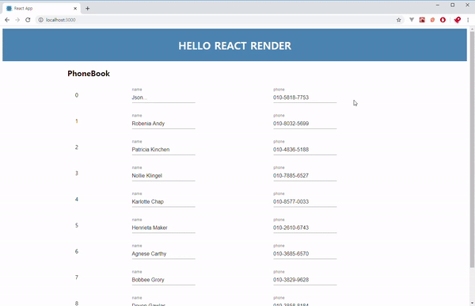

React는 웹 프론트엔드 라이브러리로 많이 사용되어지고 있습니다. 저 역시 리액트를 처음 접하고 업무 프로젝트로 사용한 지 1년 정도가 되었습니다. 라이브러리를 이용하여 개발을 하면 더 편하지만 알아야 할 것도 많이 생깁니다.

리액트로 개발을 할 때, 컴포넌트의 **Rerendering**에 대해 고민하게 될 때가 있는데요. React는 화면의 변경 사항에 대해서 ReactDOM을 이용하여 변경된 부분에 대해서만 Rerendering(또는 Update)합니다. React의 [Lifecycle](https://ko.reactjs.org/docs/react-component.html#the-component-lifecycle)을 이해하면 Rerendering을 잘 고려해서 개발할 수 있습니다.

오늘은 간단한 Phonebook을 구현하면서, ReactDOM의 업데이트를 관찰하고, 컴포넌트의 Rerendering에 대해서 살펴보겠습니다. 특히 불필요한 업데이트를 줄이는 방법에 대해 중점적으로 보려고 합니다.

---

### 0. 개발 환경 구성하기

오늘 실습 개발 환경을 위해서 다음 두 가지가 필요합니다.

1. [CRA(create-react-app)](https://github.com/facebook/create-react-app)
2. [chrome 확장프로그램 React Developer Tools](https://chrome.google.com/webstore/detail/react-developer-tools/fmkadmapgofadopljbjfkapdkoienihi)

먼저 CRA를 이용하여 간단한 React App을 만듭니다. 그리고 실습에 사용될 몇가지 패키지를 설치하겠습니다.

```bash
$ npx create-react-app react-rerendering-test
$ cd react-rerendering-test
$ npm i lodash random-name @material-ui/core
```

`lodash`와 `random-name`은 샘플 데이터를 다루기 위해서 설치합니다. `@material-ui`는 `input`태그를 대신하여 사용할 `TextField`를 위해 설치합니다. 또한 실제 업무에서도 html 태그가 아닌 UI 라이브러리의 컴포넌트를 사용하는 경우가 많으니 실습에 더 도움이 될 것이라 생각합니다.

`App.js`에 템플릿으로 작성되어있는 내용을 모두 지우고 다음과 같이 작성하겠습니다.

```jsx
// src/App.js
import React from "react";
import PhoneBook from "./components/phone-book";

function App() {
  return (
    <div className="App">
      <div
        style={ {
          backgroundColor: "steelblue",
          color: "white",
          marginBottom: 16,
        } }
      >
        <h1
          style={ {
            margin: "auto",
            width: "fit-content",
            height: 100,
            display: "flex",
            alignItems: "center",
          } }
        >
          HELLO REACT RENDER
        </h1>
      </div>
      <PhoneBook />
    </div>
  );
}
```

그리고 `src`폴더 아래에 `components`폴더를 만들고 `phone-book.js`파일을 다음과 같이 작성합니다.

```jsx
// src/components/phone-book.js
import React from "react";
import lodash from "lodash";
import randomName from "random-name";
import { withStyles, Grid, TextField } from "@material-ui/core";

const randomNumber = () => String(Math.floor((Math.random() * 100) % 10));
const randomPhone = () => `010-xxxx-xxxx`.replace(/x/g, () => randomNumber());

const memberCount = 10;
const members = lodash
  .range(memberCount)
  .map(i => ({ id: i, name: randomName(), phone: randomPhone() }));

class PhoneBook extends React.Component {
  state = { members };

  handleChange = e => {
    const {
      dataset: { id },
      name: field,
      value,
    } = e.target;

    const members = [...this.state.members];
    const index = members.findIndex(member => member.id === Number(id));
    members[index] = { ...members[index], [field]: value };

    this.setState({ members: [...members] });
  };

  render() {
    const { classes } = this.props;
    const { members } = this.state;
    return (
      <div className={classes.root}>
        <h2>PhoneBook</h2>
        {members.map(member => (
          <Grid
            key={member.id}
            container
            spacing={2}
            className={classes.row}
            alignItems="center"
          >
            <Grid item xs={2}>
              {member.id}
            </Grid>
            <Grid item xs={5}>
              <TextField
                inputProps={ { "data-id": member.id } }
                label="name"
                name="name"
                value={member.name}
                onChange={this.handleChange}
              />
            </Grid>
            <Grid item xs={5}>
              <TextField
                inputProps={ { "data-id": member.id } }
                label="phone"
                name="phone"
                value={member.phone}
                onChange={this.handleChange}
              />
            </Grid>
          </Grid>
        ))}
      </div>
    );
  }
}

const styles = {
  root: {
    margin: "0 200px",
  },
  row: {
    margin: 16,
  },
};

export default withStyles(styles)(PhoneBook);

```

이제 개발 서버를 실행해보겠습니다. 콘솔에서 `npm run start`로 시작해주세요. 다음과 같은 화면이 표시됩니다. `input`의 값도 잘 변경 됩니다.


이제 컴포넌트의 변경(Rerendering)을 관찰할 수 있도록 React Developer Tools를 설치하겠습니다.


이제 크롬의 개발자 도구를 열고, `Profiler`탭에서 `톱니바퀴 모양(view settings)`을 누르고 `Highlight updates when components render`옵션을 켜줍니다.



컴포넌트가 새로 그려질 때 마다 브라우저에 표시됩니다.

---

### 1. 컴포넌트 Rerendering 살펴보기

`PhoneBook` 컴포넌트를 살펴보겠습니다. `members` 배열을 `map`을 통해서 바로 렌더링하고 있습니다. 하나의 `TextField`에서 값을 변경하면 모든 `TextField`가 리렌더링 되는 것을 볼 수 있습니다. 그리고 타이핑을 할 때마다 모든 `TextField`가 리렌더링하느라 버벅임이 발생합니다. `setState`에서 `members`의 값을 변경하면 `PhoneBook` 컴포넌트가 업데이트 되기 때문에 자식 컴포넌트도 업데이트 되는 것입니다. 현재는 10개의 `member`가 있지만 늘어날 수록 더욱 느려질 것입니다.

---

### 2. 자식 컴포넌트 분리하기

하나의 `TextField`가 업데이트 될 때, 다른 컴포넌트는 업데이트 될 필요가 없습니다. 자식 컴포넌트로 분리해서 따로 동작하도록 만들어 보겠습니다.

각 Member 단위로 컴포넌트로 구현하겠습니다. `src/components`폴더에 `form.js`파일을 만들고 다음과 같이 작성하겠습니다.

```jsx
// src/components/form.js
import React from "react";
import { withStyles, TextField, Grid } from "@material-ui/core";

const styles = {
  form: {
    padding: 8,
    border: "1px solid lightgray",
  },
};

class Form extends React.PureComponent {
  render() {
    const { classes, member, onChange } = this.props;
    return (
      <Grid container spacing={2} className={classes.form}>
        <Grid item xs={2}>
          {member.id}
        </Grid>
        <Grid item xs={5}>
          <TextField
            inputProps={ { "data-id": member.id } }
            name="name"
            value={member.name}
            onChange={onChange}
          />
        </Grid>
        <Grid item xs={5}>
          <TextField
            inputProps={ { "data-id": member.id } }
            name="phone"
            value={member.phone}
            onChange={onChange}
          />
        </Grid>
      </Grid>
    );
  }
}

export default withStyles(styles)(Form);
```

이제 `phone-book.js`파일을 수정해줍니다.

```jsx
// src/components/phone-book.js
import React from "react";
import lodash from "lodash";
import randomName from "random-name";
import { withStyles, Grid, TextField } from "@material-ui/core";
import Form from "./form";

const randomNumber = () => String(Math.floor((Math.random() * 100) % 10));
const randomPhone = () => `010-xxxx-xxxx`.replace(/x/g, () => randomNumber());

const memberCount = 10;
const members = lodash
  .range(memberCount)
  .map(i => ({ id: i, name: randomName(), phone: randomPhone() }));

class PhoneBook extends React.Component {
  state = { members };

  handleChange = e => {
    const {
      dataset: { id },
      name: field,
      value,
    } = e.target;

    const members = [...this.state.members];
    const index = members.findIndex(member => member.id === Number(id));
    members[index] = { ...members[index], [field]: value };

    this.setState({ members: [...members] });
  };

  render() {
    const { classes } = this.props;
    const { members } = this.state;
    return (
      <div className={classes.root}>
        <h2>PhoneBook</h2>
        {members.map(member => (
          <Form key={member.id} member={member} onChange={this.handleChange} />
        ))}
      </div>
    );
  }
}

const styles = {
  root: {
    margin: "0 200px",
  },
  row: {
    margin: 16,
  },
};

export default withStyles(styles)(PhoneBook);
```

각 Member를 그리는 부분을 컴포넌트로 분리했습니다. 그리고 자식 컴포넌트로 사용되는 `Form`컴포넌트는 `PureComponent`를 상속받은 컴포넌트입니다. 한번 실행해보겠습니다.


`TextField`에 입력을 하면 `PhoneBook`컴포넌트가 업데이트 됩니다. 하지만 자식 컴포넌트인 `Form`컴포넌트는 `props`가 변하는 컴포넌트만 리렌더링이 발생합니다. 버벅임도 사라졌습니다.

---

### 3. React.memo 사용하기

`Form`컴포넌트를 `PureComponent`를 사용하지 않는다면 어떻게 할 수 있을까요? `Form`컴포넌트를 함수형 컴포넌트로 수정해 보겠습니다. 그리고 컴포넌트를 `React.memo`함수로 전달해줍니다.

```jsx
// src/components/form.js
import React from "react";
import { withStyles, TextField, Grid } from "@material-ui/core";

const styles = {
  form: {
    padding: 8,
    border: "1px solid lightgray",
  },
};

const Form = props => {
  const { classes, member, onChange } = props;
  return (
    <Grid container spacing={2} className={classes.form}>
      <Grid item xs={2}>
        {member.id}
      </Grid>
      <Grid item xs={5}>
        <TextField
          inputProps={ { "data-id": member.id } }
          name="name"
          value={member.name}
          onChange={onChange}
        />
      </Grid>
      <Grid item xs={5}>
        <TextField
          inputProps={ { "data-id": member.id } }
          name="phone"
          value={member.phone}
          onChange={onChange}
        />
      </Grid>
    </Grid>
  );
};

export default withStyles(styles)(React.memo(Form));
```

이렇게 하면 `PureComponent`를 사용하는 것과 같은 효과를 가지게 됩니다. 상태를 가지지 않는 `Form`컴포넌트의 경우에는 함수형 컴포넌트가 작성하기도 쉽고 직관적으로 코드를 작성/파악할 수 있습니다.

---

### 4. 세부 컴포넌트 분리하기

`Form`컴포넌트로 분리했지만 아직 그 안에 두 개의 `TextField`가 있습니다. 지금은 두 개이지만 몇 개가 될 지 보장할 수 없습니다. 그렇다고 `TextField`를 또 다른 컴포넌트로 작성하면 번거로울 수 있습니다. 따로 컴포넌트로 분리하지 않고 `TextField`가 각각의 업데이트에 독립적으로 동작하도록 만들어 봅시다.

`React.useMemo`를 이용하여 코드를 분리시켜보겠습니다. `form.js`를 다음과 같이 수정하겠습니다.

```jsx
// src/components/form.js
import React from "react";
import { withStyles, TextField, Grid } from "@material-ui/core";

const styles = {
  form: {
    padding: 8,
    border: "1px solid lightgray",
  },
};

const Form = props => {
  const { classes, member, onChange } = props;

  const nameField = React.useMemo(
    () => (
      <TextField
        inputProps={ { "data-id": member.id } }
        name="name"
        value={member.name}
        onChange={onChange}
      />
    ),
    [member.name, member.id],
  );

  const phoneField = React.useMemo(
    () => (
      <TextField
        inputProps={ { "data-id": member.id } }
        name="phone"
        value={member.phone}
        onChange={onChange}
      />
    ),
    [member.phone, member.id],
  );

  return (
    <Grid container spacing={2} className={classes.form}>
      <Grid item xs={2}>
        {member.id}
      </Grid>
      <Grid item xs={5}>
        {nameField}
      </Grid>
      <Grid item xs={5}>
        {phoneField}
      </Grid>
    </Grid>
  );
};

export default withStyles(styles)(React.memo(Form));
```

`TextField`를 사용하는 `name`과 `phone` 부분을 분리했습니다. `React.useMemo`를 이용하여 각각의 필드가 영향을 받는 값에 대해서만 업데이트 되도록 작성했습니다. 동작과 업데이트를 한번 보겠습니다.


이제 `Form`컴포넌트 내에서도 각 `TextField`의 업데이트가 서로 영향을 주지 않습니다. 독립적으로 리렌더링 됩니다.

---

### 마무리

오늘은 리액트 컴포넌트가 리렌더링 되는 것과 컴포넌트를 분리해서 불필요한 리렌더링을 방지하는 실습을 해봤습니다. 개발을 하다보면 컴포넌트가 커지고 복잡해질수록 불필요한 프로세스를 줄이고 성능 최적화를 구성하는 것이 어려워집니다. 작은 컴포넌트 단위부터 잘 구성하여서 성능 이슈를 발생시키지 않도록 하는 연습을 많이 해야할 것 같습니다.
