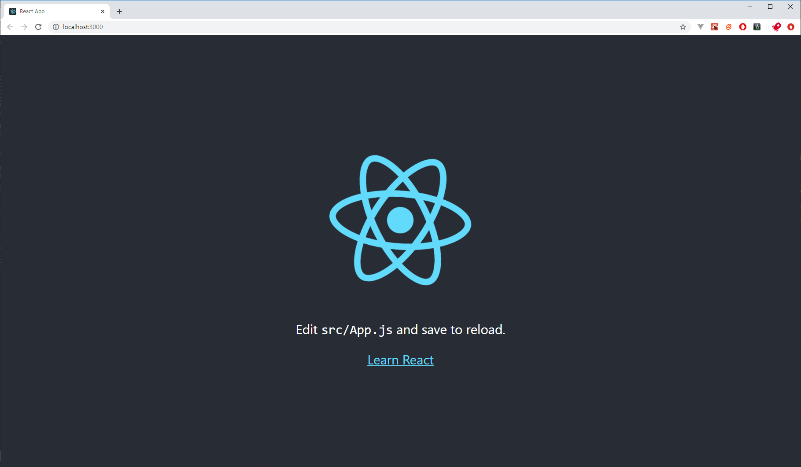

Mobx는 리액트에서 사용되어지는 상태 관리 라이브러리입니다. 리액트 자체적으로 state나 useState를 이용해서 상태 관리를 할 수 있지만, 전역적인 상태나 반응적인 변화를 위해서 Mobx와 같은 외부 라이브러리를 사용하기도 합니다.

`Mobx`에서 상태 변화를 일으키는 것을 `Action`이라고 합니다. 이 글에서는 `리액트`에서 `Action`을 사용하는 것과 `비동기` 작업에서는 어떻게 사용해야할 지 살펴보겠습니다.

_(이 글에서는 `Mobx`에 대한 주요 개념이나 사용법을 다루지 않습니다.)_

[참조] 이 글을 작성하면서 아래의 글에 도움을 받았습니다.

- [Mobx와 비동기 작업 - React - BYSEOP's devlog](https://byseop.netlify.com/mobx-async/)
- [MobX (2) 리액트 프로젝트에서 MobX 사용하기 - velog](https://velog.io/@velopert/MobX-2-%EB%A6%AC%EC%95%A1%ED%8A%B8-%ED%94%84%EB%A1%9C%EC%A0%9D%ED%8A%B8%EC%97%90%EC%84%9C-MobX-%EC%82%AC%EC%9A%A9%ED%95%98%EA%B8%B0-oejltas52z)

---

### 1. 작업 환경 구성

먼저 리액트와 Mobx를 사용할 수 있는 환경을 구성하겠습니다. 작업 순서는 다음과 같습니다.

1. create-react-app으로 리액트 프로젝트 생성
2. 프로젝트 eject 및 decorator 사용 환경 구성
3. mobx 설치 및 실습

먼저 create-react-app을 이용해 실습 프로젝트를 생성합니다.

```bash
$ npx create-react-app mobx-async-action --use-npm
```

`--use-npm` 옵션은 `yarn` 대신에 `npm`을 사용하기 위한 옵션입니다. 하지 않아도 상관없습니다.

```bash
$ cd mobx-async-action
$ npm run eject # eject에 대한 confirm 질문이 나오면 y 입력
```

`eject` 명령어를 이용해 `webpack`설정을 커스텀할 수 있게 만듭니다. 그리고 `decorator`를 사용할 수 있도록 babel 설정을 해줍니다.

```bash
$ npm i @babel/plugin-proposal-class-properties @babel/plugin-proposal-decorators
```

이제 `package.json`을 열고 babel 설정을 다음과 같이 수정합니다.

```json
"babel": {
    "presets": [
      "react-app"
    ],
    "plugins": [
      ["@babel/plugin-proposal-decorators", { "legacy": true }],
      ["@babel/plugin-proposal-class-properties", { "loose": true }]
    ]
  }
```

혹시 vscode에서 데코레이터 때문에 오류가 발생하면, 프로젝트 폴더에 `jsconfig.json`파일을 만들고 다음 코드를 추가해주세요.

```json
{
  "compilerOptions": {
    "experimentalDecorators": true
  }
}
```

이제 실습 대상 라이브러리인 `mobx`를 설치합니다.

```bash
$ npm i mobx mobx-react
```

이제 환경 설정이 끝났습니다. 설정이 잘 동작하는지 개발 서버를 구동시켜서 확인해 보겠습니다.

```bash
$ npm start
```



이제 CRA를 통해 만든 프로젝트에서 필요 없는 부분을 삭제해주겠습니다.

`src`폴더에서 `index.css`, `logo.svg`, `App.css`, `App.test.js` 파일은 지우고, `index.js`와 `App.js`파일을 수정해줍니다.

```jsx
// src/index.js
import React from 'react'
import ReactDOM from 'react-dom'
import App from './App'
import * as serviceWorker from './serviceWorker'

ReactDOM.render(<App />, document.getElementById('root'))

// If you want your app to work offline and load faster, you can change
// unregister() to register() below. Note this comes with some pitfalls.
// Learn more about service workers: https://bit.ly/CRA-PWA
serviceWorker.unregister()
```

```jsx
// src/App.js
import React, { Component } from 'react'

class App extends Component {
  render() {
    return (
      <div className='App'>
        <h1>mobx-async-action</h1>
      </div>
    )
  }
}

export default App
```

---

### 2. Mobx Action 살펴보기

먼저 `mobx`의 `observable` 변수를 선언해주고, 변수에 `reaction`을 걸어두겠습니다. 그리고 간단히 값을 변경시키는 버튼과 로직을 만들겠습니다.

```jsx
// src/App.js
import React, { Component } from 'react'
import { observable, reaction } from 'mobx'
import { observer } from 'mobx-react'

@observer
class App extends Component {
  @observable number1 = 0
  @observable number2 = 0

  constructor(props) {
    super(props)
    reaction(
      () => [this.number1, this.number2],
      ([number1, number2]) => console.log('Reaction:', number1, number2),
    )
  }

  componentDidUpdate() {
    console.log('Updated:', this.number1, this.number2)
  }

  handleClick = () => {
    this.number1 = this.getRandomNumber()
    this.number2 = this.getRandomNumber()
  }

  getRandomNumber = () => Math.ceil(Math.random() * 10)

  render() {
    return (
      <div className='App'>
        <h1>mobx-async-action</h1>
        <h5>number1: {this.number1}</h5>
        <h5>number2: {this.number2}</h5>
        <button onClick={this.handleClick}>random</button>
      </div>
    )
  }
}

export default App
```

`App`컴포넌트는 `number1`과 `number2`라는 상태를 가지고 있고, 버튼을 클릭하면 두 상태 변수에 랜덤한 값이 저장됩니다. 상태가 변경되면 콘솔에 `Reaction:` 으로 출력되도록 `reaction`을 만들어 두었고, 컴포넌트가 변경되면 `Updated:`로 콘솔에 출력됩니다.

먼저 `random`버튼을 클릭해보겠습니다.

제 경우에는 다음과 같이 출력되었습니다.

```output
# output
Reaction: 2 0
Reaction: 2 1
Updated: 2 1
```

출력을 분석해보면 두 개의 상태 변수가 변경될 때 각각의 `Action`이 총 2번 발생되고, `Action`이 끝나면 컴포넌트가 업데이트 되는 것을 알 수 있습니다.

그렇다면 비동기 상황에서는 어떻게 동작할까요? `handleClick`메소드에 `setTimeout`으로 비동기적 상황을 만들어 보겠습니다.

```jsx
// src/App.js
handleClick = () => {
  // 1초 후에 number의 값이 변하는 동작
  setTimeout(() => {
    this.number1 = this.getRandomNumber()
    this.number2 = this.getRandomNumber()
  }, 1000)
}
```

```output
# output
Reaction: 4 0
Updated: 4 0
Reaction: 4 6
Updated: 4 6
```

`setTimeout`함수를 이용해서 1초 후에 값이 변하는 `Action`을 실행시켜보았습니다. 아까와 같이 2번의 `Action`이 발생하였고, 이번에는 `Updated` 또한 2번이 발생했습니다.

`mobx`에서는 이러한 상태 변화를 하나로 묶는 `action`함수를 제공합니다. 데코레이터를 사용해서 `handleClick`메소드를 `action`으로 감싸보겠습니다.

```js
// src/App.js
import { observable, reaction, action } from 'mobx'

// 데코레이터를 이용해 mobx의 action으로 handleClick 메소드를 감싸줌
@action
handleClick = () => {
  this.number1 = this.getRandomNumber()
  this.number2 = this.getRandomNumber()
}
```

```output
# output
Reaction: 5 9
Updated: 5 9
```

실행되는 메소드를 `action`으로 감싸주니 두 변수의 상태가 변했음에도 한번의 `Action`만 발생하는 것을 볼 수 있습니다. 또한 `mobx`의 `action`으로 감싸주면 개발자도구를 통해 변화의 정보를 추적할 수 있습니다.

이번에는 하나의 함수 안에서 `action`으로 감싼 함수를 호출해보도록 하겠습니다.

```js
// src/App.js
handleClick = () => {
  this.setNumber1()
  this.setNumber2()
}

@action setNumber1 = () => (this.number1 = this.getRandomNumber())
@action setNumber2 = () => (this.number2 = this.getRandomNumber())
```

```output
# output
Reaction: 3 0
Reaction: 3 3
Updated: 3 3
```

`action`으로 감싼 함수를 각각 호출해보니 독립적으로 `Action`이 발생했습니다. 다시 `handleClick`메소드에 `action`을 감싸봅시다.

```js
// src/App.js
@action
handleClick = () => {
  this.setNumber1()
  this.setNumber2()
}

@action setNumber1 = () => (this.number1 = this.getRandomNumber())
@action setNumber2 = () => (this.number2 = this.getRandomNumber())
```

```output
# output
Reaction: 5 3
Updated: 5 3
```

`action`을 감싸주니 독립된 `Action`을 하나로 묶어 동작하게 됩니다. 또한 `setNumber1`과 `setNumber2`에 `@action`을 제거하더라도 하나의 `Action`으로 묶여 동작하는 것을 볼 수 있습니다.

이번에는 `action`내에서 비동기 동작을 관찰해 보겠습니다.

```js
// src/App.js
@action
handleClick = () => {
  setTimeout(() => {
    this.number1 = this.getRandomNumber()
    this.number2 = this.getRandomNumber()
  }, 1000)
}
```

```output
# output
Reaction: 1 0
Updated: 1 0
Reaction: 1 4
Updated: 1 4
```

동작하는 함수에 `action`을 적용시켰음에도 전혀 그렇지 않은 것처럼 동작합니다. mobx 문서에서는 다음과 같이 말합니다.

> _The action wrapper / decorator only affects the currently running function, not functions that are scheduled (but not invoked) by the current function!_

`action`으로 감싸주더라도 그 영향은 현재 실행 중인 함수 내에만 적용됩니다. `setTimeout` 또는 `Promise.then`, `async`함수 등 새롭게 호출되는 함수의 동작에 대해서는 `action`의 기능을 적용받을 수 없습니다.

---

### 3. 비동기 작업의 Action 다루기

mobx에서 이러한 비동기 작업에서 `Action`을 처리하기 위해서는 새로운 `action`을 적용해야 합니다. mobx 문서에서 다루고 있는 방법들을 살펴보겠습니다.

#### 3-1. 다른 action으로 감싸기

비동기 작업에서의 `Action`이 발생하는 부분을 다른 `action`으로 감싸주도록 하겠습니다.

```js
// src/App.js
// @action
handleClick = () => {
  setTimeout(() => {
    this.setNumbers()
  }, 1000)
}

@action
setNumbers = () => {
  this.number1 = this.getRandomNumber()
  this.number2 = this.getRandomNumber()
}
```

이렇게 비동기 작업 자체를 `action`으로 감싸 새로운 함수로 만들 수 있습니다. 만약 메인으로 호출하는 `handleClick`메소드에 `Action`이 발생할 일이 없다면 `@action`을 제거해도 됩니다.

데코레이터를 이용하지 않고 `action`을 감싸주는 방법도 있습니다.

```js
// src/App.js
@action
handleClick = () => {
  setTimeout(
    action('setNumbersAsync1', () => {
      this.number1 = this.getRandomNumber()
      this.number2 = this.getRandomNumber()
    }),
    1000,
  )

  Promise.resolve().then(
    action('setNumbersAsync2', () => {
      this.number1 = this.getRandomNumber()
      this.number2 = this.getRandomNumber()
    }),
  )
}
```

데코레이터를 사용하지 않고 `action`으로 감싸면서 새로운 함수를 생성합니다. `action`으로 생성된 `setNumbersAsync`함수가 실행 로직이 아니라 `setTimeout`과 `Promise.then`의 콜백함수 자리를 대신하고 있습니다.

#### 3-2. runInAction 사용하기

비동기 작업이 있을 때마다 `action`으로 감싸주거나, 새로운 함수를 선언하는 것은 약간 귀찮은 일이 될 수도 있습니다. mobx는 `runInAction`함수를 통해 실행 로직에서 직관성을 잃지 않고 `Action`을 발생 시킬 수 있게합니다.

```js
// src/App.js
@action
handleClick = () => {
  Promise.resolve().then(() => {
    runInAction(() => {
      this.number1 = this.getRandomNumber()
      this.number2 = this.getRandomNumber()
    })
  })
}
```

`runInAction`함수의 첫번째 인자로 익명의 함수를 넘겨줍니다. `runInAction`은 인자로 받은 함수를 즉시 실행하며 `Action`을 묶어주게 됩니다.

#### 3-3. async/await

만약 비동기 작업을 호출하는 함수가 `async`함수라면 `await`이 실행된 후에는 `action`의 적용되지 않습니다. `await` 이후의 코드 블록에서 `상태 변화`가 발생한다면 `runInAction`으로 감싸주어야 합니다.

```js
@action
handleClick = async () => {
  await Promise.resolve()
  this.number1 = this.getRandomNumber()
  this.number2 = this.getRandomNumber()
}
```

```output
# output
Reaction: 3 0
Updated: 3 0
Reaction: 3 7
Updated: 3 7
```

```js
@action
handleClick = async () => {
  await Promise.resolve()
  runInAction(() => {
    this.number1 = this.getRandomNumber()
    this.number2 = this.getRandomNumber()
  })
}
```

```output
# output
Reaction: 8 3
Updated: 8 3
```

#### 3-4 flow

`flow`를 사용하면 코드는 가장 깔끔하고 직관적이게 작성할 수 있습니다. 하지만 약간 다른 방법으로 비동기 작업을 제어합니다. `async/await`와 비슷하지만 `function *` 제너레이터를 사용합니다. `await` 대신에 제너레이터의 `yield`를 사용합니다. `runInAction`과 같은 새로운 `Action`을 감싸 줄 필요가 없어집니다.

```js
constructor(props) {
    super(props)
    // flow 내에서 this를 사용하기 위해 바인딩
    this.handleClick = this.handleClick.bind(this)
}

handleClick = flow(function*() {
  yield Promise.resolve()
  this.number1 = this.getRandomNumber()
  this.number2 = this.getRandomNumber()
})
```

---

### 마무리

지금까지 mobx의 상태 변화 Action을 다루는 법을 살펴보았습니다. 상태 변화를 감지하여 `Action`이 발생할 때, 여러 번의 `Action`을 하나로 묶어주어 상태 변화를 잘 처리할 수 있도록 여러 가지 방법을 살펴보았습니다.

특히 비동기 작업에서의 `Action` 적용은 컴포넌트의 업데이트에도 영향을 주기 때문에, 직관적이고 보기 좋은 코드를 작성할 뿐만 아니라, 컴포넌트 라이프 사이클을 이해하고 `Action`과 함께 잘 다루는 법을 익혀야 할 것 같습니다.
