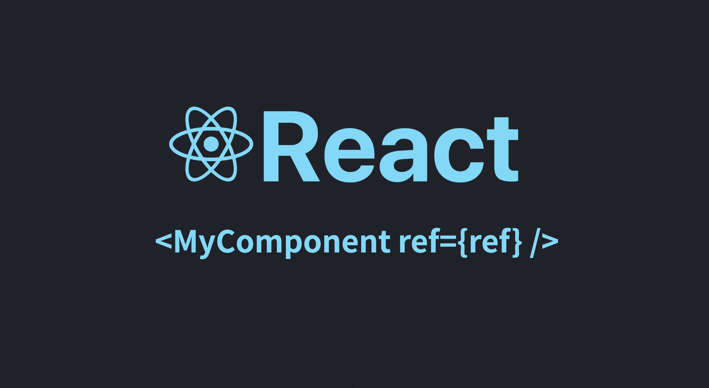

React에서 `ref` 속성(props)이 가장 많이 사용하는 용도는 `DOM` 엘리먼트를 참조하는 경우일 것입니다. HTML 엘리먼트에 대해 `ref`를 `props`로 넘겨주어 `DOM` 엘리먼트를 담거나, 콜백 함수를 넘겨주어 `DOM` 엘리먼트를 매개변수로 접근할 수 있습니다. 하지만 `ref`의 기능은 그것뿐만이 아닙니다.

> Refs provide a way to access DOM nodes or React elements created in the render method.\
> [공식문서(en)](https://reactjs.org/docs/refs-and-the-dom.html) [공식문서(ko)](https://ko.reactjs.org/docs/refs-and-the-dom.html)

리액트 공식문서에서는 ref를 통해 DOM 노드뿐만 아니라 React 엘리먼트(DOM 노드 포함)에 접근할 수 있다고 말합니다. 이번 포스트에서는 React 엘리먼트를 다루는 `ref` 속성에 대해 알아보겠습니다.

---

## DOM 조작을 위한 ref 전달

```jsx
import { useEffect, useRef } from "react"

function App() {
  const inputRef = useRef()

  useEffect(() => {
    console.log(inputRef) // { current: <input type="text"> }
  })

  return (
    <div>
      <input ref={inputRef} />
    </div>
  )
}

export default App
```

기본적으로 `jsx`로 DOM 엘리먼트를 작성할 때 `useRef`로 호출된 값을 `ref` 속성으로 넘겨주면 해당 `ref` 객체에 DOM 엘리먼트가 할당됩니다. 만약 `input`을 구현하는 컴포넌트 내부의 DOM 엘리먼트에 접근하려면 어떻게 해야 할까요? 다음 코드처럼 컴포넌트를 작성합니다.

```jsx
import { useEffect, useRef } from "react"

function MyInput(props) {
  const { ref } = props

  useEffect(() => {
    console.log("ref:", ref) // ref: undefined
  })

  return <input ref={ref} />
}

function App() {
  const inputRef = useRef()

  useEffect(() => {
    console.log("inputRef:", inputRef) // inputRef: { current: undefined }
  })

  return (
    <div>
      <MyInput ref={inputRef} />
    </div>
  )
}

export default App
```

직접 작성한 `MyInput` 컴포넌트에 `ref` 속성으로 ref 객체를 전달했음에도 `MyInput` 컴포넌트 내부에서는 `ref`라는 이름으로 전달된 `props`가 `undefined`로 전달되는 것을 확인할 수 있습니다. 공식문서에서 말하는 것처럼 `ref` 속성은 `DOM 엘리먼트`나 `React 엘리먼트`를 참조하기 위한 속성이기 때문입니다.([Special Props Warning](https://reactjs.org/warnings/special-props.html))

컴포넌트 내부의 엘리먼트를 참조하기 위해서는 어떻게 해야 할까요?

### 1. `ref`가 아닌 `inputRef` 속성으로 전달

`ref`는 컴포넌트 `props` 중에서 일종의 예약어이기 때문에 사용할 수 없습니다. 그래서 다른 이름의 `props`로 전달하면 됩니다.

```jsx
import { useEffect, useRef } from "react"

function MyInput(props) {
  const { myInputRef } = props

  useEffect(() => {
    console.log("myInputRef:", myInputRef) // myInputRef: {current: <input type="text">}
  })

  return <input ref={myInputRef} />
}

function App() {
  const inputRef = useRef()

  useEffect(() => {
    console.log("inputRef:", inputRef) // inputRef: {current: <input type="text">}
    inputRef.current.focus() // MyInput 컴포넌트의 input 엘리먼트에 focus 됨
  })

  return (
    <div>
      <MyInput myInputRef={inputRef} />
    </div>
  )
}

export default App
```

컴포넌트에 전달하는 `props`의 이름만 바꾸는 것으로 `ref` 객체를 전달하여 컴포넌트 내부의 엘리먼트에 접근할 수 있습니다. 하지만 이렇게 컴포넌트를 작성하게 되면 `input` 엘리먼트와 거의 비슷한 역할을 `MyInput` 컴포넌트가 수행함에도 약간의 다른 사용법을 제공하는 꼴이 됩니다. 이것은 일관적이지 않게 보일 수 있습니다. (`input` 엘리먼트에 접근하기 위해서 `ref`가 아닌 `inputRef` `props`를 전달해야 함.)

### 2. forwardRef 사용하기

React에서는 `ref`를 그대로 전달하는 컴포넌트를 작성할 수 있게 도움을 줍니다. 컴포넌트를 `forwardRef`로 감싸주면 됩니다.

```jsx
import { forwardRef, useEffect, useRef } from "react"

const MyInput = forwardRef(function MyInput(props, forwardedRef) {
  useEffect(() => {
    console.log("forwardedRef:", forwardedRef) // forwardedRef: {current: <input type="text">}
  })

  return <input ref={forwardedRef} />
})

function App() {
  const inputRef = useRef()

  useEffect(() => {
    console.log("inputRef:", inputRef) // inputRef: {current: <input type="text">}
    inputRef.current.focus() // MyInput 컴포넌트의 input 엘리먼트에 focus 됨
  })

  return (
    <div>
      <MyInput ref={inputRef} />
    </div>
  )
}

export default App
```

`forwardRef`함수에 함수형 컴포넌트 형태의 함수를 매개변수로 넣습니다. 이때, 두 번째 인자로 부모에게서 `ref` 속성으로 전달된 ref 객체가 전달됩니다.

만약 `MyInput` 컴포넌트가 클래스 컴포넌트로 작성되었다면, 두 방식을 조합하여 `ref`를 전달할 수 있습니다.

```jsx
import { Component, forwardRef, useEffect, useRef } from "react"

class MyInputWithInputRef extends Component {
  componentDidMount() {
    console.log("myInputRef:", this.props.myInputRef) // myInputRef: {current: <input type="text">}
  }

  render() {
    const { myInputRef } = this.props
    return <input ref={myInputRef} />
  }
}

const MyInput = forwardRef(function MyInput(props, forwardedRef) {
  useEffect(() => {
    console.log("forwardedRef:", forwardedRef) // forwardedRef: {current: <input type="text">}
  })

  return <MyInputWithInputRef myInputRef={forwardedRef} />
})

function App() {
  const inputRef = useRef()

  useEffect(() => {
    console.log("inputRef:", inputRef) // inputRef: {current: <input type="text">}
    inputRef.current.focus() // MyInput 컴포넌트의 input 엘리먼트에 focus 됨
  })

  return (
    <div>
      <MyInput ref={inputRef} />
    </div>
  )
}

export default App
```

코드가 길어졌지만 `MyInput`을 사용하는 부분(`App` 컴포넌트)에서는 `MyInput` 컴포넌트가 어떤식으로 구현되어 있는지 알 필요가 없습니다. `<MyInput>`을 `<input>`으로 교체하더라도 아무 문제가 없을 것입니다. 이것은 **Input**의 역할을 하는 컴포넌트에 대한 일관성과 신뢰성을 부여하게 됩니다.

---

이제 속성(props)으로서의 `ref`에 대해 알아봅시다.

## React 컴포넌트를 조작하기 위한 ref 전달

`ref` 속성은 React Element를 참조하기 위한 접근 방법입니다. 이번에는 컴포넌트 수준의 React Element에 접근하는 `ref`를 다루어 보겠습니다.

### 클래스 컴포넌트에 `ref` 전달하기

```jsx
import { Component, createRef, useEffect, useRef } from "react"

class MyInput extends Component {
  constructor(props) {
    super(props)
    this.state = { value: "" }
    this.inputRef = createRef()
    this.focus = () => {
      this.inputRef.current.focus()
    }
    this.reset = () => {
      this.setState({ value: "" })
    }
  }

  render() {
    return (
      <input
        ref={this.inputRef}
        value={this.state.value}
        onChange={(e) => this.setState({ value: e.target.value })}
      />
    )
  }
}

function App() {
  const ref = useRef()

  const handleReset = () => {
    ref.current.reset() // MyInput 컴포넌트 내부의 state를 조작함
  }

  const handleFocus = () => {
    ref.current.focus() // MyInput 컴포넌트 내부의 input 엘리먼트에 포커스 됨
  }

  useEffect(() => {
    console.log("ref:", ref) // ref: {current: MyInput}
    handleFocus()
  })

  return (
    <div>
      <button onClick={handleReset}>reset</button>
      <button onClick={handleFocus}>focus</button>
      <br />
      <MyInput ref={ref} />
    </div>
  )
}

export default App
```

클래스로 작성된 컴포넌트에 `ref` 속성을 전달하면 해당 클래스로부터 생성된 React 엘리먼트에 접근할 수 있습니다. 클래스의 속성이나 메서드에도 접근할 수 있고, state나 context에도 접근할 수 있습니다.(심지어 render 메소드까지)\
위의 예시 코드와 같이 하위 컴포넌트의 메서드를 통해 부모 컴포넌트가 자식 컴포넌트를 컨트롤할 수 있습니다.(하지만 이런 데이터, 이벤트 흐름을 리액트에서 권장하지는 않습니다.)

### 함수 컴포넌트에 `ref` 전달하기

```jsx
import { forwardRef, useEffect, useRef, useState } from "react"

const MyInput = forwardRef(function MyInput(props, forwardedRef) {
  const ref = useRef()
  const [value, setValue] = useState("")

  useEffect(() => {
    // 수동으로 ref 객체에 내부 메서드를 할당
    forwardedRef.current = {
      focus: () => {
        ref.current.focus()
      },
      reset: () => {
        setValue("")
      },
    }
  }, [forwardedRef])

  return (
    <input ref={ref} value={value} onChange={(e) => setValue(e.target.value)} />
  )
})

function App() {
  const ref = useRef()

  const handleReset = () => {
    if (ref.current) {
      ref.current.reset()
    }
  }

  const handleFocus = () => {
    if (ref.current) {
      ref.current.focus()
    }
  }

  useEffect(() => {
    console.log("ref:", ref) // ref: {current: {focus: fn, reset: fn}}
    handleFocus()
  })

  return (
    <div>
      <button onClick={handleReset}>reset</button>
      <button onClick={handleFocus}>focus</button>
      <br />
      <MyInput ref={ref} />
    </div>
  )
}

export default App
```

함수 컴포넌트는 `ref` 속성으로 엘리먼트에 접근할 수 없기 때문에, `forwardRef`를 이용하여 `MyInput` 컴포넌트 내부로 ref 객체를 전달한 후에 수동으로 내부 동작을 할당해 줄 수 있습니다.

React Hooks 에서는 이와 같은 기능을 제공하는 `useImperativeHandle` 함수가 있습니다.

```jsx
import {
  forwardRef,
  useEffect,
  useImperativeHandle,
  useRef,
  useState,
} from "react"

const MyInput = forwardRef(function MyInput(props, forwardedRef) {
  const ref = useRef()
  const [value, setValue] = useState("")

  // hooks를 이용하여 ref 객체에 내부 메서드를 할당
  useImperativeHandle(forwardedRef, () => ({
    focus: () => ref.current.focus(),
    reset: () => setValue(""),
  }))

  return (
    <input ref={ref} value={value} onChange={(e) => setValue(e.target.value)} />
  )
})

function App() {
  const ref = useRef()

  const handleReset = () => {
    if (ref.current) {
      ref.current.reset()
    }
  }

  const handleFocus = () => {
    if (ref.current) {
      ref.current.focus()
    }
  }

  useEffect(() => {
    console.log("ref:", ref) // ref: {current: {focus: fn, reset: fn}}
    handleFocus()
  })

  return (
    <div>
      <button onClick={handleReset}>reset</button>
      <button onClick={handleFocus}>focus</button>
      <br />
      <MyInput ref={ref} />
    </div>
  )
}

export default App
```

앞선 예시 코드에서 수동으로 ref 객체에 할당해주던 작업을 `useImperativeHandle` 함수로 대체하였습니다. `useImperativeHandle` 함수의 코드를 따라가보면 이렇게 구현되어 있습니다.

```jsx
function imperativeHandleEffect<T>(
  create: () => T,
  ref: {| current: T | null |} | ((inst: T | null) => mixed) | null | void
) {
  if (typeof ref === "function") {
    const refCallback = ref
    const inst = create()
    refCallback(inst)
    return () => {
      refCallback(null)
    }
  } else if (ref !== null && ref !== undefined) {
    const refObject = ref
    if (__DEV__) {
      if (!refObject.hasOwnProperty("current")) {
        console.error(
          "Expected useImperativeHandle() first argument to either be a " +
            "ref callback or React.createRef() object. Instead received: %s.",
          "an object with keys {" + Object.keys(refObject).join(", ") + "}"
        )
      }
    }
    const inst = create()
    refObject.current = inst
    return () => {
      refObject.current = null
    }
  }
}
```

[Github React 저장소](https://github.com/facebook/react/blob/aa25824f3ebbdbbea01be48417f2f99251be1a12/packages/react-reconciler/src/ReactFiberHooks.old.js#L1512)

실제 구현은 조금 더 복잡하지만, 핵심적인 부분은 앞서 수동으로 할당해주던 것과 꽤 비슷하네요.

## 마무리

DOM 엘리먼트를 참조하기 위해서 주로 `ref`를 이용합니다. 이번 글에서는 `ref` 객체가 아닌 React 엘리먼트의 **`ref` 속성**이 어떤 동작을 하는지 살펴봤습니다. 리액트를 사용하여 컴포넌트 단위로 UI를 구성하고 코드를 재사용하는 등등 프론트엔드 개발에서 편리한 점이 많은데요. 단순히 사용하는 것을 넘어 리액트가 어떻게 동작하는지 이해하면 더 잘 활용할 수 있을 것 같습니다. 이 글이 리액트의 동작을 이해하는데 도움이 되었기를 바랍니다.
