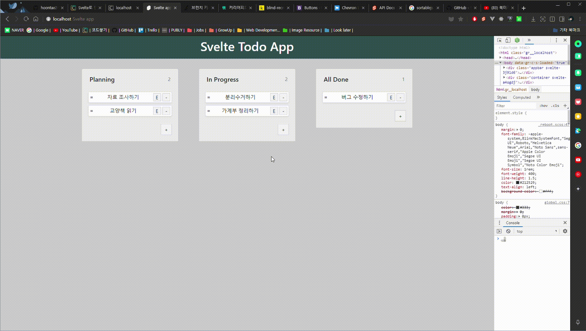

이번 포스트에서는 `Item`의 순서를 변경할 수 있도록 구현하겠습니다.

### 1. Item 순서 변경 구현하기

`Item`의 순서를 변경하여서 Todo-App을 사용하기 좋게 만들어 보겠습니다. 순서를 변경하는 UI/UX는 심플하게 드래그해서 변경할 수 있게 만들 것입니다.

`event`를 이용하여 구현할 수도 있겠지만, 해본 적도 없고 하니 이미 만들어진 라이브러리를 이용하여 적용해보겠습니다.

#### 1.1 Sortablejs 라이브러리 적용하기

정렬을 구현하는 여러 라이브러리 중 [Sortablejs](https://github.com/SortableJS/Sortable)를 이용하겠습니다.

`npm`을 이용해서 설치하겠습니다.

> $ npm install sortablejs

이제 각 `Board`의 리스트에 적용해 보겠습니다. `Item`들을 감싸는 `div`를 만들어줍니다. 또 `list`라는 변수를 선언해주고 만들어 준 `div`에 바인딩 시켜주겠습니다.

`svelte`로 부터 `onMount`함수를 `import`하고, 그 안에 다음과 같이 구현해주세요. `list`변수에 `div` Element가 바인딩 되면 `Sortable` 라이브러리를 적용시키도록 합니다.

```html
<!-- Board.svelte -->
<script>
  import { onMount } from 'svelte'
  import Sortable from 'sortablejs'
  
  let list = null
  onMount(() => {
    if(list) {
      new Sortable(list)
    }
  })
</script>
<div id={board.id} class="item-list" bind:this={list}>
{#each _items as item (item.id)}
  <Item
    {item}
    on:update={handleUpdateItem}
    on:remove={handleRemoveItem}
  />
{/each}
</div>
```

이제 브라우저로 가서 잘 적용되었는지 확인해 봅니다. `Item`을 드래그해서 이동할 수 있게 되었고, 순서도 변경이 됩니다.

하지만 DOM Element만 움직이는 것 일뿐, 아직 실제 `Store`에 있는 데이터의 순서가 변경되는 것은 아닙니다.

#### 1.2 Sortablejs를 이용하여 순서 변경 구현하기

`Sortablejs`를 적용하여서 `DOM Element`를 드래그로 움직일 수 있게 했습니다. 드래그로 순서가 변경될 때, `Store`에 있는 실제 데이터가 변경되도록, 이벤트 핸들러를 연결시켜주면 됩니다.

먼저 그 전에 `Store`에 있는 데이터에서 `Item`의 `id` 값을 약간 수정해주고, `Item` 컴포넌트에서 드래그 핸들을 만들어주도록 하겠습니다.

```js
// stores/index.js
const _boards = [
  { id: uuid(), title: 'Planning' },
  { id: uuid(), title: 'In Progress' },
  { id: uuid(), title: 'All Done' },
]

const _items = [
  { id: uuid(), boardId: _boards[0].id, title: '자료 조사하기', done: false },
  { id: uuid(), boardId: _boards[0].id, title: '교양책 읽기', done: false },
  { id: uuid(), boardId: _boards[1].id, title: '분리수거하기', done: false },
  { id: uuid(), boardId: _boards[1].id, title: '가계부 정리하기', done: false },
  { id: uuid(), boardId: _boards[2].id, title: '버그 수정하기', done: false },
]

const createItems = () => {
  const { subscribe, reset, update: _update, set } = items
  // ...생략...
  return { subscribe, reset, set, add, remove, update }
}
```

`Board`와 `Item`의 `id`를 이용해서 비교할 때, 문자와 숫자가 섞이면 비교하기 번거로우니 모두 문자로 수정하겠습니다. 그리고 `items`에 `set`함수를 넣어줘서 순서가 변경되면 적용되는 부분에 사용하도록 하겠습니다.

다음은 `Item`컴포넌트를 수정해줍니다.

```html
<!-- Item.svelte -->
<div
  id={item.id}
  class="item card p-1 mb-2 shadow-sm"
  class:shadow={hovering}
  on:mouseenter={() => hovering = true}
  on:mouseleave={() => hovering = false}
>
  <span class="drag-handle">=</span>
  {#if isEditable}
  <input bind:value={item.title} />
  {:else}
  <span class:item-done={item.done} on:click={handleToggleDone}>
    {item.title}
  </span>
  {/if}
  <div class="item-action">
    <button class="item-btn" on:click={handleToggleEditable}>E</button>
    <button class="item-btn" on:click={handleRemoveItem}>-</button>
  </div>
</div>
```

`Item`의 가장 상위 `div` 태그에 `id`속성을 넣어주었고, 드래그를 위한 핸들 아이콘을 하나 만들어 주었습니다.

이제 순서가 변경될 수 있도록 `Sortable`에 옵션과 이벤트를 등록합니다.

```html
<!-- Board.svelte -->
<script>
  const handleSortItem = e => {
    const target = $items.find(item => item.id === e.item.id)
    const allItems = $items.filter(item => item.id !== e.item.id)
    const _items = allItems.filter(item => item.boardId === e.to.id)
    target.boardId = e.to.id
    _items.splice(e.newIndex, 0, target)

    const newItems = allItems
      .filter(item => item.boardId !== e.to.id)
      .concat(_items)
    items.set(newItems)
  }

  let list = null
  onMount(() => {
    if (list) {
      new Sortable(list, {
        group: 'board',
        handle: '.drag-handle',
        animation: 300,
        onEnd: handleSortItem,
      })
    }
  })
</script>
```

`onMount`함수에서 `Sortable` 생성자에 옵션을 추가해줍니다.

- `group`옵션은 다른 `Board`의 리스트로 드래그하여 움직일 수 있게 해줍니다.
- `handle`옵션은 `Item`전체를 클릭하여 드래그하지 않고, `handle`에 주입된 클래스이름을 가진 `Element`를 클릭하여 드래그할 수 있게 해줍니다.
- `animation`옵션은 드래그로 `Item`의 순서가 변경될 때, 약간의 애니매이션을 사용합니다.
- `onEnd`옵션은 드래그가 끝났을 때, 이벤트 핸들러로 콜백 함수를 호출합니다. 실제 `Store`의 데이터를 변경하기 위해 사용됩니다.

`onEnd`옵션의 이벤트 핸들러로 위에서 선언한 `handleSortItem`함수를 호출합니다. 해당 함수에서는 실제 데이터의 순서가 변경되도록 구현합니다.

이제 브라우저로 가서 확인해보겠습니다.



잘 동작하는지 확인하고 싶으면, 순서 변경 후 `items`를 콘솔로 출력해보시면 됩니다.

---

### 마무리

여기까지 **Svelte로 만드는 Todo-App**을 만들어 보았습니다. **Svelte**를 공부하기 위해서 간단히 튜토리얼이나 공식문서를 훑어보았고, 어떻게 동작하는지 실습하는 형식으로 공부하기 위해 이 시리즈의 포스트를 작성하며 공부해 보았습니다.

이제 기초적인 부분을 시작했고, 전반적으로 `Svelte`로 만든 앱이 어떻게 동작하는지 조금 알았으니, 공식 문서를 꼼꼼히 읽어보며 공부하면 더 도움이 될 것이고, 이해하기도 쉬울 것입니다.

*전체 프로젝트 코드는 [Github](https://github.com/hoontae24/hello-svelte)에서 보실 수 있습니다.*
