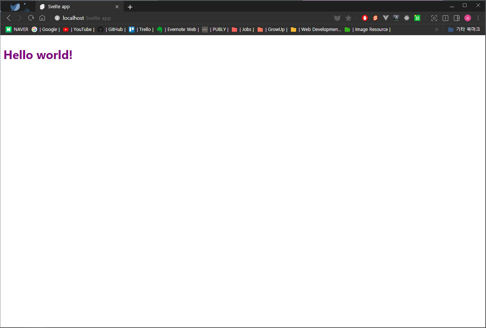
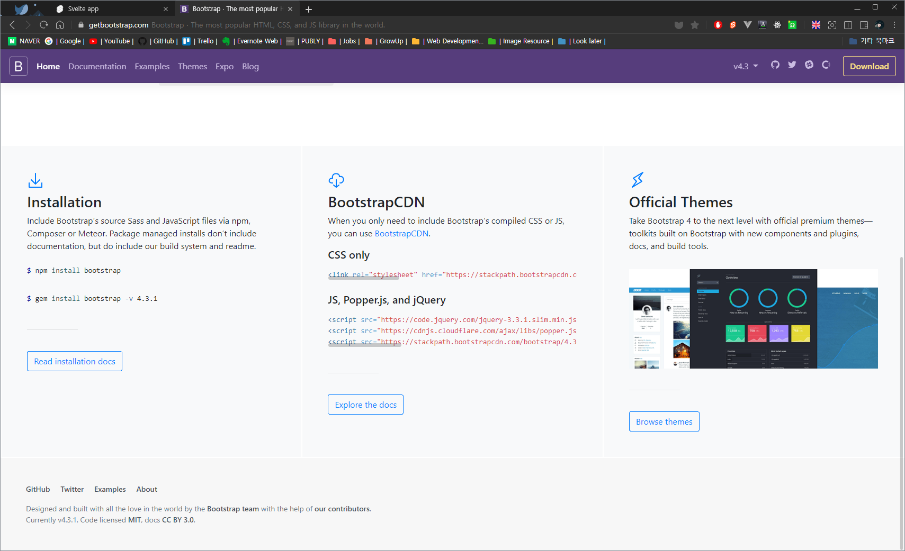
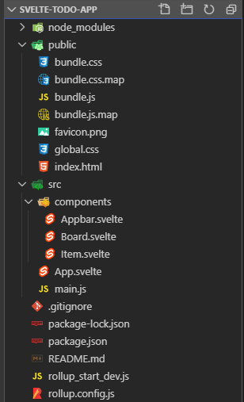
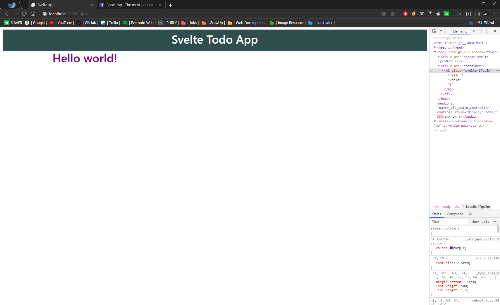
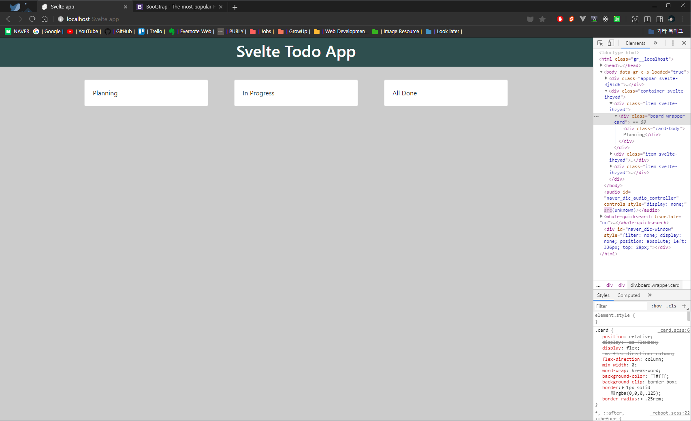
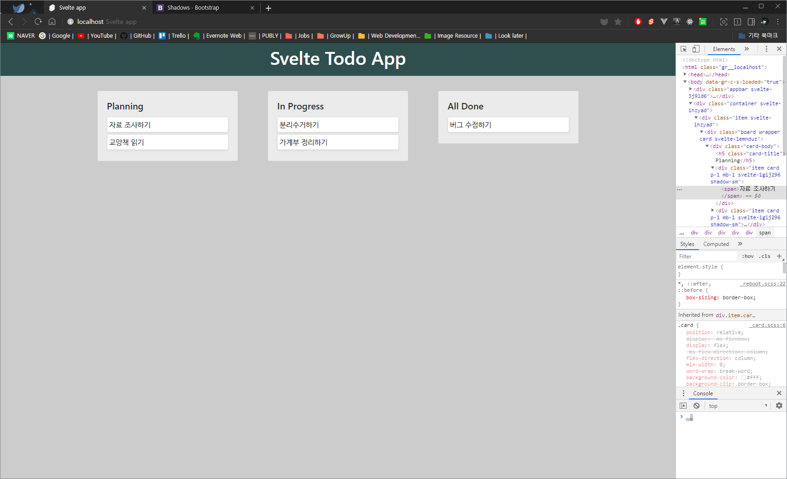

최신 프론트엔드 기술 중 [Svelte](https://svelte.dev/)라는 기술에 대해 TODO-App 제작을 하면서 알아보겠습니다.

Svelte에 대한 소개나 API는 [공식문서](https://svelte.dev/docs)나 아래의 자료를 읽어주세요.

- [웹 프레임워크 Svelte를 소개합니다.](https://velog.io/@ashnamuh/hello-svelte)
- [SvelteJS(스벨트) - 새로운 개념의 프론트엔드 프레임워크](https://heropy.blog/2019/09/29/svelte/)

_이 글은 Svelte 실습 예제입니다._
*전체 프로젝트 코드는 [Github](https://github.com/hoontae24/hello-svelte)에서 보실 수 있습니다.*

---

### 1. Svelte 설치하기

먼저 Svelte를 설치합니다. Svelte 공식 사이트의 [QuickStart Guide](https://svelte.dev/blog/the-easiest-way-to-get-started)를 참조해 주세요.

터미널에서 degit을 이용해서 Svelte 프로젝트 템플릿을 내려받을 수 있습니다.

> $ npx degit sveltejs/template svelte-todo-app  
> $ cd svelte-todo-app  
> $ npm install  
> $ npm run dev

위의 작업을 마치고 [http://localhost:5000](http://localhost:5000)에 접속해봅니다. 프로젝트 설치는 잘된 것 같습니다.



### 2. 컴포넌트 만들기

TODO를 구성할 "할 일" 항목은 **Item**입니다.
**Item**이 모여서 **Board**를 구성하고, **Board**를 통해 "할 일의 진행 상태"를 구분하도록 하겠습니다.
그리고 꼭 필요한 것은 아니지만, **Appbar**를 만들도록 하겠습니다.

그리고 저는 CSS 디자인 감각이 없어서 부트스트랩의 도움을 받도록 하겠습니다.  
구글에서 `부트스트랩`을 검색하고 홈페이지에서 CDN을 가져오겠습니다.



프로젝트에서 `public/index.html` 파일의 `<head>`태그 안에 cdn을 붙여 넣어줍니다.

```html
<!-- public/index.html -->
<link
  rel="stylesheet"
  href="https://stackpath.bootstrapcdn.com/bootstrap/4.3.1/css/bootstrap.min.css"
  integrity="sha384-ggOyR0iXCbMQv3Xipma34MD+dH/1fQ784/j6cY/iJTQUOhcWr7x9JvoRxT2MZw1T"
  crossorigin="anonymous"
/>
```

#### 2.1 Appbar 컴포넌트 만들기

먼저 Appbar를 만들겠습니다. 없어도 전혀 지장이 없지만, 너무 밋밋하면 재미없으니까요.

`/src` 폴더 아래에 `components`폴더를 만들고, 그 아래 `Appbar.svelte` 파일을 만들겠습니다. 또 `Board.svelte`와 `Item.svelte` 파일도 미리 만들어 두겠습니다.



**Appbar**에는 간단하게 제목 정도 나오게 만들어 주겠습니다.

```html
<!-- Appbar.svelte -->
<script>
  const appTitle = 'Svelte Todo App'
</script>

<div class="appbar">
  <h1 class="title">{appTitle}</h1>
</div>

<style>
  .appbar {
    background-color: darkslategrey;
    padding: 8px;
  }

  .appbar > .title {
    text-align: center;
    color: white;
  }
</style>
```

`App.svelte` 파일로 가서 **Appbar** 컴포넌트를 추가해 주겠습니다.

`<script>`태그 가장 위에 `import` 구문을 입력하고, 페이지에 표시될 태그 상단에 `<Appbar />`를 추가해줍니다.

```html
<!-- App.svelte -->
<script>
  import Appbar from './components/Appbar.svelte'

  export let name
</script>

<style>
  h1 {
    color: purple;
  }
</style>

<Appbar />
<h1>Hello {name}!</h1>
```

그리고 앱의 내용들이 가운데 올 수 있도록 `Container`로 감싸도록 하겠습니다.

`src/App.svelte` 파일을 수정합니다. 기존의 내용 부분에 있던 코드를 `container`클래스를 가진 `<div>`태그로 감싸줍니다. 부트스트랩에 정의된 클래스이기 때문에 `<div>`태그가 [컨테이너](https://getbootstrap.com/docs/4.3/layout/overview/) 역할을 합니다.

```html
<!-- App.svelte -->
<div class="container">
  <h1>Hello {name}!</h1>
</div>
```

이제 브라우저에 가서 확인해 봅니다.



**Appbar**와 **부트스트랩**이 적용된 **Container**가 잘 나오는 것을 확인할 수 있습니다.

#### 2.2 Board 컴포넌트 만들기

다음은 제대로 Todo-App에 쓰일 부분들을 만들도록 하겠습니다.

`src/components/Board.svelte`로 가서 **Board**를 만들도록 하겠습니다.

먼저 간단하게 제목 정도만 표시할 수 있도록 해주겠습니다.

```html
<!-- Board.svelte -->
<script>
  export let board = null
</script>

{#if board}
<div class="board wrapper card">
  <!-- 부트스트랩의 card 디자인 이용 -->
  <div class="card-body">
    {board.title}
  </div>
</div>
{/if}

<style>
  .board.wrapper {
    background-color: #e9ecef;
  }
</style>
```

기초적인 문법을 잠깐 짚고 넘어가겠습니다.

```javascript
export let board = null
```

`Svelte`에서 `<script>`태그 내부에 `export`구문을 쓰면 부모 컴포넌트의 값을 받아오는 **props**가 됩니다. (만약 부모 컴포넌트에서 넘겨주는 값이 없다면 여기서는 `null`로 지정됩니다.)

```html
<div class="card-body">
  {board.title}
</div>
```

일반적인 html태그를 쓰는 부분에서 {}를 이용하여 script에서 선언한 변수를 참조할 수 있습니다. `{board.title}`은 부모 컴포넌트에서 넘겨준 `board`객체의 `title`속성을 가져옵니다.

이제 부모 컴포넌트인 `App.svelte`로 가서 **Board**를 구성해줍니다.

`<script>`태그 상단에서 `Board`컴포넌트를 불러옵니다.

```javascript
import Board from './components/Board.svelte'
```

그리고 그 아래에 Board로 사용할 임시 데이터를 선언해줍니다.

```javascript
const boards = [
  { title: 'Planning' },
  { title: 'In Progress' },
  { title: 'All Done' },
]
```

`container`안쪽 부분의 원래 내용을 지우고 Board를 다음과 같이 작성합니다.

```html
<div class="container">
  {#each boards as board}
  <div class="item">
    <Board board={board} />
  </div>
  {/each}
</div>
```

`Svelte`의 `#each`구문은 [여기](https://svelte.dev/docs#each)서 확인하세요.  
items 배열에 있는 값을 하나씩 꺼내 item이라는 변수로 참조하게 합니다.

```html
<Board board={board} />
```

`<Board>` 컴포넌트의 `board`속성으로 값을 지정하면 `Board.svelte`에서 `export` 구문으로 선언한 `board`에 전달됩니다.

각 `Board`에 CSS를 약간 추가해줍니다.

```html
<style>
  .container {
    overflow: auto;
    display: flex;
  }
  .container .item {
    width: 300px;
    flex-grow: 1;
    margin: 32px;
  }
</style>
```

그리고 전체 페이지의 배경화면을 약간 어둡게 바꾸겠습니다.  
`public/global.css`파일의 `body`부분에 다음과 같이 추가하겠습니다.

```css
body {
  padding: 0px; /* padding: 8px;에서 수정 */
  background-color: #ccc !important; /* 추가 */
}
```

제대로 동작하는지 확인해 보겠습니다.



`App.svelte`에 선언한 `boards`의 데이터가 컴포넌트의 속성을 통해서 주입된 것을 확인할 수 있습니다.

#### 2.3 Item 컴포넌트 만들기

먼저 `item`으로 사용될 임시 데이터를 만듭니다.

`App.svelte`파일의 `<script>`태그에 다음 내용을 추가해줍니다.

```javascript
const items = [
  { id: 1, boardId: 1, title: '자료 조사하기', done: false },
  { id: 2, boardId: 1, title: '교양책 읽기', done: false },
  { id: 3, boardId: 2, title: '분리수거하기', done: false },
  { id: 4, boardId: 2, title: '가계부 정리하기', done: false },
  { id: 5, boardId: 3, title: '버그 수정하기', done: false },
]
```

그리고 이전에 만들어 둔 `boards`데이터에 `id`속성을 추가해줍니다.

```javascript
const boards = [
  { id: 1, title: 'Planning' },
  { id: 2, title: 'In Progress' },
  { id: 3, title: 'All Done' },
]
```

각 `item`들은 자신이 속하는 `Board`의 `id`값을 가지고 있습니다.

`Board.svelte`파일로 가서 `Board`의 제목 아래에 `item`들이 표시되도록 합니다.

```html
<!-- Board.svelte -->
<script>
  import Item from './Item.svelte' // Item 컴포넌트를 불러옵니다.

  export let board = null
  export let items = [] // App 컴포넌트에서 전달하는 items를 받습니다.
</script>

{#if board}
<div class="board wrapper card">
  <div class="card-body">
    <h5 class="card-title">
      {board.title}
    </h5>
    {#each items as item (item.id)}
    <Item {item} />
    <!-- <Item item={item} />과 동일함. 속성과 변수명이 같으면 생략가능 -->
    {/each}
  </div>
</div>
{/if}

<style>
  .board.wrapper {
    background-color: #ebebeb;
  }
</style>
```

`Item.svelte`파일에서 `item`이 표시되도록 다음과 같이 작성해줍니다. (주석으로 표시한 부분만 이해하면 됩니다.)

```html
<!-- Item.svelte -->
<script>
  export let item = null // Board에서 item값을 전달 받습니다.
  let hovering = false
</script>

{#if item}
<div
  class="item card p-1 mb-1 shadow-sm"
	class:shadow={hovering}
	on:mouseenter={() => hovering = true}
	on:mouseleave={() => hovering = false}
>
  <span>
    {item.title}
    <!-- item의 제목을 출력합니다. -->
  </span>
</div>
{/if}

<style>
  .item {
    transition: box-shadow 0.25s ease-in;
  }
</style>
```



각 `item`의 제목도 잘 출력되고, hover에도 반응하는 것을 볼 수 있습니다.

---

다음 시간에는 임시로 만들었던 `boards`와 `items` 데이터를 `store`로 분리해 관리하고, 추가/삭제 등의 동작도 구현해보겠습니다.

*전체 프로젝트 코드는 [Github](https://github.com/hoontae24/hello-svelte)에서 보실 수 있습니다.*
