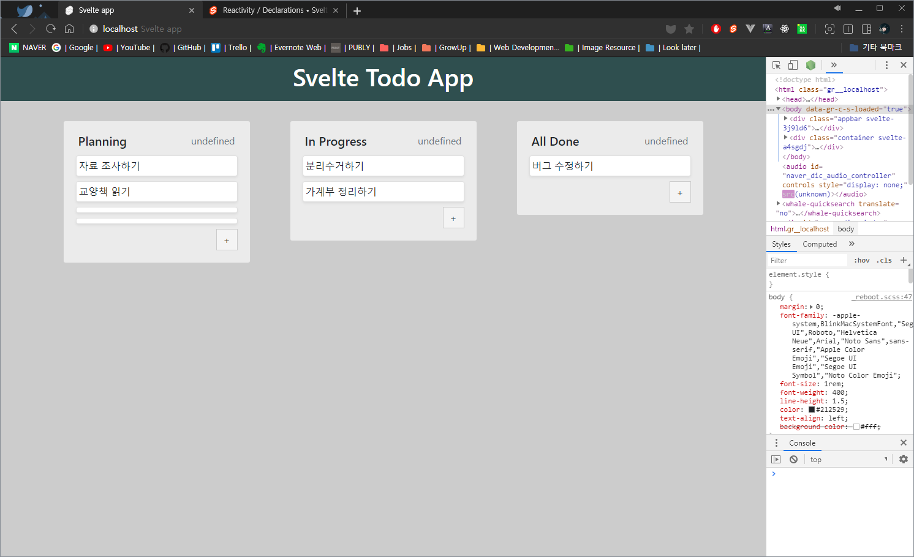
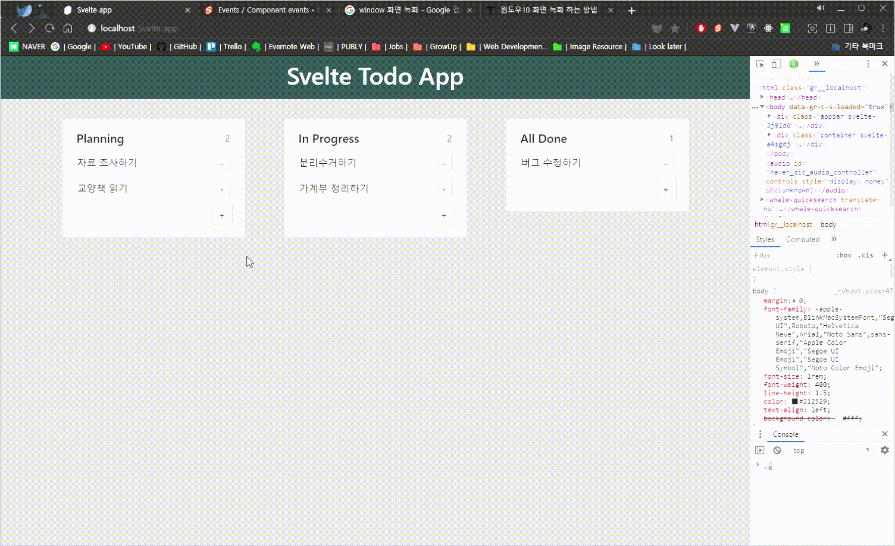
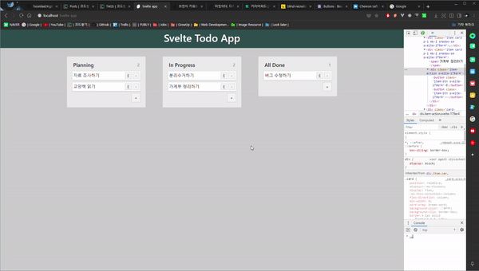

지난 시간에 이어서 `boards`와 `items` 데이터를 `Store`를 만들어서 관리하고, `CRUD`를 구현하겠습니다.

### 1. Store 구현하기

`Svelte`는 이미 `Store` 기능을 내장하고 있습니다. `svelte/store`를 `import`하면 그 기능을 사용할 수 있습니다.

먼저 `Store`를 구현할 파일을 만들도록 하겠습니다. `/src`폴더 아래에 `stores`폴더를 만들고, `index.js`파일을 생성합니다.

만약 `Store`로 사용할 데이터가 많다면 `/stores`폴더 안에 여러 파일을 만들어 구현하면 관리가 편하겠지만, 현재 프로젝트에서는 `boards`와 `items` 두 개의 데이터만 관리하면 되니, `index.js`파일 안에 함께 구현하도록 하겠습니다.

`Store`에 대한 기본 지식은 [svelte/store 공식 API 문서](https://svelte.dev/docs#svelte_store)를 참조해주세요.

#### 1.1 boards 데이터 Store로 구현하기

이제 `/src/stores/index.js`파일을 다음과 같이 작성합니다.

```js
// src/stores/index.js
import { writable } from 'svelte/store'
import uuid from 'uuid/v4'

const _boards = [
  { id: 1, title: 'Planning' },
  { id: 2, title: 'In Progress' },
  { id: 3, title: 'All Done' },
]

const createBoards = () => {
  const boards = writable(_boards)
  const { subscribe, reset, update: _update } = boards

  const add = () => {
    _update(boards => boards.concat({ id: uuid(), title: '' }))
  }

  const remove = board => {
    if (!board) return
    _update(boards => boards.filter(_board => _board.id !== board.id))
  }

  const update = board => {
    if (!board) return
    _update(boards =>
      boards.map(_board => (_board.id === board.id ? board : _board)),
    )
  }

  return { subscribe, reset, add, remove, update }
}

export const boards = createBoards()
```

`Store 모듈`에서 불러온 `writable`함수의 파라미터로 초기화 할 `boards`데이터를 넣어줍니다.

생성된 `Store`객체 `boards`에서 `update`메소드를 이용해 `add`, `remove`, `update` 함수를 구현합니다. (`update`라는 이름의 함수를 따로 구현하기 위해서 원래의 `update`메소드를 `_update`로 명명하였음.)

`createBoards`함수가 리턴하는 객체의 `add`, `remove`, `update`함수는 데이터를 다루는 데에 사용하기 위해 구현하였고, `subscribe`, `reset`함수는 컴포넌트 내에서 `$boards`로 접근하기 위해서 함께 넘겨줍니다.

`add`함수에서 `board`를 생성하려고 할 때 id가 필요한데, 중복되지 않는 값이 필요하므로 `uuid`를 사용하도록 하겠습니다. 상단에서 `uuid`를 import 하고, 콘솔로 가서 모듈을 설치하겠습니다.

> \$ npm install uuid

`package.json`파일을 열어보면, 다음과 같이 모듈이 의존성에 추가된 것을 볼 수 있습니다.

```json
// package.json
"dependencies": {
    "sirv-cli": "^0.4.4",
    "uuid": "^3.3.3"
  },
```

다음은 `App.svelte`파일로 가서 만들어둔 `boards`를 불러오겠습니다.

`./stores`에서 `boards`를 import하고, 기존에 사용하던 boards배열 데이터는 삭제하겠습니다.

```html
<!-- App.svelte -->
<script>
  import { boards } from './stores'

  // 기존의 데이터는 삭제
  // const boards = [
  //   { id: 1, title: 'Planning' },
  //   { id: 2, title: 'In Progress' },
  //   { id: 3, title: 'All Done' },
  // ]

  // (... 생략 ...)
</script>

<!-- 기존의 boards를 $boards로 바꿔줍니다. -->
<!-- {#each boards as board (board.id)} -->
{#each $boards as board (board.id)}
<div class="item">
  <Board board={board} items={items.filter(item => item.boardId === board.id)}
  />
</div>
{/each}

<!-- (... 생략 ...) -->
```

앞서 말했던 것 처럼, `boards`자체는 `Store`객체이기 때문에, 해당하는 데이터에 접근하려면 `$`를 앞에 붙여야 합니다.

이제 페이지로 접속해서 여전히 잘 동작하는지 확인해보세요. `Store`가 잘 생성되었는지 확인하기 위해서 `boards`의 기본 데이터를 변경해보고, 반영되는지 확인하면 됩니다.

#### 1.2 items 데이터 Store로 구현하기

다음은 `items`데이터를 `Store`로 구현하겠습니다. `boards`에서 했던 것과 거의 동일합니다.

`stores/index.js`파일로 가서 아래의 내용을 추가하겠습니다.

```js
// stores/index.js
const _items = [
  { id: 1, boardId: 1, title: '자료 조사하기', done: false },
  { id: 2, boardId: 1, title: '교양책 읽기', done: false },
  { id: 3, boardId: 2, title: '분리수거하기', done: false },
  { id: 4, boardId: 2, title: '가계부 정리하기', done: false },
  { id: 5, boardId: 3, title: '버그 수정하기', done: false },
]

const createItems = () => {
  const items = writable(_items)
  const { subscribe, reset, update: _update } = items

  const add = boardId => {
    if (!boardId) return
    _update(items =>
      items.concat({ id: uuid(), boardId, title: '', done: false }),
    )
  }

  const remove = item => {
    if (!item) return
    _update(items => items.filter(_item => _item.id !== item.id))
  }

  const update = item => {
    if (!item) return
    _update(items => items.map(_item => (_item.id === item.id ? item : _item)))
  }

  return { subscribe, reset, add, remove, update }
}

export const items = createItems()
```

`boards`와 다른 부분은 `add`함수에서 `item`을 생성할 때, 어느 `board`에 소속해야할 지 알기 위해 `boardId`를 파라미터로 받는 부분입니다. 나머지는 동일합니다.

이제 `App.svelte`파일로 가서 `items`를 삭제합니다.

```html
<!-- App.svelte -->
<script>
  // 기존 데이터 삭제
  // const items = [
  //   { id: 1, boardId: 1, title: '자료 조사하기', done: false},
  //   { id: 2, boardId: 1, title: '교양책 읽기', done: false},
  //   { id: 3, boardId: 2, title: '분리수거하기', done: false},
  //   { id: 4, boardId: 2, title: '가계부 정리하기', done: false},
  //   { id: 5, boardId: 3, title: '버그 수정하기', done: false},
  // ]
</script>

<!-- Board에 주입해주었던 items를 삭제합니다 -->
<Board board={board} />
```

`Board.svelte`로 가서 `Store`의 `items`를 `import`하고, `$items`로 접근하여 해당 `board`에 연결된 `items`를 불러오게 `filter`를 걸어줍니다. (원래 `Board.svelte`에 있던 부분을 옮겼습니다.)

`$`를 이용해 `_items`에 반응성 변수를 만들고 해당 `board`의 `items`를 접근합니다.

기존에 `items`로 접근했던 부분을 `_items`로 변경해주세요.

```html
<!-- Board.svelte -->
<script>
  import { items } from '../stores'

  // 기존에 props로 주입되었던 items는 삭제합니다.
  // export items = []
  $: _items = $items.filter(item => item.boardId === board.id)
</script>
<!-- "items" -> "_items" -->
{#each _items as item (item.id)}
<Item {item} />
{/each}
```

페이지로 가서 잘 동작하는지 확인해보세요.

**Todo-app**에서 사용할 `boards`와 `items`데이터를 `Store`로 구현해 보았습니다. 페이지는 변한 것 없이 그대로지만, 데이터를 관리하는 부분은 수월해졌습니다. 만약 `Store`를 이용하지 않으려면, 자식 컴포넌트로 [이벤트](https://svelte.dev/docs#createEventDispatcher)를 전달해서 데이터를 변경하거나, [bind된 속성](https://svelte.dev/docs#bind_component_property)을 이용하면 됩니다.

---

### 2. Item CRUD 구현하기

> **CRUD**는 _대부분의 컴퓨터 소프트웨어가 가지는 기본적인 데이터 처리 기능인 Create(생성), Read(읽기), Update(갱신), Delete(삭제)를 묶어서 일컫는 말이다._ (참조. 위키백과)

**Item**의 동작은 **추가(C)**, **읽기(R)**, **변경(U)**, **삭제(D)** 정도가 있습니다. **읽기**는 따로 구현할 것 없이 지금처럼 보이기만 하면 됩니다.

**추가**와 **삭제**는 버튼을 통해 단순하게 동작하도록 먼저 만들고, **변경**은 **Item**의 제목을 변경하고, **done**속성을 이용하여 완료 체크를 할 수 있도록 만들어 보겠습니다.

#### 2.1 Item 추가 기능 구현하기

`Item`을 추가하는 방법은 여러가지로 구현할 수 있겠지만, 각 `Board`에 있는 `추가`버튼을 클릭하면 해당 `Board`에 새로운 `Item`이 추가되도록 구현해 보겠습니다.

먼저, `Board`의 우측 하단에 버튼을 하나 만들겠습니다.

```html
<!-- Board.svelte -->
<!-- card-body안쪽의 마지막 부분에 버튼을 추가합니다. -->
<div class="card-action">
  <button class="add-item">+</button>
</div>

<style>
  /* 간단한 스타일을 지정합니다. */
  .add-item {
    float: right;
    width: 35px;
    height: 35px;
    padding: 0;
  }
</style>
```

버튼을 클릭하면 새로운 `Item`이 추가되도록 하겠습니다. `Board.svelte` 파일에 `handleAddItem`함수를 만들고 방금 생성한 버튼에 연결시켜줍니다. `handleAddItem`함수는 `items.add`를 호출하도록 구현하겠습니다.

```html
<!-- Board.svelte -->
<script>
  import Item from './Item.svelte'
  import { items } from '../stores'

  export let board = null
  $: _items = $items.filter(item => item.boardId === board.id)

  // handleAddItem 함수 구현
  const handleAddItem = () => items.add(board.id)
</script>

<!-- ...생략... -->

<!-- button의 onclick 이벤트에 handleAddItem함수를 연결합니다. -->
<button class="add-item" on:click={handleAddItem}>+</button>
```

이제 버튼을 클릭해 보겠습니다.



`Item`을 추가하는 부분에 `title`을 지정해주지 않아서 제대로 나오지 않습니다.

`stores/index.js`로 가서 해당 부분을 고쳐주겠습니다.

```js
// stores/index.js
const add = boardId => {
  if (!boardId) return
  _update(items =>
    items.concat({ id: uuid(), boardId, title: '새 항목', done: false }),
  )
}
```

변경 후 다시 버튼을 클릭해보면 **"새 항목"** 이라는 제목으로 잘 추가됩니다.

#### 2.2 Item 삭제 기능 구현하기

먼저 `Item.svelte`컴포넌트에 삭제 버튼을 만들겠습니다.

```html
<!-- Item.svelte -->
<div
  class="item card p-1 mb-2 shadow-sm"
  class:shadow={hovering}
  on:mouseenter={() => hovering = true}
  on:mouseleave={() => hovering = false}
>
  <span>
    {item.title}
  </span>
  <div class="item-action">
    <button class="item-btn">-</button>
  </div>
</div>

<style>
  .item {
    transition: box-shadow .25s ease-in;
    flex-direction: row;
    justify-content: space-between
  }

  .item-btn {
    width: 25px;
    height: 25px;
    padding: 0;
  }
</style>
```

아직 버튼은 아무 동작이 없습니다. 이제 `handleRemoveItem`함수를 만들고 이벤트로 전달해주겠습니다.

```html
<!-- Item.svelte -->
<script>
  import { createEventDispatcher } from 'svelte'
  const dispatch = createEventDispatcher()

  export let item = null
  let hovering = false

  const handleRemoveItem = () => dispatch('remove', item)
</script>

<!-- ...생략... -->
<button class="item-btn" on:click={handleRemoveItem}>-</button>
```

`"remove"`로 전달한 이벤트를 리스너를 `Board.svelte`에 연결해주겠습니다.

```html
<!-- Board.svelte -->
<script>
  import Item from './Item.svelte'
  import { items } from '../stores'

  export let board = null
  $: _items = $items.filter(item => item.boardId === board.id)

  const handleAddItem = () => items.add(board.id)
  // e 객체의 detail에 dispatch 함수의 두번째 인자가 담겨 전달됩니다.
  const handleRemoveItem = e => items.remove(e.detail)
</script>

<!-- ...생략... -->
{#each _items as item (item.id)}
<!-- 하위 컴포넌트에서 remove로 넘겨준 이벤트를 on:remove 으로 받아줍니다. -->
<Item {item} on:remove={handleRemoveItem} />
{/each}
```

잘 동작하네요.



#### 2.3 Item 편집 기능 구현하기

`Item`의 편집은 제목을 수정하고, 완료 체크를 할 수 있도록 구현해보겠습니다.

수정 버튼을 만들어서, 버튼을 클릭하면 제목이 `input`으로 변하는 동작을 구현하고, 제목을 수정하도록 만들어 보겠습니다.

삭제 버튼 옆에 수정 버튼을 만들어 줍니다. 그리고 수정버튼을 클릭하면 변하는 상태 변수 `isEditable`과 핸들러 `handleToggleEditable`을 만들어 줍니다. 수정 버튼에는 핸들러를 연결해 줄 것입니다.

그리고 `isEditable`의 상태에 따라 `Item`의 제목이 `input`이 되도록 구현해 줍니다.

`Item.svelte` 파일을 다음과 같이 수정합니다.

```html
<!-- Item.svelte -->
<script>
  import { createEventDispatcher } from 'svelte'
  const dispatch = createEventDispatcher()

  export let item = null
  let hovering = false
  let isEditable = false

  const handleRemoveItem = () => dispatch('remove', item)
  const handleToggleEditable = () => (isEditable = !isEditable)
</script>

{#if item}
<div
  class="item card p-1 mb-2 shadow-sm"
  class:shadow={hovering}
  on:mouseenter={() => hovering = true}
  on:mouseleave={() => hovering = false}
>
  {#if isEditable}
  <input bind:value={item.title} />
  {:else}
  <span>
    {item.title}
  </span>
  {/if}
  <div class="item-action">
    <button class="item-btn" on:click={handleToggleEditable}>E</button>
    <button class="item-btn" on:click={handleRemoveItem}>-</button>
  </div>
</div>
{/if}
```

제목을 수정할 수 있도록 UI는 구성했으니, 수정된 제목이 `Store`에 반영되도록 해줍니다.

`isEditable`이 `true`에서 `false`로 변할 때, 즉 수정을 완료하고 `submit`할 때 값을 저장하도록 구현해 주겠습니다.

`handleUpdateItem` 함수를 만들어주고, `handleToggleEditable` 함수에서 `isEditable`이 변할 때, 실행되도록 구현해 보겠습니다.

```html
<!-- Item.svelte -->
<script>
  import { createEventDispatcher } from 'svelte'
  const dispatch = createEventDispatcher()

  export let item = null
  let hovering = false
  let isEditable = false

  const handleRemoveItem = () => dispatch('remove', item)
  const handleUpdateItem = () => dispatch('update', item)
  const handleToggleEditable = () => {
    isEditable = !isEditable
    if (!isEditable) handleUpdateItem()
  }
</script>
```

`handleUpdateItem` 함수에서는 상위 컴포넌트로 이벤트를 발생시키게 하였습니다. `Board.svelte` 파일로 가서 해당 이벤트를 연결시켜 줍니다.

```html
<!-- Board.svelte -->
<script>
  const handleUpdateItem = e => items.update(e.detail)
</script>

{#each _items as item (item.id)}
<Item {item} on:update={handleUpdateItem} on:remove={handleRemoveItem} />
{/each}
```

`Board.svelte` 컴포넌트에서 `on:update`로 해당 이벤트의 콜백을 연결해주고, `store`에 구현해둔 `update`를 호출합니다.



실제로 좋은 UX를 제공하려면, `Enter`키를 입력하거나 `input`에서 `blur`처리가 될 때, 상태를 변경시켜줘야 하겠지만, 그 작업은 생략하도록 하겠습니다.

이제 `Item`의 완료처리를 구현해보겠습니다. 완료처리는 간단하게 제목을 클릭하면 제목에 실선이 그어지고, 색이 변하도록 만들겠습니다.

`Item.svelte`파일에서 다음과 같이 수정합니다.

```html
<!-- Item.svelte -->
<script>
  const handleToggleDone = () => {
    item.done = !item.done
    handleUpdateItem()
  }
</script>

<span class:item-done={item.done} on:click={handleToggleDone}>
  {item.title}
</span>

<style>
  .item-done {
    text-decoration: line-through;
    color: gray;
  }
</style>
```

`item`의 제목이 표시되는 엘리먼트를 클릭했을 때, `item.done`의 값이 변경되도록 해주고, `store`에 반영시켜줍니다. `item.done`의 값에 따라 `item-done`클래스를 가지도록 해주고, css로 실선과 색이 변하도록 해줍니다.

---

이렇게 **Item**의 간단한 CRUD를 구현해 보았습니다. **svelte**로 기본적인 동작들을 만들면서 알아야 할 것들을 자연스럽게 사용해 볼 수 있었습니다.

다음 시간에는 각 `Item`들의 순서를 변경하고, 다른 `Board`로 이동시키는 동작을 구현해보겠습니다.

*전체 프로젝트 코드는 [Github](https://github.com/hoontae24/hello-svelte)에서 보실 수 있습니다.*
