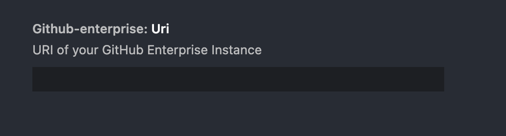

코드 작업을 하며 사용하는 vscode extensions 중에 [GitHub Pull Requests and Issues](https://marketplace.visualstudio.com/items?itemName=GitHub.vscode-pull-request-github)가 있습니다. 실제 개발보다는 협업에 가까운 도구입니다. Github과 연동하여 PR이나 이슈를 vscode에서 확인할 수 있는 확장앱입니다. 최근에 vscode로 회사 업무를 하면서 불편한 것이 생겨 이 확장앱을 직접 수정하고 기여한 내용을 공유해 보겠습니다.

## 문제 인식


확장앱에서 제공하는 기능 중에 `Copy Github Permalink`라는 것이 있습니다. 이것은 `Github Permalink`를 vscode 내에서 접근하여 복사해주는 기능입니다. ([Permalink](https://github.com/github/docs/blob/main/contributing/permalinks.md)는 github에 게시된 소스 코드의 특정 라인(또는 리소스)에 매핑된 URL 주소입니다.) 팀원들과 협업하면서 프로젝트의 특정 소스 코드를 지칭할 때, Permalink를 통해 공유할 수 있습니다.

하지만 `Github Pull Requests and Issues` 확장앱에서 복사된 Permalink의 도메인은 `github.com`으로 고정되어 있었습니다. 현재 사내에 Github Enterprise Server를 따로 구축하여 사용하는 환경이기 때문에 사내 도메인으로 복사가 되어야 하는데, 그 부분이 지원되지 않고 있었습니다.

```text
# 유효한 사내 Github permalink
https://github.myenterpriseserver.com/company-user/company-project/blob/ref/src/app.js#L10

# 실제 복사된 permalink
https://github.com/company-user/company-project/blob/ref/src/app.js#L10
```

그런데 해당 확장앱은 Github Enterprise Server를 지원하고 있습니다. 아래 사진과 같이 환경설정에서 `github-enterprise.uri` 정보를 입력하면 사내 Github Enterprise 서버에서 PR 및 이슈 등의 정보를 가져올 수 있습니다.



그래서 Permalink에 대해 Enterprise Server의 도메인이 적용되지 않는 것이 버그이거나 자연스럽지 않은 동작으로 느껴졌습니다. 그래서 직접 확장앱의 코드를 수정하고 기여할 수 있는지 확인해 보았습니다.

## 확장앱 정책 살펴보기

해당 확장앱이 제3자인 제가 수정하여 기여할 수 있는 정책으로 되어있는지 확인해 보겠습니다. 일반 어플리케이션과 다르게 확장앱의 경우에는 오픈소스로 운영되는 경우가 있기 때문에 직접 기여할 수 있을 것입니다. 다행히 해당 확장앱의 [Github Repo](https://github.com/Microsoft/vscode-pull-request-github)에서 [Contributing](https://github.com/Microsoft/vscode-pull-request-github) 관련 내용을 확인할 수 있었습니다. 아마 MS에서 개발하고 있기 때문에 문서가 잘 정리된 것으로 보입니다.


확장앱을 수정하기 위해서 개발 모드로 작업을 진행할 수 있게 가이드를 제공하고 있습니다. 확장앱의 모든 환경을 다 이해하진 못해도 해당 가이드를 따라 기능을 수정해보겠습니다.

## 디버깅 및 기능 수정하기


로컬 환경에 소스코드를 clone하여 내려받고 의존성 패키지를 설치합니다. 그리고 `yarn watch` 명령어를 실행하여 개발 환경에서 실행할 수 있게 되어 있습니다. 또는 `yarn bundle`이나 `yarn compile` 명령어를 통해 빌드할 수 있습니다. 저는 `yarn watch`를 통해 확장앱을 빌드하겠습니다.

확장앱이 준비되면 vscode 디버깅 기능을 실행합니다. `F5`키를 누르거나 command palette에서 `Debug: Start Debugging`을 실행합니다. 디버깅 모드가 실행되면 `[Extensions Development Host]`라는 Prefix가 붙은 vscode 새 창이 실행됩니다.


이 vscode 환경에서는 제가 작업하는 확장앱의 수정이 반영된 버전을 다룰 수 있습니다. 기존 확장앱의 vscode에서 원하는 기능이 동작하도록 코드를 수정하고 빌드합니다. 그리고 디버깅 모드로 실행하여 제가 수정한 기능이 제대로 동작하는지 디버깅할 수 있습니다.

## 프로젝트 메인 저장소에 PR로 기여하기

원하는 기능이 동작하도록 확장앱의 소스코드를 수정하고 커밋까지 완료합니다. 그리고 원본이 되는 저장소에 PR을 요청합니다. PR 가이드를 살펴보면 사전에 특별히 해야할 작업은 없는 것 같습니다. 적당히 제목과 내용을 작성한 다음 PR을 생성합니다. (실제 생성된 [PR](https://github.com/microsoft/vscode-pull-request-github/pull/3460))


해당 확장앱은 Microsoft의 CLA(Contributor License Agreement)에 동의하여야 기여할 수 있습니다. 가이드의 내용처럼 PR을 생성하면 [microsoft-cla bot](https://github.com/apps/microsoft-cla)이 CLA 동의를 위한 절차를 안내해줍니다. 라이선스 관련 내용을 확인하고 Github 계정을 이용하여 인증한 뒤 동의를 진행합니다.

CLA 동의 작업이 끝나면 Maintainer의 리뷰가 진행되어야 PR이 머지될 수 있습니다. 제 경우에는 PR 생성일부터 3-4일 정도 후에 리뷰 및 머지가 되었습니다. 이렇게 저의 vscode 확장앱 기여를 끝냈습니다!


## 마치며

처음으로 vscode extensions를 개발하는 환경을 다루어 보았습니다. 사실 확장앱 개발 환경에 대해 제대로 살펴보진 않았지만 `Extensions Development Host`를 배운 것만으로도 새로운 경험이었습니다. 또한 확장앱에 필요한 기능을 수정하여 기여했던 것 또한 뿌듯한 경험이었습니다.

이러한 경험은 개발에 대한 관점을 많이 넓혀줍니다. 개발자로서 참여할 수 있는 프로젝트의 환경 도메인이 하나 추가되었습니다. 필요한 아이디어를 잘 정리해서 vscode 확장앱을 하나 개발해보는 것도 재미있을 것 같습니다. 작은 경험이지만 vscode를 사용하는 개발자에게 도움이 되었기를 바랍니다.
